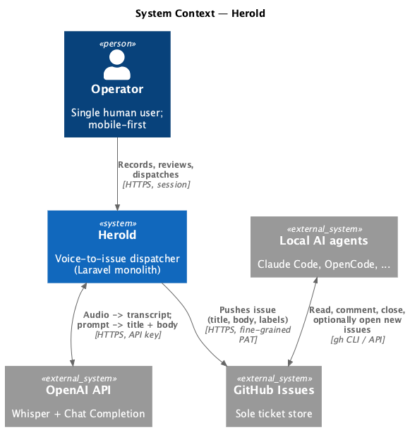
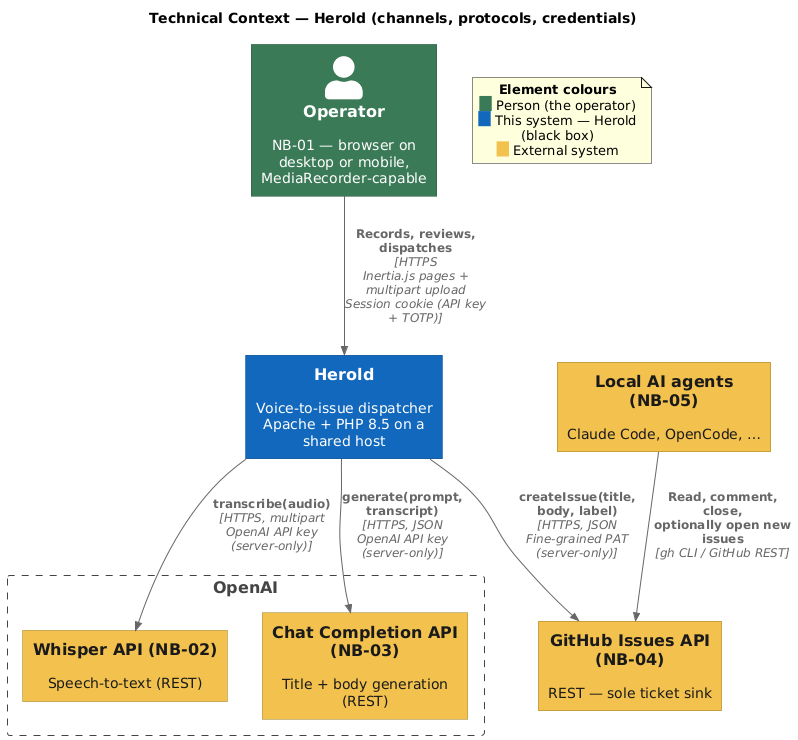

# 3 Context and Scope

Where [chapter 2](A02-architecture-constraints.md) enumerated the *constraints* that bind the architecture, chapter 3 places the system in its surroundings. It answers two questions in turn:

- **Business context** — *who* or *what* does Herold exchange information with, and what does the information *mean*?
- **Technical context** — *how* (over which channels, with which protocols and credentials) is each exchange carried out?

The business context was already fixed, implementation-free, in the spec block [`P2 — Architecture Overview`](../spec/P2-architekturueberblick.md) and detailed in [`S1 — Neighbouring System Interfaces`](../spec/S1-nachbarsysteme.md). This chapter reproduces the result and adds the technical bindings the spec deliberately omits.

---

## 3.1 Business Context

The business-level system context is canonical at spec level. Reproduced here for orientation:

*Source: [`../spec/diagrams/p2-system-context.plantuml`](../spec/diagrams/p2-system-context.plantuml).*

Inventory (canonical at [`P2.2`](../spec/P2-architekturueberblick.md#p22-neighbouring-systems); detailed interface contracts in [`S1`](../spec/S1-nachbarsysteme.md)):

| Neighbour | Information flowing in / out | Business event |
|-----------|------------------------------|----------------|
| **Operator browser** (NB-01) | Voice recording, message-type selection, optional metadata, edits | Operator captures, reviews, dispatches a voice note |
| **OpenAI Whisper API** (NB-02) | Audio → transcript text | Operator triggers `Process` on a recorded note |
| **OpenAI Chat Completion API** (NB-03) | Prompt + transcript → title, Markdown body, optional extras | Operator triggers `Process` on a recorded note |
| **GitHub Issues API** (NB-04) | Title, sanitised body, single type label → issue number + URL | Operator triggers `Send` on a processed note |
| **Local AI agents** (NB-05) | Read, comment, close, possibly open further issues — *on GitHub* | Indirect; outside Herold's request path |

Herold has **no** further neighbours. There is no email gateway, no scheduler, no monitoring back-end, no peer enterprise system, no agent-facing API.

---

## 3.2 Technical Context

The same five neighbours, mapped to the concrete channels Herold uses to talk to each. The architectural commitments enforced at this boundary are:

1. **Every outbound channel terminates on the server.** Third-party credentials never reach the browser ([NFR-15b-01](../spec/N1-nichtfunktional.md#15b-integrity-requirements)).
2. **Every inbound channel terminates at the same Apache/PHP process.** No separate ingress for agents — they are indirect via GitHub ([ADR-003](A09-architecture-decisions.md#adr-003-github-issues-as-sole-ticket-store)).
3. **Every outbound channel blocks the operator's HTTP request.** No queue, no scheduled retry, no background worker ([ADR-002](A09-architecture-decisions.md#adr-002-devprod-parity----apache--synchronous-processing)).

*Source: [`diagrams/a03-technical-context.plantuml`](diagrams/a03-technical-context.plantuml).*

| Channel | Transport | Payload | Authentication |
|---------|-----------|---------|----------------|
| Operator → Herold *(app shell / pages)* | HTTPS at the hosting edge | Inertia.js page payloads (JSON-over-HTML hydration) | Laravel session cookie, set after API key + TOTP verification (TECH-13) |
| Operator → Herold *(audio upload)* | HTTPS, `multipart/form-data` | Browser-encoded audio blob from `MediaRecorder` | Same session as above; payload validated per [NFR-15a-03](../spec/N1-nichtfunktional.md#15a-access-requirements) |
| Herold → OpenAI Whisper *(NB-02)* | HTTPS, `multipart/form-data` | Audio bytes + model identifier (hard-coded in the adapter — risk [R-07](A11-risks-and-technical-debts.md#111-risks)) | OpenAI API key from server-only env |
| Herold → OpenAI Chat *(NB-03)* | HTTPS, `application/json` | Per-type preprocessing prompt + transcript; optional extra-field schema | OpenAI API key (same credential as NB-02) |
| Herold → GitHub Issues *(NB-04)* | HTTPS, `application/json` | Title, sanitised Markdown body, exactly one type label | Fine-grained GitHub PAT (`Issues: Read & Write`), server-only |
| Local AI agents → GitHub | `gh` CLI / GitHub REST | Issue read, comment, close, possibly open new issues | Agent's own GitHub credentials — **not** a Herold channel |

### 3.2.1 Channel-level invariants

The following hold for NB-02, NB-03, and NB-04 alike, regardless of which use case opens the channel:

- **Synchronous and blocking** per [NFR-12a-01](../spec/N1-nichtfunktional.md#12a-speed-and-latency-requirements). The pipeline waits on every response.
- **Status does not advance on failure.** A failed call leaves `voice_notes.status` untouched and populates `error_message`; the operator retries explicitly. Strategy: [N2.5](../spec/N2-querschnittskonzepte.md#n25-failure-handling).
- **Server-only credentials.** Every outbound call carries a host-supplied secret retrieved from server environment, never round-tripped through the browser. Strategy: [N2.8](../spec/N2-querschnittskonzepte.md#n28-secret-handling).
- **Redacted in logs.** No log entry leaving the application carries an API key, PAT, session value, the operator's TOTP secret, or operator-derived content. Strategy: [N2.6](../spec/N2-querschnittskonzepte.md#n26-logging).
- **Provider portability.** Transcription (NB-02) and generation (NB-03) are each isolated behind one integration seam, so replacing the provider is a local change. Driven by [NFR-14c-01](../spec/N1-nichtfunktional.md#14c-adaptability-requirements) and quality goal [QG-04](A01-introduction-and-goals.md#12-quality-goals).

Internal persistence (SQLite, audio file store) is deliberately left inside the Herold black box at this level. It is detailed in [chapter 7 — Deployment View](A07-deployment-view.md) and informs the data lifecycle covered in [chapter 8 — Cross-cutting Concepts](A08-cross-cutting-concepts.md).
