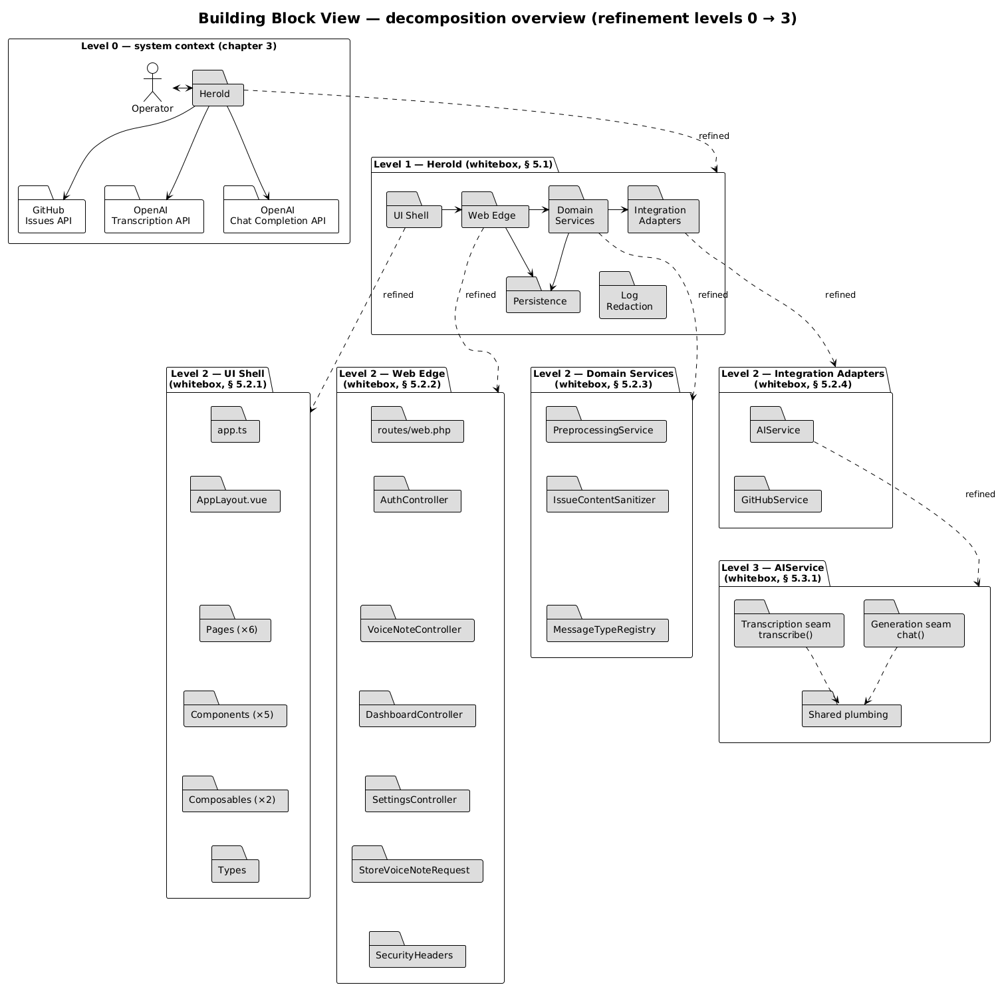
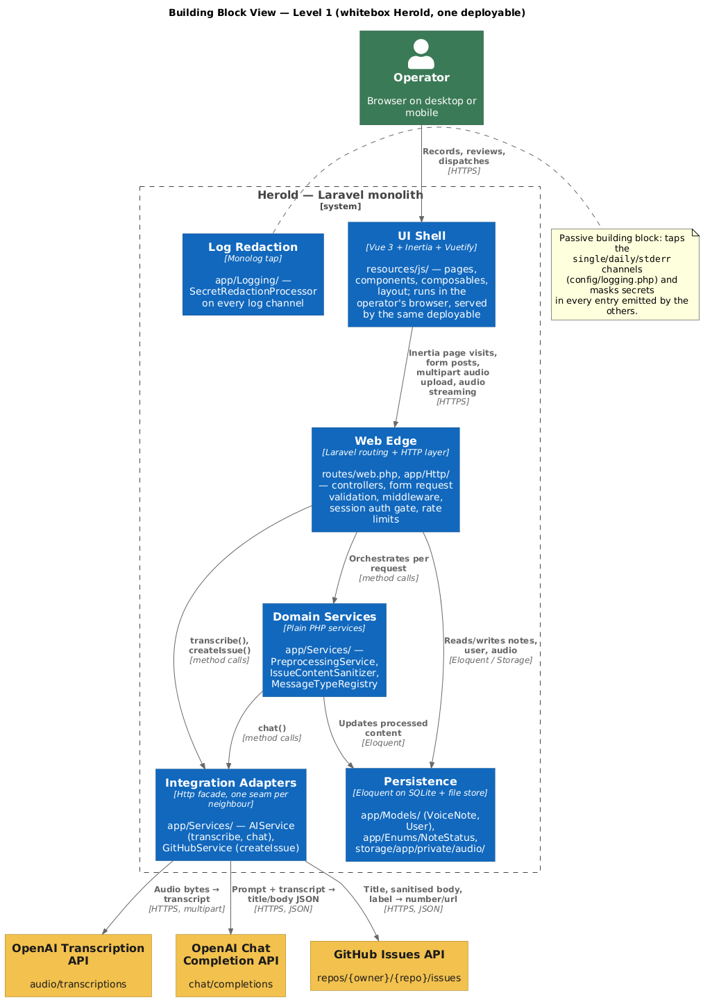
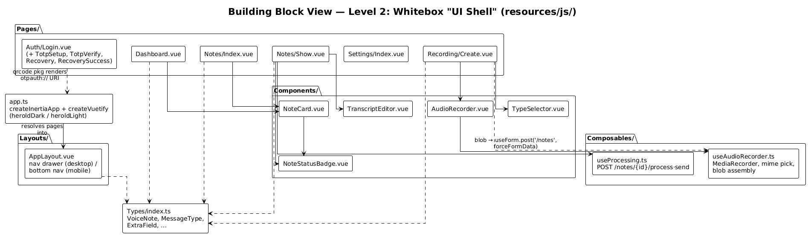
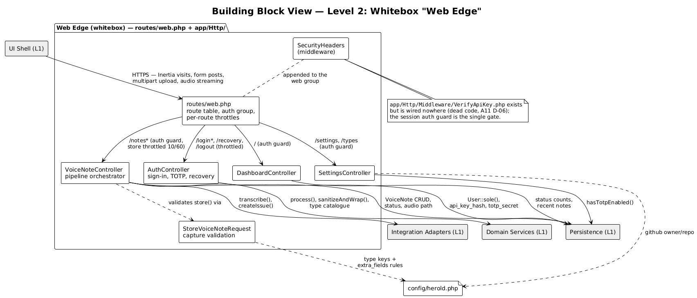
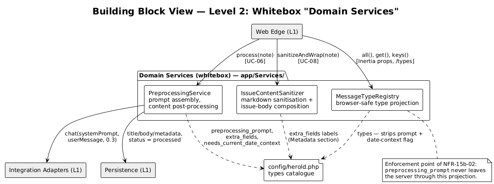
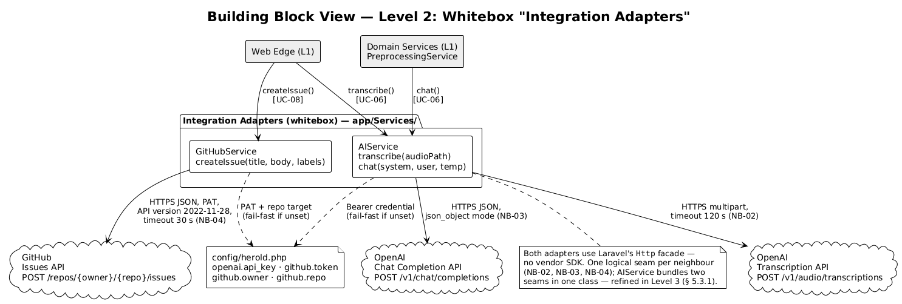
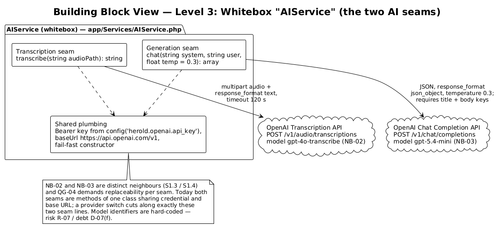

# 5 Building Block View

The building block view refines the system top-down, alternating black boxes and white boxes per refinement level (Starke/Hruschka, *SW-Arch kompakt*, ch. 5):

- **Level 0** is the context view of [chapter 3](A03-context-and-scope.md) — Herold as one black box among its neighbours.
- **Level 1** ([§ 5.1](#51-whitebox-overall-system)) opens that black box: the whitebox *Herold* and, as [§ 5.1.1](#511-blackbox-ui-shell)–[§ 5.1.6](#516-blackbox-log-redaction), the black-box descriptions of its six contained building blocks.
- **Level 2** ([§ 5.2](#52-level-2)) opens four of those six blocks as whiteboxes, each with its own diagram; the contained elements appear as black boxes.
- **Level 3** ([§ 5.3](#53-level-3)) opens one level-2 black box — `AIService` — whose inner seam structure carries an architectural decision of its own.

Every block maps to a concrete directory, class, file, or method in the source tree; nothing is aspirational. Refinement is deliberately asymmetric: a branch ends as soon as further decomposition would only restate code (justifications at the end of each level).

The figure below shows the complete decomposition at a glance — the refinement schema of the book applied to Herold. Grey folders are black boxes, framed packages are the whiteboxes that open them, and each dashed *refined* edge connects a black box on level *n* to its whitebox on level *n + 1*:

*Source: [`diagrams/a05-decomposition-overview.plantuml`](diagrams/a05-decomposition-overview.plantuml). This overview shows structure only; the relations inside each whitebox are drawn in the per-whitebox diagrams of [§ 5.1](#51-whitebox-overall-system)–[§ 5.3](#53-level-3).*

---

## 5.1 Whitebox Overall System

*Source: [`diagrams/a05-building-blocks.plantuml`](diagrams/a05-building-blocks.plantuml).*

**Motivation.** One Laravel monolith, one deployable ([ADR-001](A09-architecture-decisions.md#adr-001-inertiajs-as-frontend-bridge-no-separate-api-layer-for-the-browser-ui), [ADR-002](A09-architecture-decisions.md#adr-002-devprod-parity----apache--synchronous-processing)). The cut lines inside it follow the four-layer strategy of [§ 4.2](A04-solution-strategy.md#42-top-level-decomposition) and are chosen along the two portability seams demanded by [QG-04](A01-introduction-and-goals.md#12-quality-goals) (AI provider) and [TECH-05](A02-architecture-constraints.md#21-technical-constraints) (GitHub), and along the Inertia bridge that separates browser-executed from server-executed code without introducing an API tier.

**Contained building blocks** (black boxes at this level; described in §§ 5.1.1–5.1.6):

| # | Block | Location | Responsibility (one line) |
|---|-------|----------|---------------------------|
| [5.1.1](#511-blackbox-ui-shell) | **UI Shell** | `resources/js/` | Everything executed in the operator's browser. |
| [5.1.2](#512-blackbox-web-edge) | **Web Edge** | `routes/web.php`, `app/Http/` | HTTP boundary, auth gate, validation — and the pipeline orchestration. |
| [5.1.3](#513-blackbox-domain-services) | **Domain Services** | `app/Services/` | Herold-owned logic between edge and adapters. |
| [5.1.4](#514-blackbox-integration-adapters) | **Integration Adapters** | `app/Services/` | The only code knowing external endpoints and credentials. |
| [5.1.5](#515-blackbox-persistence) | **Persistence** | `app/Models/`, `app/Enums/`, `storage/` | Eloquent models, SQLite schema, audio file store. |
| [5.1.6](#516-blackbox-log-redaction) | **Log Redaction** | `app/Logging/` | Secret masking on every log channel. |

**Important interfaces** (cross-block; each is detailed in the whitebox that owns it):

| Interface | Between | Contract |
|-----------|---------|----------|
| Inertia page protocol | UI Shell ↔ Web Edge | Server-driven page props over HTTPS; no separate JSON API for the browser (ADR-001). Two deliberate exceptions: `GET /types` (prompt-stripped type catalogue as JSON) and `GET /notes/{note}/audio` (audio streaming). |
| Audio upload | UI Shell → Web Edge | `POST /notes` as `multipart/form-data` (`audio` blob + `type` + `metadata`), validated by `StoreVoiceNoteRequest` ([§ 8.3](A08-cross-cutting-concepts.md#83-validation)). |
| AI seam | Web Edge / Domain Services → Integration Adapters | `transcribe(string $audioPath): string` and `chat(string $systemPrompt, string $userMessage, float $temperature): array` — the two operations behind which the AI provider is replaceable ([QG-04](A01-introduction-and-goals.md#12-quality-goals)); refined in [§ 5.3.1](#531-whitebox-aiservice). |
| Ticket seam | Web Edge → Integration Adapters | `createIssue(string $title, string $body, array $labels): array{number, html_url}` — the one-way push of [S1.5](../spec/S1-nachbarsysteme.md#s15--nb-04--github-issues-api). |
| Type catalogue | all server-side blocks → `config/herold.php` | Per-type bindings (label, icon, `github_label`, `extra_fields`, `preprocessing_prompt`); the single resolution point of [N2.2](../spec/N2-querschnittskonzepte.md#n22-type-driven-configuration), detailed in [§ 8.2](A08-cross-cutting-concepts.md#82-type-driven-configuration). |

The UI Shell is *served by* the deployable but *executes in* the browser; the deployment consequences of that split are covered in [chapter 7](A07-deployment-view.md). The runtime interplay of the blocks is traced per scenario in [chapter 6](A06-runtime-view.md).

### 5.1.1 Blackbox UI Shell

- **Purpose/Responsibility:** Renders the dialogues of [B1](../spec/B1-dialogspezifikation.md), captures audio in-browser, holds transient form state. No business rules, no secrets, no direct calls to external systems.
- **Interfaces:** *Provided:* the operator-facing UI. *Required:* the Inertia page protocol, the audio upload, and the two JSON/streaming endpoints of the Web Edge — nothing else; every server contact goes through the Web Edge.
- **Location:** `resources/js/` (built into `public/build/` at release time).
- **Fulfilled requirements:** [NFR-10a-01](../spec/N1-nichtfunktional.md#10a-appearance-requirements), [NFR-11a-01](../spec/N1-nichtfunktional.md#11a-ease-of-use-requirements), [NFR-13a-01](../spec/N1-nichtfunktional.md#13a-expected-physical-environment).
- **Refined in:** [§ 5.2.1](#521-whitebox-ui-shell).

### 5.1.2 Blackbox Web Edge

- **Purpose/Responsibility:** Terminates every HTTP request: route table, session auth gate, rate limits, form-request validation, security headers — and the **pipeline orchestration**: the `process`/`send` controller actions drive the synchronous pipeline of [ADR-002](A09-architecture-decisions.md#adr-002-devprod-parity----apache--synchronous-processing).
- **Interfaces:** *Provided:* all HTTP routes (public auth/recovery routes; session-guarded application routes). *Required:* method calls into Domain Services, Integration Adapters, and Persistence.
- **Location:** `routes/web.php`, `app/Http/`, wiring in `bootstrap/app.php`.
- **Fulfilled requirements:** [NFR-15a-01](../spec/N1-nichtfunktional.md#15a-access-requirements)–[NFR-15a-04](../spec/N1-nichtfunktional.md#15a-access-requirements), [NFR-12a-01](../spec/N1-nichtfunktional.md#12a-speed-and-latency-requirements), [NFR-12d-01](../spec/N1-nichtfunktional.md#12d-reliability-and-availability-requirements).
- **Refined in:** [§ 5.2.2](#522-whitebox-web-edge).

### 5.1.3 Blackbox Domain Services

- **Purpose/Responsibility:** Herold-owned logic that is neither HTTP handling nor external integration: prompt assembly and content post-processing, markdown sanitisation, message-type resolution.
- **Interfaces:** *Provided:* `process(VoiceNote)`, `sanitizeAndWrap(VoiceNote)`, `all()/get()/keys()`. *Required:* the generation seam of the Integration Adapters (`chat()`), Persistence (Eloquent writes), and the type catalogue in `config/herold.php`.
- **Location:** `app/Services/` (`PreprocessingService`, `IssueContentSanitizer`, `MessageTypeRegistry`).
- **Fulfilled requirements:** [NFR-14a-01](../spec/N1-nichtfunktional.md#14a-maintenance-requirements), [NFR-15b-02](../spec/N1-nichtfunktional.md#15b-integrity-requirements), [NFR-15b-04](../spec/N1-nichtfunktional.md#15b-integrity-requirements).
- **Refined in:** [§ 5.2.3](#523-whitebox-domain-services).

### 5.1.4 Blackbox Integration Adapters

- **Purpose/Responsibility:** The only code that knows external endpoints, payload shapes, and credentials — one logical seam per neighbour: transcription (NB-02), generation (NB-03), ticket dispatch (NB-04). Both adapter classes use Laravel's `Http` facade; no vendor SDK.
- **Interfaces:** *Provided:* the AI seam and the ticket seam (see the interface table above). *Required:* credentials and repository coordinates from `config/herold.php`; HTTPS egress to `api.openai.com` and `api.github.com`.
- **Location:** `app/Services/` (`AIService`, `GitHubService`).
- **Fulfilled requirements:** [NFR-14c-01](../spec/N1-nichtfunktional.md#14c-adaptability-requirements), [NFR-15b-01](../spec/N1-nichtfunktional.md#15b-integrity-requirements); realises [S1.3](../spec/S1-nachbarsysteme.md#s13--nb-02--openai-whisper-api)–[S1.5](../spec/S1-nachbarsysteme.md#s15--nb-04--github-issues-api).
- **Open issue:** model identifiers hard-coded — risk [R-07](A11-risks-and-technical-debts.md#111-risks).
- **Refined in:** [§ 5.2.4](#524-whitebox-integration-adapters), then [§ 5.3.1](#531-whitebox-aiservice).

### 5.1.5 Blackbox Persistence

- **Purpose/Responsibility:** Owns all durable state: the `VoiceNote` and `User` Eloquent models, the `NoteStatus` enum, the SQLite schema (incl. the users-singleton trigger), and the private audio file store.
- **Interfaces:** *Provided:* Eloquent model API and `Storage` disk `local`. *Required:* none (leaf block).
- **Location:** `app/Models/`, `app/Enums/`, `database/migrations/`, `storage/app/private/`.
- **Fulfilled requirements:** [CON-3a-03](../spec/P1-constraints.md#con-3a-03-low-footprint-database), [CON-3a-04](../spec/P1-constraints.md#con-3a-04-single-user-system).
- **Not refined further here:** its inner structure is a data model, not a component structure — documented as [§ 8.1](A08-cross-cutting-concepts.md#81-domain-model-and-persistence) with the [relational data model](diagrams-png/relational-datamodel.png).

### 5.1.6 Blackbox Log Redaction

- **Purpose/Responsibility:** Passive block: a Monolog tap that masks secrets in every log entry emitted by the other blocks, on the `single`, `daily`, and `stderr` channels.
- **Interfaces:** *Provided:* none callable — it intercepts. *Required:* the config keys whose values it masks.
- **Location:** `app/Logging/` (`RedactSecrets`, `SecretRedactionProcessor`), wired in `config/logging.php`.
- **Fulfilled requirements:** [NFR-15b-03](../spec/N1-nichtfunktional.md#15b-integrity-requirements).
- **Not refined further here:** two classes with one rule set — documented as [§ 8.7](A08-cross-cutting-concepts.md#87-logging).

---

## 5.2 Level 2

Level 2 opens the level-1 black boxes 5.1.1–5.1.4 as whiteboxes — one subsection, one diagram each. In the diagrams, grey boxes denote *other* level-1 blocks (context of the whitebox, not content). Persistence and Log Redaction are not refined (justification in §§ 5.1.5–5.1.6).

### 5.2.1 Whitebox UI Shell

*Source: [`diagrams/a05-l2-ui-shell.plantuml`](diagrams/a05-l2-ui-shell.plantuml).*

**Motivation.** The decomposition mirrors the Vue/Inertia idiom: one page per dialogue of [B1](../spec/B1-dialogspezifikation.md), reusable components below, browser-API access isolated in composables.

Contained black boxes:

| Block | Responsibility |
|-------|----------------|
| `app.ts` | Entry point: `createInertiaApp` with an eager `Pages/**/*.vue` resolver, plus Vuetify setup with the custom `heroldDark` (default) and `heroldLight` themes. |
| `Layouts/AppLayout.vue` | Responsive chrome per [NFR-10a-01](../spec/N1-nichtfunktional.md#10a-appearance-requirements): navigation drawer on desktop, bottom navigation on mobile; destinations Dashboard, Record, Notes, Settings; logout via `router.post('/logout')`. |
| `Pages/` | One page per dialogue: `Dashboard`, `Notes/Index`, `Notes/Show` (detail with the three-step status stepper and the Process/Send actions), `Recording/Create`, `Settings/Index`, and the auth set `Auth/Login`, `Auth/TotpSetup`, `Auth/TotpVerify`, `Auth/Recovery`, `Auth/RecoverySuccess`. |
| `Components/` | `AudioRecorder` (record/playback UI with a decorative CSS waveform), `TypeSelector`, `NoteCard`, `NoteStatusBadge`, `TranscriptEditor`. |
| `Composables/` | `useAudioRecorder.ts` — the `MediaRecorder` integration: `getUserMedia({audio: true})`, container preference `audio/webm;codecs=opus` → `audio/webm` → `audio/ogg;codecs=opus`, chunked assembly into a `Blob`. `useProcessing.ts` — triggers the two pipeline actions via `router.post('/notes/{id}/process' | '/send')`. |
| `Types/index.ts` | Shared TypeScript contracts (`VoiceNote`, `MessageType`, `ExtraField`, `DashboardStats`, paginated shapes) mirroring the Inertia props. |

### 5.2.2 Whitebox Web Edge

*Source: [`diagrams/a05-l2-web-edge.plantuml`](diagrams/a05-l2-web-edge.plantuml).*

**Motivation.** One controller per dialogue area; validation extracted where it is schema-driven (capture); everything auth-related concentrated in a single class so the gate has one owner.

Contained black boxes (all under `app/Http/` unless noted):

| Block | Responsibility |
|-------|----------------|
| `routes/web.php` | Single route file. Public: login/TOTP/recovery routes with `throttle:5,1` (sign-in factors) and `throttle:5,60` (recovery) per [NFR-15a-02](../spec/N1-nichtfunktional.md#15a-access-requirements). Protected: everything else behind the stock session `auth` guard, upload capped at `throttle:10,60`. |
| `Controllers/AuthController` | The complete authentication surface: API-key verification (`verifyKey`), TOTP enrolment (`setupTotp`, `confirmTotp`), TOTP verification (`verifyTotp`), sign-out (`logout`), and file-token recovery (`showRecovery`, `processRecovery`). Also hosts the home-rolled RFC-6238 TOTP implementation ([TECH-13](A02-architecture-constraints.md#21-technical-constraints)) as private methods — detailed in [§ 8.4](A08-cross-cutting-concepts.md#84-authentication-and-session). |
| `Controllers/VoiceNoteController` | The pipeline orchestrator, realising [UC-05](../spec/F2-anwendungsfaelle.md#uc-05--capture-voice-note)–[UC-11](../spec/F2-anwendungsfaelle.md#uc-11--delete-a-voice-note): `index`, `create`, `store` (capture), `show`, `audio` (streaming), `update` (edit), `destroy` (delete incl. audio file), `process` (transcribe + generate), `send` (sanitise + dispatch). `process` and `send` are the two long-running synchronous actions of [ADR-002](A09-architecture-decisions.md#adr-002-devprod-parity----apache--synchronous-processing). |
| `Controllers/DashboardController` | [UC-13](../spec/F2-anwendungsfaelle.md#uc-13--view-dashboard): per-status counts (including the orthogonal error count) and the five most recent notes. |
| `Controllers/SettingsController` | [UC-12](../spec/F2-anwendungsfaelle.md#uc-12--view-settings): read-only GitHub target (owner/repo) and TOTP confirmation state. |
| `Requests/StoreVoiceNoteRequest` | Schema-driven capture validation: audio (`mimetypes:audio/webm,video/webm,audio/ogg,audio/mp4`, max 25 MB), `type` against the configured catalogue, per-type `extra_fields` rules; unknown metadata keys are stripped in `validated()` ([§ 8.3](A08-cross-cutting-concepts.md#83-validation)). |
| `Middleware/SecurityHeaders` | Appended to the `web` group in `bootstrap/app.php`: `X-Frame-Options: DENY`, `X-Content-Type-Options: nosniff`, `Referrer-Policy`, `Permissions-Policy` (microphone self-only). |

One structural caveat: `Middleware/VerifyApiKey` exists in the tree but is wired nowhere — recorded as technical debt [D-06](A11-risks-and-technical-debts.md#112-technical-debts).

### 5.2.3 Whitebox Domain Services

*Source: [`diagrams/a05-l2-domain-services.plantuml`](diagrams/a05-l2-domain-services.plantuml).*

**Motivation.** Three services, three concerns, no mutual dependencies — each consumes the type catalogue independently, which keeps [N2.2](../spec/N2-querschnittskonzepte.md#n22-type-driven-configuration)'s single resolution point honest.

Contained black boxes:

| Block | Interface | Notes |
|-------|-----------|-------|
| `PreprocessingService` | `process(VoiceNote): void` | Resolves the note's type entry from `config/herold.php` (unknown type → exception), builds the system prompt from `preprocessing_prompt`, appends metadata lines and — for types flagged `needs_current_date_context` (`diary`, `todo`) — the current date, calls the generation seam (`chat()`), then persists `processed_title`, `processed_body`, merges extracted `extra_fields` (e.g. `deadline`, `entry_date`, `vault`) into `metadata`, and sets `status = processed`. |
| `IssueContentSanitizer` | `sanitizeAndWrap(VoiceNote): string` | Composes the dispatched issue body: sanitised `processed_body` plus a generated `## Metadata` section, joined by `---` rules — realising both the neutralisation and the visual delimitation demanded by [NFR-15b-04](../spec/N1-nichtfunktional.md#15b-integrity-requirements). Sanitisation rules in [§ 8.5](A08-cross-cutting-concepts.md#85-content-sanitisation). |
| `MessageTypeRegistry` | `all(): array`, `get(string): ?array`, `keys(): array` | The browser-safe view of the type catalogue: `all()` strips `preprocessing_prompt` and `needs_current_date_context` before anything reaches an Inertia prop or the `/types` endpoint — the enforcement point of [NFR-15b-02](../spec/N1-nichtfunktional.md#15b-integrity-requirements). |

### 5.2.4 Whitebox Integration Adapters

*Source: [`diagrams/a05-l2-integration-adapters.plantuml`](diagrams/a05-l2-integration-adapters.plantuml).*

**Motivation.** Three logical seams — one per neighbour NB-02/NB-03/NB-04 ([S1.3](../spec/S1-nachbarsysteme.md#s13--nb-02--openai-whisper-api)–[S1.5](../spec/S1-nachbarsysteme.md#s15--nb-04--github-issues-api)) — realised in two classes: the two OpenAI seams share credential and base URL and therefore live in one class, `AIService`; the GitHub seam is its own class.

Contained black boxes:

| Block | Interface | Notes |
|-------|-----------|-------|
| `AIService` | `transcribe(string): string`, `chat(string, string, float): array` | The AI provider boundary ([QG-04](A01-introduction-and-goals.md#12-quality-goals)). Credential from `config('herold.openai.api_key')`; construction fails fast if missing. Bundles the transcription seam (NB-02) and the generation seam (NB-03) — opened as a whitebox in [§ 5.3.1](#531-whitebox-aiservice). |
| `GitHubService` | `createIssue(string, string, array): array` | The ticket seam (NB-04): `POST https://api.github.com/repos/{owner}/{repo}/issues` with `X-GitHub-Api-Version: 2022-11-28`, 30 s timeout, fine-grained PAT and repository coordinates from `config('herold.github')`. Returns issue `number` and `html_url`; any non-success response throws. |

---

## 5.3 Level 3

Level 3 opens the one level-2 black box whose inner structure carries an architectural decision: `AIService`, where two *logically independent* seams share one class. `GitHubService` (single operation), the controllers (flat action methods), and the UI components (leaf files) end their branches at level 2 — refining them would only restate code.

### 5.3.1 Whitebox AIService

*Source: [`diagrams/a05-l3-aiservice.plantuml`](diagrams/a05-l3-aiservice.plantuml).*

**Motivation.** The spec treats transcription (NB-02, [S1.3](../spec/S1-nachbarsysteme.md#s13--nb-02--openai-whisper-api)) and generation (NB-03, [S1.4](../spec/S1-nachbarsysteme.md#s14--nb-03--openai-chat-completion-api)) as distinct neighbours, and [NFR-14c-01](../spec/N1-nichtfunktional.md#14c-adaptability-requirements) demands that each be replaceable independently. Inside the class the two seams share nothing but the Bearer credential and the base URL — a provider switch cuts along exactly these lines, so the seams are documented as separate building blocks even though both are methods of `app/Services/AIService.php` today.

Contained black boxes:

| Block | Realisation | Contract |
|-------|-------------|----------|
| **Transcription seam** | `transcribe(string $audioPath): string` | `POST /v1/audio/transcriptions`, model `gpt-4o-transcribe`, multipart file attach, `response_format: text`, timeout 120 s. Returns the plain-text transcript; any non-success response throws (`Whisper transcription failed: …`). Serves [UC-06](../spec/F2-anwendungsfaelle.md#uc-06--process-voice-note) step 3. |
| **Generation seam** | `chat(string $systemPrompt, string $userMessage, float $temperature = 0.3): array` | `POST /v1/chat/completions`, model `gpt-5.4-mini`, `response_format: json_object`, temperature 0.3. Parses `choices.0.message.content` and requires `title` + `body` keys, else throws. Serves [UC-06](../spec/F2-anwendungsfaelle.md#uc-06--process-voice-note) step 4 (called by `PreprocessingService`). |
| **Shared plumbing** | Constructor + private state | Bearer key from `config('herold.openai.api_key')` (fail-fast `RuntimeException` when unset), base URL `https://api.openai.com/v1`, Laravel `Http` facade. |

**Open issues:** both model identifiers are hard-coded in the seams instead of being host-configured — risk [R-07](A11-risks-and-technical-debts.md#111-risks), debt [D-07](A11-risks-and-technical-debts.md#112-technical-debts)(f). Splitting the class into one adapter per seam becomes mandatory the moment the two seams stop sharing a provider (e.g. transcription moves to a local model); until then the shared-class realisation is the simpler, equally seam-faithful choice.
