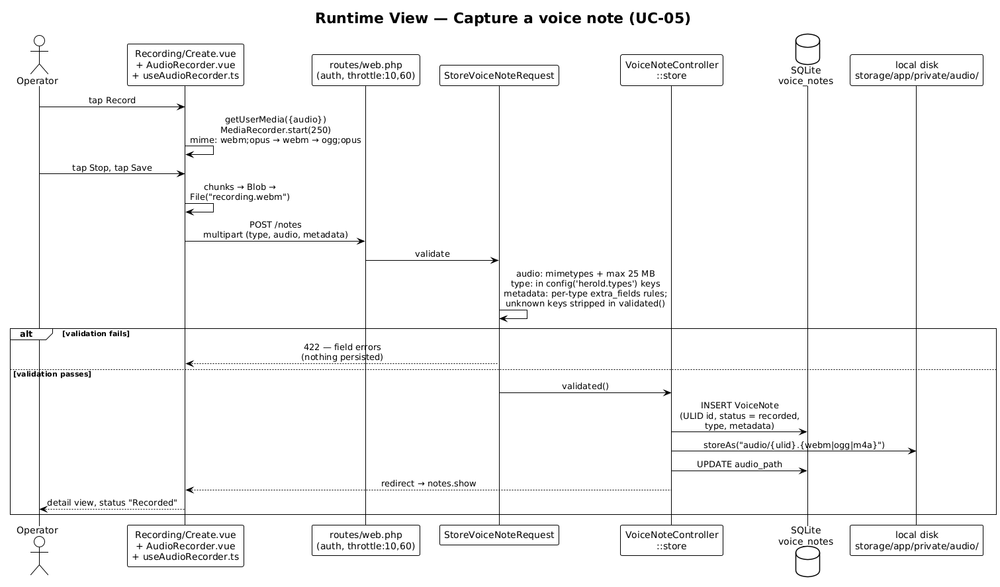
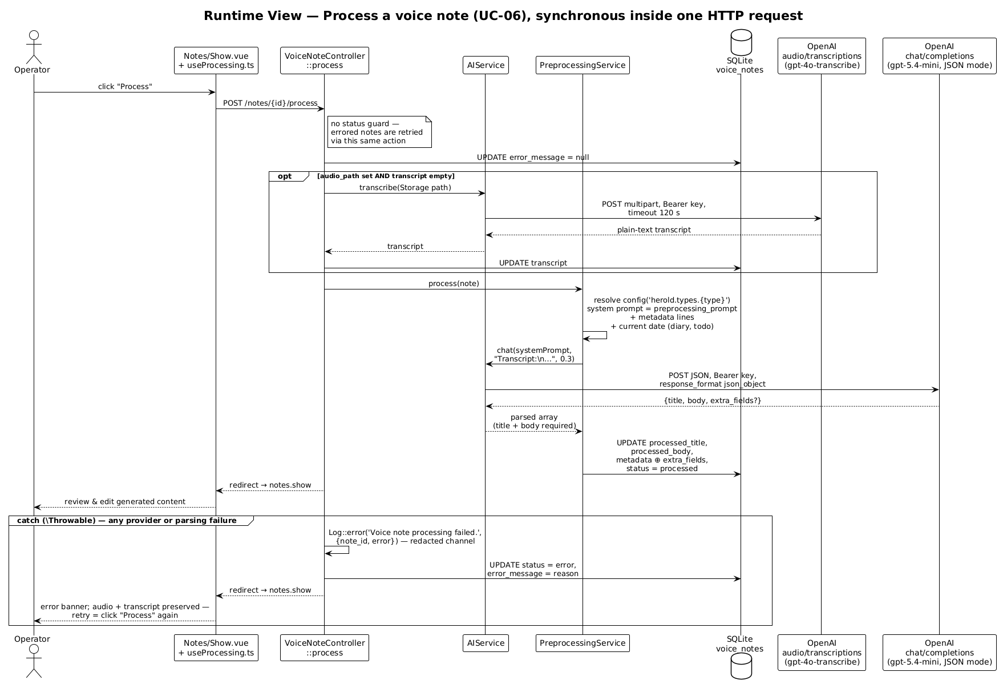
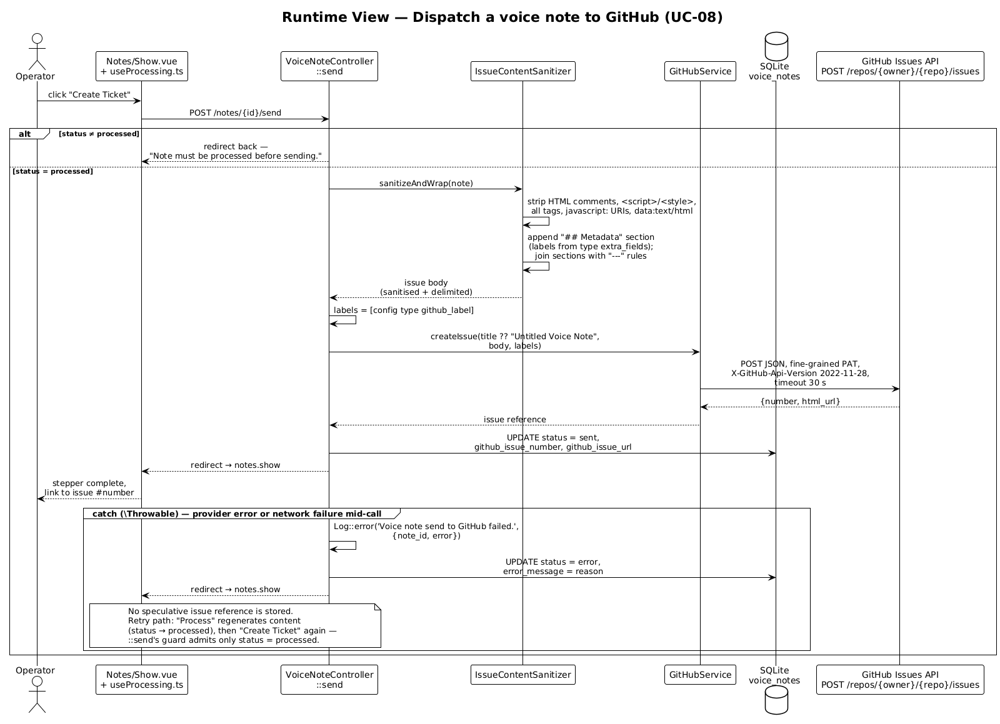
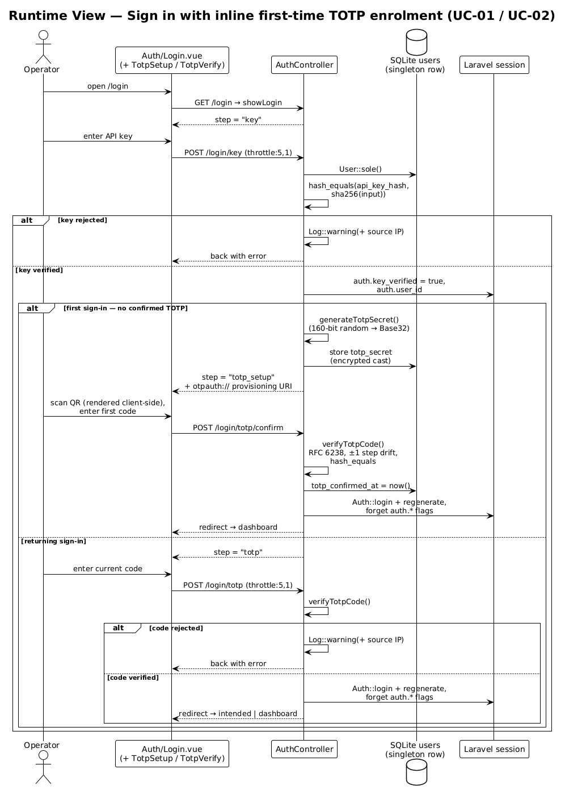
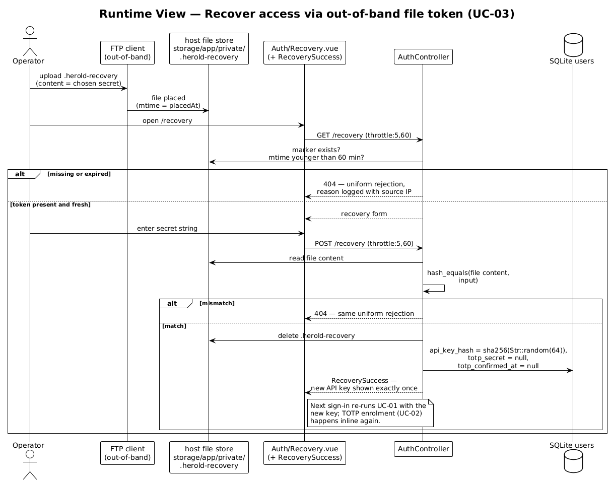

# 6 Runtime View

The runtime view shows how the building blocks of [chapter 5](A05-building-block-view.md) cooperate in the architecturally decisive scenarios. Selection criterion, per arc42: relevance, not coverage — the five scenarios below carry every non-obvious runtime decision (synchronous pipeline, failure semantics, two-factor gate, out-of-band recovery). Plain CRUD scenarios (browse, view, edit, delete — [UC-09](../spec/F2-anwendungsfaelle.md#uc-09--browse-voice-notes)–[UC-11](../spec/F2-anwendungsfaelle.md#uc-11--delete-a-voice-note)) follow the standard Inertia request/response pattern and are not diagrammed.

| Scenario | Use case | Why architecturally relevant |
|----------|----------|------------------------------|
| [6.1](#61-capture-a-voice-note) Capture | [UC-05](../spec/F2-anwendungsfaelle.md#uc-05--capture-voice-note) | Browser-side `MediaRecorder` capture; multipart upload; schema-driven validation before any persistence. |
| [6.2](#62-process-a-voice-note) Process | [UC-06](../spec/F2-anwendungsfaelle.md#uc-06--process-voice-note) | The synchronous two-provider pipeline of [ADR-002](A09-architecture-decisions.md#adr-002-devprod-parity----apache--synchronous-processing); the longest-running request in the system. |
| [6.3](#63-dispatch-to-github) Send | [UC-08](../spec/F2-anwendungsfaelle.md#uc-08--dispatch-voice-note) | Sanitisation at the dispatch boundary; one-way push; no speculative state on mid-call failure. |
| [6.4](#64-sign-in-with-inline-totp-enrolment) Sign in | [UC-01](../spec/F2-anwendungsfaelle.md#uc-01--sign-in) + [UC-02](../spec/F2-anwendungsfaelle.md#uc-02--enrol-second-factor) | The two-step session gate incl. first-run enrolment — sole access control of the system ([N2.4](../spec/N2-querschnittskonzepte.md#n24-authentication-and-session)). |
| [6.5](#65-recover-access) Recovery | [UC-03](../spec/F2-anwendungsfaelle.md#uc-03--recover-access) | The only flow that crosses an out-of-band channel (host file store) into the request path. |

All server-side steps run inside a single Apache/PHP request; there is no queue hop, no polling, and no background continuation anywhere in this chapter.

---

## 6.1 Capture a voice note

*Source: [`diagrams/a06-capture.plantuml`](diagrams/a06-capture.plantuml).*

Notable aspects:

- **Capture is entirely client-side until submission.** `useAudioRecorder.ts` acquires the microphone, prefers `audio/webm;codecs=opus` and falls back to `audio/webm`, then `audio/ogg;codecs=opus`; chunks arrive every 250 ms and are assembled into one `Blob`. Cancelling before *Save* therefore persists nothing.
- **Validation precedes persistence.** `StoreVoiceNoteRequest` enforces the upload constraints of [NFR-15a-03](../spec/N1-nichtfunktional.md#15a-access-requirements) (accepted MIME types, 25 MB cap) and the per-type metadata schema; unknown metadata keys are silently stripped in `validated()`. A 422 leaves no row and no file behind ([N2.3](../spec/N2-querschnittskonzepte.md#n23-validation)).
- **Two writes, one ownership rule.** The `VoiceNote` row (ULID id, `status = recorded`) is created first, then the audio file is stored as `audio/{ulid}.{ext}` — the extension derived from the actual MIME type (`webm`, `ogg`, or `m4a`) — and `audio_path` is linked back. The file never exists without its owning row ([D1.1](../spec/D1-datenmodell.md#voicenote)).

## 6.2 Process a voice note

*Source: [`diagrams/a06-process.plantuml`](diagrams/a06-process.plantuml).*

Notable aspects:

- **Two provider calls in sequence, one request.** Transcription (`AIService::transcribe`, 120 s timeout) and generation (`AIService::chat`, JSON mode) block the operator's request back-to-back — the accepted trade-off of [ADR-002](A09-architecture-decisions.md#adr-002-devprod-parity----apache--synchronous-processing), bounded by [NFR-12a-01](../spec/N1-nichtfunktional.md#12a-speed-and-latency-requirements).
- **Transcription is skipped when a transcript exists.** `process` re-runs cheaply after a generation failure: the persisted transcript short-circuits the Whisper call, so a retry costs only the chat completion.
- **No status guard on entry.** `process` accepts a note in any status and clears `error_message` first; this single action is simultaneously the initial processing and the retry mechanism of [NFR-12d-01](../spec/N1-nichtfunktional.md#12d-reliability-and-availability-requirements).
- **Type knowledge arrives via configuration.** `PreprocessingService` resolves prompt, extra-field schema, and the `needs_current_date_context` flag (types `diary`, `todo` receive the current date for relative-date resolution) from `config/herold.php` — no type conditionals in the pipeline ([§ 8.2](A08-cross-cutting-concepts.md#82-type-driven-configuration)).
- **Failure is data.** Any `Throwable` is caught once, logged with the note id (through the redacting channel, [§ 8.7](A08-cross-cutting-concepts.md#87-logging)), and materialised as `status = error` + `error_message`; audio and transcript survive. Failure semantics in detail: [§ 8.6](A08-cross-cutting-concepts.md#86-failure-handling).

## 6.3 Dispatch to GitHub

*Source: [`diagrams/a06-send.plantuml`](diagrams/a06-send.plantuml).*

Notable aspects:

- **Guarded entry.** `send` admits only `status = processed`; anything else bounces back with an inline error. This makes double-dispatch of an already-`sent` note impossible through the UI or a replayed request.
- **Sanitise-then-push.** `IssueContentSanitizer::sanitizeAndWrap` produces the outbound body immediately before the API call: markup neutralised, operator-derived content and the generated `## Metadata` section visually delimited by horizontal rules ([NFR-15b-04](../spec/N1-nichtfunktional.md#15b-integrity-requirements)). The persisted `processed_body` is left as-is; only the dispatched artefact is transformed.
- **Exactly one label.** The type's `github_label` from `config/herold.php` is the only label attached — triage beyond that is downstream ([S1.5](../spec/S1-nachbarsysteme.md#s15--nb-04--github-issues-api)).
- **Mid-call failure stores nothing speculative.** On any `Throwable` the note flips to `status = error` without an issue reference; Herold never assumes the issue was created. The retry path runs through *Process* first (which resets the note to `processed`), then *Send* — a consequence of the entry guard, documented as part of the failure concept ([§ 8.6](A08-cross-cutting-concepts.md#86-failure-handling)).

## 6.4 Sign in with inline TOTP enrolment

*Source: [`diagrams/a06-sign-in.plantuml`](diagrams/a06-sign-in.plantuml).*

Notable aspects:

- **One controller, three steps, one session.** `showLogin` derives the current step (`key` → `totp_setup` → `totp`) from session flags and the user's enrolment state; the intermediate first-factor success is held as `auth.key_verified` in the session, never as a half-authenticated login.
- **Enrolment is lazy and inline.** The first successful key verification auto-generates a TOTP secret (160-bit random, Base32) and drives the operator through provisioning-URI capture and code confirmation before any session is issued — [UC-02](../spec/F2-anwendungsfaelle.md#uc-02--enrol-second-factor) as an inline branch of [UC-01](../spec/F2-anwendungsfaelle.md#uc-01--sign-in), exactly as specified.
- **The session attests both factors.** `Auth::login` fires only after the second factor verifies; the session id is regenerated and the intermediate flags are dropped. Every protected route then relies solely on the stock session `auth` guard ([§ 8.4](A08-cross-cutting-concepts.md#84-authentication-and-session)).
- **Rate limits sit in front of the credential checks.** `throttle:5,1` guards both factor endpoints; failures are logged with source IP ([NFR-15a-02](../spec/N1-nichtfunktional.md#15a-access-requirements), [N2.6](../spec/N2-querschnittskonzepte.md#n26-logging)).

## 6.5 Recover access

*Source: [`diagrams/a06-recovery.plantuml`](diagrams/a06-recovery.plantuml).*

Notable aspects:

- **The out-of-band channel is a file.** The operator places `.herold-recovery` (content: a self-chosen secret) into `storage/app/private/` via FTP; the file's modification time is the `placedAt` of [D1.1](../spec/D1-datenmodell.md#recoverytoken), enforcing the 60-minute TTL of [NFR-15a-04](../spec/N1-nichtfunktional.md#15a-access-requirements).
- **Uniform rejection.** Missing file, expired file, and mismatched secret all surface as the same `404`; the discriminating reason exists only in the (redacted) log together with source IP. `throttle:5,60` caps attempts.
- **Redemption is atomic in effect.** On match, one code path deletes the token file, rotates the API key (`api_key_hash` ← SHA-256 of a fresh 64-char random), clears `totp_secret` and `totp_confirmed_at`, and renders the new key exactly once — replace, never reveal ([N2.8](../spec/N2-querschnittskonzepte.md#n28-secret-handling)).
- **Recovery does not authenticate.** Unlike the spec's postcondition sketch, the implementation ends without a session: the operator proceeds to a normal sign-in with the new key, which re-triggers TOTP enrolment inline.
