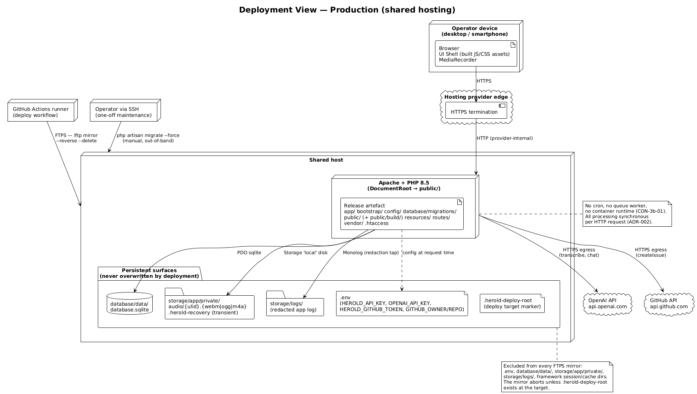
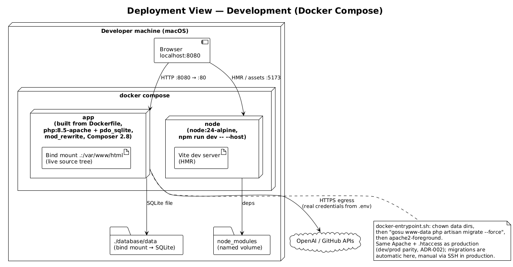
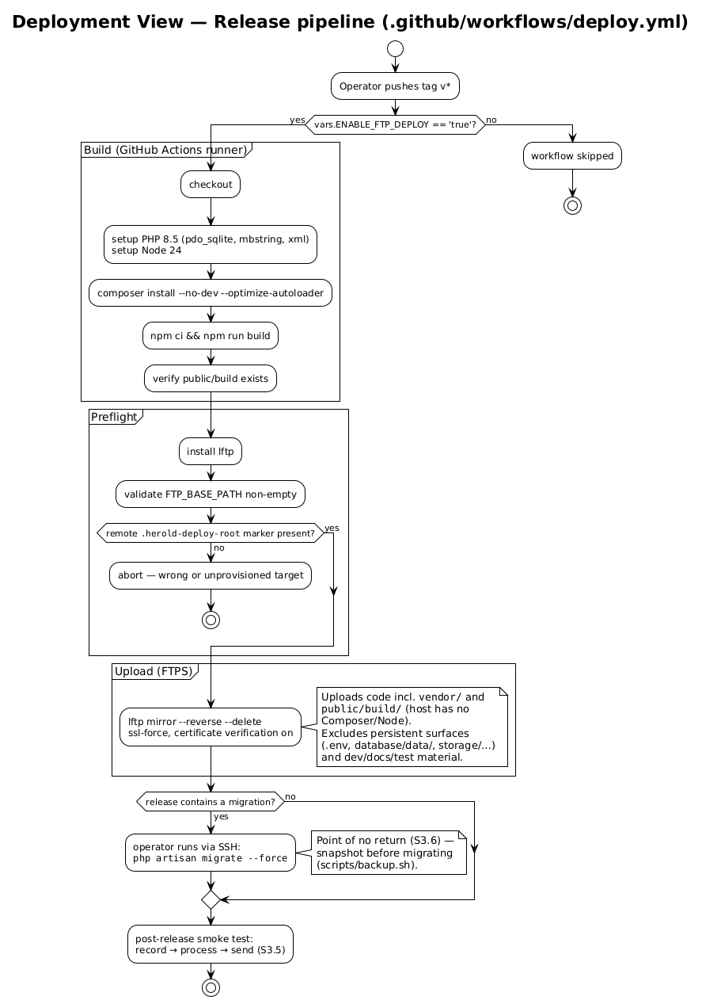

# 7 Deployment View

The deployment view maps the building blocks of [chapter 5](A05-building-block-view.md) onto the two execution environments that exist: **production** on a shared host and **development** under Docker Compose. There is no staging environment — the unit of rollout is the single installation ([S3](../spec/S3-inbetriebnahme.md)). The spec-level commissioning contract (host preconditions, persistent surfaces, first commissioning, rollback) is fixed in [S3](../spec/S3-inbetriebnahme.md); this chapter binds it to concrete hosts, paths, and tooling.

---

## 7.1 Infrastructure Level 1

### 7.1.1 Production — shared hosting

*Source: [`diagrams/a07-deployment-prod.plantuml`](diagrams/a07-deployment-prod.plantuml).*

**Motivation.** [TECH-01](A02-architecture-constraints.md#21-technical-constraints)/[ORG-03](A02-architecture-constraints.md#22-organisational-constraints): existing shared hosting, no infrastructure budget. The single deployable selected by [ADR-004](A09-architecture-decisions.md#adr-004-laravel-monolith-as-a-single-deployable-application-platform) needs only Apache, PHP 8.5 with `pdo_sqlite`/`mbstring`/`xml`, HTTPS at the provider edge, outbound HTTPS egress, and a writable file area — exactly the precondition set of [S3.2](../spec/S3-inbetriebnahme.md#s32-host-preconditions).

**Nodes and channels.**

| Element | Realisation |
|---------|-------------|
| Web edge | Provider-terminated HTTPS at a stable URL; required for `MediaRecorder` availability and credential transport. Apache's DocumentRoot points to `public/`; `public/.htaccess` is the standard Laravel front controller (rewrite to `index.php`, `Authorization` header pass-through). |
| Application runtime | Apache + PHP 8.5, invoked per request. No cron, no queue worker, no container runtime ([CON-3b-01](../spec/P1-constraints.md#con-3b-01-shared-hosting-production), [ADR-002](A09-architecture-decisions.md#adr-002-devprod-parity----apache--synchronous-processing)). |
| Persistent surfaces | Per [S3.3](../spec/S3-inbetriebnahme.md#s33-persistent-state-surfaces): the [ADR-005](A09-architecture-decisions.md#adr-005-sqlite-as-embedded-persistence) SQLite file `database/data/database.sqlite`, the audio store `storage/app/private/audio/`, the redacted log under `storage/logs/`, the manually placed `.env`, and — transiently — the recovery drop point `storage/app/private/.herold-recovery`. None of these is ever part of an upload. |
| Deploy channel | FTPS, exercised by the release workflow ([§ 7.2](#72-infrastructure-level-2--release-pipeline)); the target must carry the `.herold-deploy-root` marker file, otherwise the mirror aborts before touching anything. |
| Maintenance channel | Limited SSH for one-off actions only: `php artisan migrate --force` after schema-bearing releases ([ORG-06](A02-architecture-constraints.md#22-organisational-constraints)), first-commissioning bootstrap ([S3.4](../spec/S3-inbetriebnahme.md#s34-first-commissioning)). |
| Outbound | HTTPS to `api.openai.com` and `api.github.com` — the only egress the pipeline needs ([chapter 3](A03-context-and-scope.md#32-technical-context)). |

**Mapping of building blocks.** All six server-side blocks of [§ 5.1](A05-building-block-view.md#51-whitebox-overall-system) execute in the single Apache/PHP node. The UI Shell is *stored* there as built Vite assets (`public/build/`) but *executes* in the operator's browser. SQLite and the audio store are files inside the same host — there is no second machine anywhere in production.

**Quality characteristics.** Availability equals the hosting provider's Apache availability; there is no redundancy and none is required ([ORG-02](A02-architecture-constraints.md#22-organisational-constraints)). Performance is dominated by outbound provider latency, not by the host ([NFR-12a-01](../spec/N1-nichtfunktional.md#12a-speed-and-latency-requirements)); the host's PHP execution limits bound the worst case (risk [R-02](A11-risks-and-technical-debts.md#111-risks)).

### 7.1.2 Development — Docker Compose

*Source: [`diagrams/a07-deployment-dev.plantuml`](diagrams/a07-deployment-dev.plantuml).*

**Motivation.** [TECH-02](A02-architecture-constraints.md#21-technical-constraints)/[ADR-002](A09-architecture-decisions.md#adr-002-devprod-parity----apache--synchronous-processing): reproduce the production runtime as closely as Docker allows, with zero local PHP/Node installation.

| Service | Image / build | Role |
|---------|---------------|------|
| `app` | Built from the local `Dockerfile` on `php:8.5-apache`: `mod_rewrite`, `pdo_sqlite`, Composer 2.8, DocumentRoot → `public/`, custom entrypoint. Port `8080 → 80`; source tree bind-mounted to `/var/www/html`; `./database/data` bind-mounted for the SQLite file. | The same Apache + `.htaccess` + PHP surface as production. `docker-entrypoint.sh` fixes ownership (`gosu www-data`), runs `php artisan migrate --force`, then starts Apache — migrations are automatic in dev, deliberately manual in production. |
| `node` | `node:24-alpine`, named volume for `node_modules`, port `5173`. | Vite dev server with HMR (`npm run dev`). Build-time only; production receives static assets per [ADR-006](A09-architecture-decisions.md#adr-006-off-host-frontend-build-with-vite). |

Remaining dev/prod deltas are known and accepted: bind-mounted source instead of a release artefact, Vite dev server instead of built assets, automatic instead of manual migrations, and Docker's Linux userland instead of the provider's. The webserver, PHP version, rewrite rules, and database engine are identical.

---

## 7.2 Infrastructure Level 2 — release pipeline

*Source: [`diagrams/a07-release-pipeline.plantuml`](diagrams/a07-release-pipeline.plantuml).*

**Trigger and gate.** Pushing a `v*` tag triggers `.github/workflows/deploy.yml`; the job runs only when the repository variable `ENABLE_FTP_DEPLOY` is `'true'`. Credentials (`FTP_HOST`, `FTP_USER`, `FTP_PASSWORD`) are GitHub Actions secrets; `FTP_BASE_PATH` is a repository variable, validated non-empty before use.

**Deployment artefact.** The off-host build selected by [ADR-006](A09-architecture-decisions.md#adr-006-off-host-frontend-build-with-vite) and specified operationally in [S3.5](../spec/S3-inbetriebnahme.md#s35-ongoing-releases) assembles everything the host cannot produce itself:

| Content of the artefact | Origin | Building block ([§ 5.1](A05-building-block-view.md#51-whitebox-overall-system)) |
|--------------------------|--------|------------------------------------------------------------------------------|
| `app/`, `routes/`, `config/`, `bootstrap/`, `database/migrations/` | Repository | Web Edge, Domain Services, Integration Adapters, Persistence (schema), Log Redaction |
| `vendor/` | `composer install --no-dev --optimize-autoloader` in CI | Framework + dependencies (host has no Composer) |
| `public/` incl. `public/build/` and `.htaccess` | `npm ci && npm run build` in CI | UI Shell as static assets (host has no Node) |

Deliberately excluded from the mirror: the persistent surfaces (`.env`, `database/data/`, `storage/app/private/`, `storage/logs/`, framework session/cache directories) plus all development, documentation, and test material (`tests/`, `docs/`, `scripts/`, Docker files, `node_modules/`, …). The `--delete` flag makes the mirror authoritative for code while the exclude list shields state — the artefact-versus-state split demanded by [S3.3](../spec/S3-inbetriebnahme.md#s33-persistent-state-surfaces).

**Safety interlocks.**

- The mirror aborts unless the remote `.herold-deploy-root` marker exists — a guard against uploading into the wrong directory with `--delete` armed.
- FTPS is enforced (`ssl:ssl-force true`) with certificate verification on.
- Schema migrations never run from CI. If a release contains one, the operator runs `php artisan migrate --force` via SSH afterwards — the point of no return of [S3.6](../spec/S3-inbetriebnahme.md#s36-rollback-and-point-of-no-return); `scripts/backup.sh` (WAL-safe SQLite `.backup` + audio + `.env` into a timestamped zip) is the snapshot tool for the moment before.

**Companion automation.**

| Workflow / script | Purpose |
|-------------------|---------|
| `.github/workflows/ci.yml` | On push/PR: `Unit`, `Feature`, `Acceptance` test suites against in-memory SQLite, `pint --test` lint, and a frontend build check. |
| `scripts/deploy.sh` | Manual fallback deploy from the dev machine: same build steps inside the Compose containers, same marker check, same lftp mirror and exclude list. |
| `scripts/backup.sh` | Operator-run backup of the persistent surfaces (see D-04 in [chapter 11](A11-risks-and-technical-debts.md#112-technical-debts)). |
| `scripts/generate-diagrams.sh` | Renders all PlantUML sources in `docs/*/diagrams/` to the sibling `diagrams-png/` ([CONV-06](A02-architecture-constraints.md#23-conventions)). |

First commissioning (marker + `.env` placement, empty-schema bootstrap, operator seeding) follows [S3.4](../spec/S3-inbetriebnahme.md#s34-first-commissioning) and is documented operationally in [`FTP_DEPLOYMENT.md`](../../FTP_DEPLOYMENT.md).
