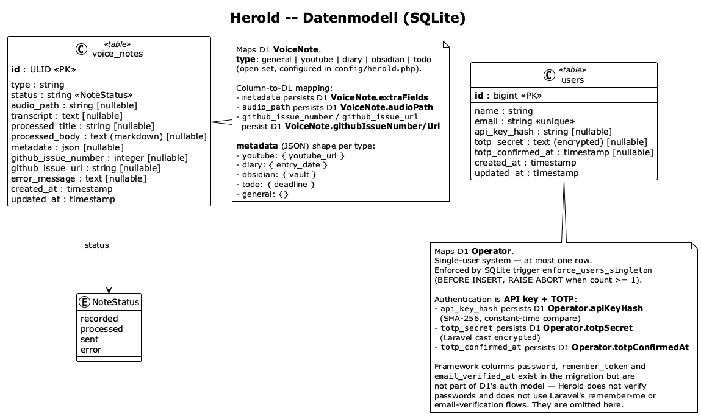

# 8 Cross-cutting Concepts

This chapter documents the concepts that span multiple building blocks. The *strategies* are fixed, implementation-free, at spec level in [`N2 — Cross-cutting Concepts`](../spec/N2-querschnittskonzepte.md); each section here records how the strategy is **realised in code** — classes, config keys, algorithms — and names deviations where the implementation differs from the spec (consolidated as debt [D-07](A11-risks-and-technical-debts.md#112-technical-debts)). Sections 8.1 and 8.9–8.11 have no N2 counterpart; they are architecture-native concepts (persistence mapping, audio handling, UI, development).

| § | Concept | Spec strategy |
|---|---------|---------------|
| [8.1](#81-domain-model-and-persistence) | Domain model and persistence | [D1](../spec/D1-datenmodell.md), [D2](../spec/D2-datentypen.md) |
| [8.2](#82-type-driven-configuration) | Type-driven configuration | [N2.2](../spec/N2-querschnittskonzepte.md#n22-type-driven-configuration) |
| [8.3](#83-validation) | Validation | [N2.3](../spec/N2-querschnittskonzepte.md#n23-validation) |
| [8.4](#84-authentication-and-session) | Authentication and session | [N2.4](../spec/N2-querschnittskonzepte.md#n24-authentication-and-session) |
| [8.5](#85-content-sanitisation) | Content sanitisation | [N2.7](../spec/N2-querschnittskonzepte.md#n27-content-sanitisation) |
| [8.6](#86-failure-handling) | Failure handling | [N2.5](../spec/N2-querschnittskonzepte.md#n25-failure-handling) |
| [8.7](#87-logging) | Logging | [N2.6](../spec/N2-querschnittskonzepte.md#n26-logging) |
| [8.8](#88-secret-handling) | Secret handling | [N2.8](../spec/N2-querschnittskonzepte.md#n28-secret-handling) |
| [8.9](#89-audio-capture-and-storage) | Audio capture and storage | — |
| [8.10](#810-ui-architecture) | UI architecture | — |
| [8.11](#811-development-and-test-concept) | Development and test concept | — |

---

## 8.1 Domain model and persistence

The physical schema is the SQLite realisation of the D1 information model:



*Source: [`diagrams/relational-datamodel.plantuml`](diagrams/relational-datamodel.plantuml). Kept in sync with every schema change ([CONV-06](A02-architecture-constraints.md#23-conventions)).*

**Table-to-D1 mapping.**

| D1 entity | Physical realisation |
|-----------|----------------------|
| [`VoiceNote`](../spec/D1-datenmodell.md#voicenote) | Table `voice_notes`; model `App\Models\VoiceNote` with `HasUlids` — the ULID primary key delivers the time-sortable `Identifier` of [D2.2](../spec/D2-datentypen.md#d22-identifier) (recency ordering in UC-09 is `latest()` on `created_at`). `metadata` is a JSON column cast to `array`, holding the snake_case slot record per type (`youtube_url`, `entry_date`, `vault`, `deadline`). `status` is a string column cast to the `App\Enums\NoteStatus` backed enum. |
| [`Operator`](../spec/D1-datenmodell.md#operator) | Table `users`; model `App\Models\User`. Herold-specific columns `api_key_hash` (SHA-256 hex), `totp_secret` (Laravel `encrypted` cast — ciphertext at rest), `totp_confirmed_at`. The single-instance rule ([CON-3a-04](../spec/P1-constraints.md#con-3a-04-single-user-system)) is enforced twice: in code via `User::sole()` and in the database via the SQLite trigger `enforce_users_singleton` (`BEFORE INSERT … RAISE(ABORT)`), so even raw SQL cannot create a second operator. |
| [`RecoveryToken`](../spec/D1-datenmodell.md#recoverytoken) | Deliberately **not** a table: the file `.herold-recovery` on the `local` disk. `token` = file content, `placedAt` = file mtime ([§ 6.5](A06-runtime-view.md#65-recover-access)). |
| [`GitHubIssue` / `GitHubRepository`](../spec/D1-datenmodell.md#d12-ticket-data) | Not persisted — owned by GitHub. Herold stores only the back-references `github_issue_number` and `github_issue_url` on `voice_notes`. Repository coordinates come from configuration, not data. |

**Framework remnants.** `users.password` (seeded with an inert bcrypt value), `remember_token`, `email_verified_at`, and the stock `password_reset_tokens`, `cache*`, `jobs*` tables exist as Laravel scaffolding but participate in no Herold flow (debt [D-02](A11-risks-and-technical-debts.md#112-technical-debts)). Sessions are first-class, though: the `sessions` table backs the session guard of § 8.4.

**Migrations** run out-of-band (`php artisan migrate --force`) — automatically at container start in dev, manually via SSH in production ([§ 7.1.2](A07-deployment-view.md#712-development--docker-compose), [ORG-06](A02-architecture-constraints.md#22-organisational-constraints)). The initial migration set also *seeds* the singleton operator row from `HEROLD_API_KEY` ([S3.4](../spec/S3-inbetriebnahme.md#s34-first-commissioning) step 5).

## 8.2 Type-driven configuration

The single resolution point of [N2.2](../spec/N2-querschnittskonzepte.md#n22-type-driven-configuration) is **`config/herold.php`**, key `types`. One entry per `MessageTypeDT` value:

```php
'todo' => [
    'label' => '…', 'icon' => 'mdi-…',          // display attributes (browser-safe)
    'github_label' => 'type:todo',               // dispatch label
    'needs_current_date_context' => true,        // inject current date into the prompt
    'extra_fields' => [                          // D2.7 slot inventory
        ['name' => 'deadline', 'type' => 'date', 'required' => false, 'label' => '…'],
    ],
    'preprocessing_prompt' => '…',               // server-only (NFR-15b-02)
],
```

Consumers and their access paths:

| Consumer | Uses |
|----------|------|
| `MessageTypeRegistry` | Browser-safe projection: `all()` strips `preprocessing_prompt` and `needs_current_date_context` before types reach Inertia props or `GET /types`. |
| `StoreVoiceNoteRequest` / `VoiceNoteController::update` | `type` validated against `array_keys(config('herold.types'))`; per-type `extra_fields` become validation rules (`url` → `url`, `date` → `date_format:Y-m-d`, else `string`). |
| `PreprocessingService` | `preprocessing_prompt`, `extra_fields` (extraction schema), `needs_current_date_context`. |
| `IssueContentSanitizer` | `extra_fields` labels for the `## Metadata` section. |
| `VoiceNoteController::send` | `github_label` → the issue's single label. |

No consumer hard-codes a type name; `TypeExtensionTest` proves that a new type added *only* in config is immediately capturable, validated, processed, and labelled. **Layering note:** the spec splits type definition into a code-level catalogue ([D2.4](../spec/D2-datentypen.md#d24-messagetypedt)) and host-level bindings ([NFR-14a-01](../spec/N1-nichtfunktional.md#14a-maintenance-requirements)); the implementation folds both layers into the config file — the catalogue *is* the set of config keys, which satisfies the fit criterion (bindings changeable without code edits) while making the "closed set" a convention between spec and config rather than a PHP enum.

## 8.3 Validation

Strict, schema-driven, at the two boundaries that accept operator input ([N2.3](../spec/N2-querschnittskonzepte.md#n23-validation)):

- **Capture** (`POST /notes` → `StoreVoiceNoteRequest`): `audio` required, `mimetypes:audio/webm,video/webm,audio/ogg,audio/mp4`, max 25 600 KB (= the 25 MB of [NFR-15a-03](../spec/N1-nichtfunktional.md#15a-access-requirements)); `type` must be a configured key; per-type metadata rules as in § 8.2. `validated()` additionally intersects `metadata` against the declared slot names — unknown keys are dropped, empty values nulled, so nothing undeclared ever reaches the JSON column.
- **Edit** (`PUT /notes/{note}` → `VoiceNoteController::update`): same per-type rule construction against the *bound* type, plus free-text rules for `transcript`, `processed_title` (max 255), `processed_body`; the same key-intersection filter applies.

Failures return standard Laravel 422 field errors that Inertia surfaces inline; nothing is persisted on rejection. Rate limits complement validation at the same boundary: `throttle:10,60` on capture (deviation from the spec's 20/h — [D-07](A11-risks-and-technical-debts.md#112-technical-debts)(c)), `throttle:5,1` on both sign-in factors, `throttle:5,60` on recovery.

## 8.4 Authentication and session

Realisation of [N2.4](../spec/N2-querschnittskonzepte.md#n24-authentication-and-session), concentrated in `AuthController` ([§ 6.4](A06-runtime-view.md#64-sign-in-with-inline-totp-enrolment)):

- **Factor 1 — API key.** Presented at `POST /login/key`, hashed with SHA-256 and compared via `hash_equals` against `users.api_key_hash`. Success is held as the session flag `auth.key_verified` — not yet a login.
- **Factor 2 — TOTP.** Home-rolled RFC 6238/4226 ([TECH-13](A02-architecture-constraints.md#21-technical-constraints)), no library: 160-bit secret, custom Base32 codec, HMAC-SHA1 with dynamic truncation to 6 digits, 30 s steps, ±1 step clock-drift window, `hash_equals` comparison. Enrolment is inline on first sign-in (secret auto-generated after factor 1; `otpauth://` provisioning URI rendered as a QR client-side via the `qrcode` package; confirmed code sets `totp_confirmed_at`).
- **Session as the gate.** Only after factor 2 does `Auth::login()` run, followed by session-id regeneration and removal of the intermediate flags. Every protected route sits behind the stock session `auth` middleware — the single gate; no per-use-case checks exist. `POST /logout` invalidates the session ([UC-04](../spec/F2-anwendungsfaelle.md#uc-04--sign-out)).
- **Defence-in-depth at the edge.** `SecurityHeaders` middleware on the whole `web` group: `X-Frame-Options: DENY`, `X-Content-Type-Options: nosniff`, `Referrer-Policy: strict-origin-when-cross-origin`, `Permissions-Policy: camera=(), microphone=(self)`.
- **Recovery** replaces both factors via the out-of-band file token ([§ 6.5](A06-runtime-view.md#65-recover-access)); all rejection reasons collapse to a uniform 404 ([NFR-15a-04](../spec/N1-nichtfunktional.md#15a-access-requirements)).
- **Authorisation is degenerate** by design: one operator, one role, full access ([N2.9](../spec/N2-querschnittskonzepte.md#n29-out-of-scope-for-n2)).

## 8.5 Content sanitisation

The algorithmic core ([AF-03](../spec/F3-anwendungsfunktionen.md#af-03--markdown-sanitisation)) lives in `IssueContentSanitizer` and runs immediately before dispatch:

1. **Neutralise** — remove HTML comments (`<!-- … -->`, the classic hidden-instruction carrier), `<script>`/`<style>` blocks including content, every remaining HTML tag (`strip_tags`), `javascript:` URIs, and `data:text/html` payloads. Markdown structure (headings, lists, links, code fences) passes through untouched.
2. **Delimit** — compose the outbound body as sanitised `processed_body`, then a generated `## Metadata` section (labelled values from the type's `extra_fields`), the sections separated by `---` rules — the visual boundary between operator-derived content and application-generated structure required by [NFR-15b-04](../spec/N1-nichtfunktional.md#15b-integrity-requirements).
3. **Exclude** — neither the transcript nor any prompt material is ever part of the issue body (asserted by `IssueSanitizationTest`, including the agent-directive injection case).

**Deviation from N2.7:** the spec schedules sanitisation at *every* persistence and dispatch boundary; the implementation sanitises only the dispatched artefact — `processed_body` is persisted raw after generation ([UC-06](../spec/F2-anwendungsfaelle.md#uc-06--process-voice-note)) and after edits ([UC-07](../spec/F2-anwendungsfaelle.md#uc-07--edit-generated-content)). The dispatched issue is thereby fully covered; the persisted intermediate is not ([D-07](A11-risks-and-technical-debts.md#112-technical-debts)(b)).

## 8.6 Failure handling

Realisation of [N2.5](../spec/N2-querschnittskonzepte.md#n25-failure-handling) — synchronous, loss-free, operator-retried:

- **One catch per pipeline action.** `process` and `send` each wrap their work in a single `try/catch (\Throwable)`. The handler logs the failure (note id + message, through the redacting channel) and writes `status = NoteStatus::ERROR` plus `error_message`; the UI renders the message on the detail view.
- **Nothing is lost.** Audio file, transcript, and any generated content survive a failure; `process` clears `error_message` on entry and skips transcription when a transcript exists, so retries re-run only the failed remainder.
- **Retry asymmetry.** `process` has no status guard — it is both first run and retry. `send` admits only `status = processed`; after a failed dispatch (status `error`) the operator re-runs *Process* (which restores `processed`) and then *Send*. No speculative issue reference is ever stored on a mid-call failure ([§ 6.3](A06-runtime-view.md#63-dispatch-to-github)).
- **Realisation note.** The spec models failure as the orthogonal flag `errorMessage` with an unchanged three-value status ([D2.5](../spec/D2-datentypen.md#d25-notestatusdt)); the implementation adds `error` as a fourth `NoteStatus` case carrying the same information (visible as its own dashboard count). Semantically equivalent for retries, structurally different — [D-07](A11-risks-and-technical-debts.md#112-technical-debts)(a).
- **Validation rejections are not failures**: they surface as 422 field errors and never touch `status`/`error_message` ([§ 8.3](#83-validation)).

## 8.7 Logging

Realisation of [N2.6](../spec/N2-querschnittskonzepte.md#n26-logging):

- **Channels.** Standard Laravel Monolog stack (`single`/`daily`/`stderr` per `config/logging.php`); the log file lives on the persistent surface `storage/logs/` ([S3.3](../spec/S3-inbetriebnahme.md#s33-persistent-state-surfaces)).
- **Redaction is structural, not disciplinary.** Every one of those channels carries the tap `App\Logging\RedactSecrets`, which installs `SecretRedactionProcessor` into Monolog. The processor masks (a) the concrete values of `app.key`, `herold.api_key`, `herold.github.token`, `herold.openai.api_key` wherever they appear in message or context, (b) `Bearer`/`Authorization`/session-token patterns, and (c) any context key matching `token|api_key|secret|password|authorization|bearer|session_id|session_token|cookie`. Call sites cannot opt out — the enforcement point of [NFR-15b-03](../spec/N1-nichtfunktional.md#15b-integrity-requirements), verified by `LogRedactionTest`.
- **Reference, never embed.** Pipeline events log `note_id` and a failure reason only — never transcript, generated content, or metadata values (`Log::error('Voice note processing failed.', ['note_id' => …, 'error' => …])`).
- **Security events carry source IP.** Failed key/TOTP verifications, all three recovery rejection reasons, and successful recovery are logged with `$request->ip()` — the discriminating recovery reason exists *only* here, while the operator sees the uniform 404.

## 8.8 Secret handling

Realisation of [N2.8](../spec/N2-querschnittskonzepte.md#n28-secret-handling) / [D2.6](../spec/D2-datentypen.md#d26-opaquesecret) `OpaqueSecret`:

| Secret | At rest | In transit / use |
|--------|---------|------------------|
| Operator API key | Never stored — only `users.api_key_hash` (SHA-256). | Presented once per sign-in; constant-time hash comparison; regenerated (not revealed) by recovery. |
| TOTP secret | `users.totp_secret` under Laravel's `encrypted` cast (APP_KEY-encrypted ciphertext in SQLite). | Decrypted only inside `verifyTotpCode`; surfaced exactly once at enrolment as the provisioning URI. |
| Recovery token | Operator-chosen file content, deleted on redemption or expiry. | `hash_equals` against trimmed input. |
| OpenAI key, GitHub PAT | `.env` → `config('herold.openai.api_key')` / `config('herold.github.token')`; `.env` is never deployed and never overwritten ([§ 7.2](A07-deployment-view.md#72-infrastructure-level-2--release-pipeline)). | Attached server-side as Bearer tokens by the adapters; constructors fail fast when unset. |

Guards that keep secrets (and near-secrets) off the browser channel ([NFR-15b-01](../spec/N1-nichtfunktional.md#15b-integrity-requirements)/[-02](../spec/N1-nichtfunktional.md#15b-integrity-requirements)): the `User` model hides `password`, `remember_token`, `api_key_hash`, `totp_secret` from serialisation; `MessageTypeRegistry` strips `preprocessing_prompt` from every browser-bound type projection; `SettingsController` exposes only GitHub owner/repo and the boolean TOTP state. `ApiSecurityTest` asserts all of it. Logs are covered by § 8.7.

## 8.9 Audio capture and storage

- **Capture** happens exclusively in the browser via `useAudioRecorder.ts`: `getUserMedia({audio: true})`, container preference `audio/webm;codecs=opus` → `audio/webm` → `audio/ogg;codecs=opus`; when none is supported the browser's default container is used (Safari: `audio/mp4`, which the upload validation accepts and stores as `.m4a`). Chunks arrive every 250 ms and are assembled into a single `Blob`. HTTPS is a hard prerequisite — `MediaRecorder` is unavailable on insecure origins, which is why the dev environment serves via localhost and production requires provider TLS ([S3.2](../spec/S3-inbetriebnahme.md#s32-host-preconditions)).
- **Storage** uses the `local` filesystem disk rooted at `storage/app/private/` — outside the web root, unreachable without the application. Path pattern `audio/{ulid}.{webm|ogg|m4a}`, extension derived from the actual MIME type at upload.
- **Playback** streams through the authenticated route `GET /notes/{note}/audio` (`response()->file` with the stored MIME type); there is no public URL to an audio file.
- **Lifecycle** follows [D1.1](../spec/D1-datenmodell.md#voicenote): created at capture, kept for the note's entire lifetime (no pruning, no retention timer), deleted together with the row in `destroy` — file first, then row.

## 8.10 UI architecture

- **Inertia as the only browser contract** ([ADR-001](A09-architecture-decisions.md#adr-001-inertiajs-as-frontend-bridge-no-separate-api-layer-for-the-browser-ui)): Laravel controllers return `Inertia::render(page, props)`; routing, auth, and validation stay server-side; the Vue layer renders props and posts forms. The two non-Inertia endpoints (`/types` JSON, audio streaming) are deliberate, session-guarded exceptions.
- **Vuetify Material Design** with two custom themes (`heroldDark` default, `heroldLight`), MDI icons, and the responsive chrome of `AppLayout.vue` — navigation drawer on desktop, bottom navigation on mobile — fulfilling [NFR-10a-01](../spec/N1-nichtfunktional.md#10a-appearance-requirements) with a single codebase for both contexts ([TECH-07](A02-architecture-constraints.md#21-technical-constraints)). Visual language: [`DESIGN.md`](../../DESIGN.md).
- **State is server state.** No client store; every mutation round-trips through a controller and returns fresh props. The only client-held state is the in-progress recording and transient form state.

## 8.11 Development and test concept

- **Test pyramid, inverted deliberately.** The substantive coverage is the **Acceptance** suite (`tests/Acceptance/`, HTTP-level with faked externals): authentication and recovery (incl. rate limiting and the DB-level singleton), upload validation, the processing pipeline (incl. error preservation and retry), GitHub dispatch, sanitisation (incl. injection cases), API secret exposure, security headers, log redaction, and type extensibility. `Unit`/`Feature` hold stubs. Frontend: Vitest specs for `AppLayout` and `Login`.
- **External boundaries are faked in tests** — the adapter seams (`AIService`, `GitHubService`) are replaced with Mockery doubles via the container (`$this->app->instance(...)`), and `Storage::fake` stands in for the audio store; the real integration is exercised by the manual smoke test after commissioning/release ([S3.4](../spec/S3-inbetriebnahme.md#s34-first-commissioning)/[S3.5](../spec/S3-inbetriebnahme.md#s35-ongoing-releases)) — accepted as debt [D-03](A11-risks-and-technical-debts.md#112-technical-debts).
- **CI** (`.github/workflows/ci.yml`) runs the three suites against in-memory SQLite, `pint --test`, and a frontend build check on every push/PR; the deploy workflow is separate and tag-gated ([§ 7.2](A07-deployment-view.md#72-infrastructure-level-2--release-pipeline)).
- **Conventions**: Conventional Commits ([CONV-02](A02-architecture-constraints.md#23-conventions)), English-only code and docs ([CONV-01](A02-architecture-constraints.md#23-conventions)), spec/arch synchronisation duty ([CONV-07](A02-architecture-constraints.md#23-conventions)).
