# B1 — Dialogue Specification

Dialogue specification in the sense of Siedersleben (chapter 4.5): the operator-facing screens of Herold, the navigation between them, and the dialogue patterns shared across screens. B1 describes **what each screen offers the operator** and **how screens connect** — independently of any visual design language, component library, or front-end technology. Visual identity (colour, typography, glow, spacing) is *not* part of B1; it is fixed in `DESIGN.md` and consumed uniformly by every screen described here.

Each screen realises one or more use cases from F2; conversely, every operator-meaningful step in F2 is rendered by exactly one screen in B1. The mapping is recorded in B1.1 and re-stated per screen in B1.3. Numbering of dialogue identifiers (`DLG-xx`) is stable; once referenced from another block, an ID is not renumbered.

---

## B1.1 Dialogue Index

| ID | Screen | Group | Realises UC | Auth required |
|----|--------|-------|-------------|---------------|
| [DLG-01](#dlg-01--sign-in-first-factor) | Sign-in (first factor) | Access | UC-01 (steps 1–3) | no |
| [DLG-02](#dlg-02--second-factor-verification) | Second-factor verification | Access | UC-01 (step 5) | no (mid-flow) |
| [DLG-03](#dlg-03--second-factor-enrolment) | Second-factor enrolment | Access | UC-02 | no (mid-flow) |
| [DLG-04](#dlg-04--recovery) | Recovery | Access | UC-03 (steps 1–4) | no |
| [DLG-05](#dlg-05--recovery-result) | Recovery result | Access | UC-03 (step 6) | yes (post-recovery) |
| [DLG-06](#dlg-06--dashboard) | Dashboard | Common | — (entry hub) | yes |
| [DLG-07](#dlg-07--notes-list) | Notes list | Management | UC-09 | yes |
| [DLG-08](#dlg-08--note-detail) | Note detail | Management / Note flow | UC-10 (host); UC-06, UC-07, UC-08, UC-11 (entered from here) | yes |
| [DLG-09](#dlg-09--capture-voice-note) | Capture voice note | Note flow | UC-05 | yes |
| [DLG-10](#dlg-10--settings) | Settings | Configuration | UC-12 | yes |

The system-wide chrome (application header, navigation, sign-out control) is described in B1.4 rather than as a standalone dialogue, since it is composed onto every authenticated screen and carries no goal of its own.

The navigation map shows how the operator moves between dialogues. The two cluster backgrounds separate the unauthenticated *Access* dialogues from those reached through an *Authenticated session*. Per-dialogue fill colour mirrors the encoding used in F2: warm tones for dialogues reachable without an established session, cool tone for dialogues that require one (DLG-05 sits in between — the recovery has succeeded, but no session has yet been established).

Within the authenticated cluster the persistent navigation chrome (side nav on desktop, bottom nav on mobile) is rendered once as a fan-in choice node rather than as N×N edges, since every authenticated screen offers the same four targets — *Dashboard*, *Record*, *Notes*, *Settings* — plus the *Sign out* control that leaves the cluster entirely (see B1.4).

---

## B1.2 Per-Screen Specification Template

Each entry in B1.3 follows the same shape:

| Section | Meaning |
|---------|---------|
| **Identifier** | Stable `DLG-xx` ID. |
| **Name** | Human-readable screen name. |
| **Realises** | UC(s) from F2 and the specific scenario steps rendered here. |
| **Purpose** | One sentence on what the operator accomplishes on this screen. |
| **Entry points** | How the operator reaches this screen. |
| **Layout regions** | Logical regions of the screen (header, primary content, action area, side panels), independent of pixel layout. |
| **Inputs** | Operator-supplied fields and controls, with their dialogue-level constraints (mandatory, optional, conditional). |
| **Actions** | Operator-triggered actions available on the screen and the use case or scenario step each one drives. |
| **Outcomes** | Resulting screen transitions per action (success, failure, cancel). |
| **Validation** | Dialogue-level validation rules. Algorithmic validation lives in [N2](N2-querschnittskonzepte.md) *Validation* (backed by [D2.7](D2-datentypen.md#d27-typespecificdata)); here only what the operator sees and when. |
| **Empty / loading / error states** | What the screen presents when there is no data, while a synchronous operation runs, or when the last action failed. |
| **Qualities** | Cross-references into N1 (NFRs), N2 (cross-cutting concepts) where relevant. |

---

## B1.3 Dialogue Specifications

The screenshots embedded in this section are rendered from the static mockups in `poc-ui/`; they document the dialogue-level intent, not a binding visual design (see [§B1.5](#b15-out-of-scope-for-b1)).

### B1.3.1 Access

#### DLG-01 — Sign-in (first factor)

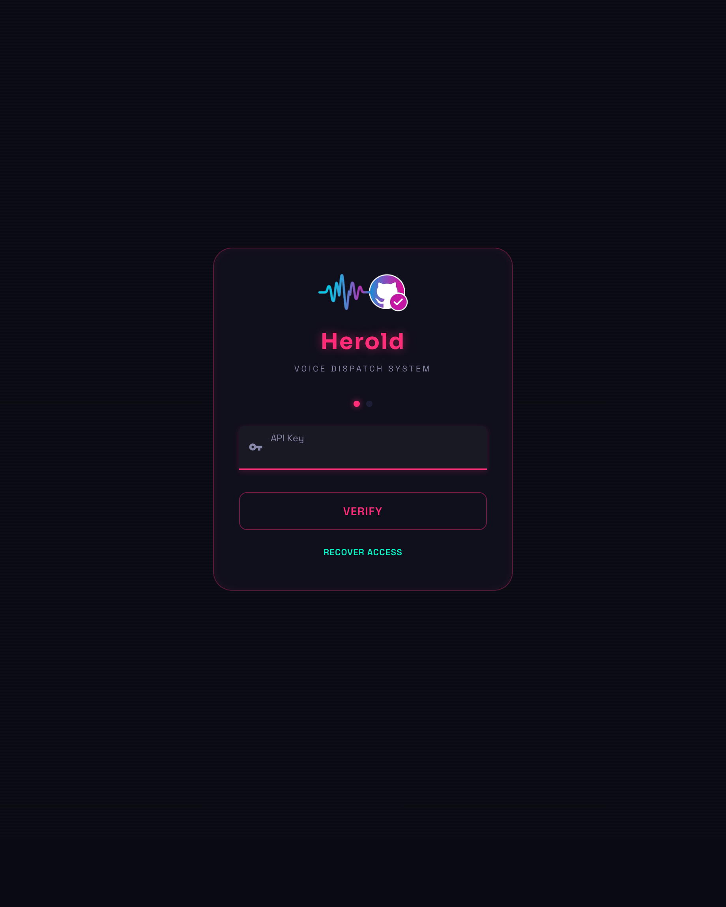

| Section | Content |
|---------|---------|
| **Identifier** | DLG-01 |
| **Name** | Sign-in (first factor) |
| **Realises** | [UC-01](F2-anwendungsfaelle.md#uc-01--sign-in) steps 1–3. |
| **Purpose** | Authenticate the operator's first factor (the API key) and route them onward — to inline second-factor enrolment (DLG-03) on the first sign-in, or to second-factor verification (DLG-02) on every subsequent sign-in. |
| **Entry points** | Operator opens Herold without an active session; redirected here from any authenticated screen by the *Unauthenticated redirect* pattern ([§B1.4.2](#b142-unauthenticated-redirect)); returned here after [UC-04](F2-anwendungsfaelle.md#uc-04--sign-out) *Sign out*. |
| **Layout regions** | Brand header; single-column form region with the API-key field; primary action; secondary recovery link. |
| **Inputs** | API key (mandatory). |
| **Actions** | *Verify* — submits the API key for first-factor verification. *Recover Access* — pivots to DLG-04 ([UC-03](F2-anwendungsfaelle.md#uc-03--recover-access)) when the operator cannot complete sign-in. |
| **Outcomes** | *First sign-in (no confirmed second factor bound):* DLG-03. *Subsequent sign-in (confirmed second factor bound):* DLG-02. *Verification fails:* remains on DLG-01 with a generic error; retry within the rate limit. *Recover Access:* DLG-04. |
| **Validation** | Dialogue-level: API key field must not be empty. Algorithmic verification of the key against the stored credential lives in [N2](N2-querschnittskonzepte.md). |
| **Empty / loading / error states** | *Empty:* clean field on first display. *Loading:* *Synchronous operation feedback* ([§B1.4.3](#b143-synchronous-operation-feedback)) while verification runs. *Error:* *Synchronous error handling* ([§B1.4.4](#b144-synchronous-error-handling)) and *Form validation feedback* ([§B1.4.6](#b146-form-validation-feedback)); rate-limit lockout surfaces per [NFR-15a-02](N1-nichtfunktional.md) *Login Rate Limiting and Lockout*. |
| **Qualities** | [NFR-15a-01](N1-nichtfunktional.md) *Two-Factor Browser Authentication*; [NFR-15a-02](N1-nichtfunktional.md) *Login Rate Limiting and Lockout*. |

#### DLG-02 — Second-factor verification

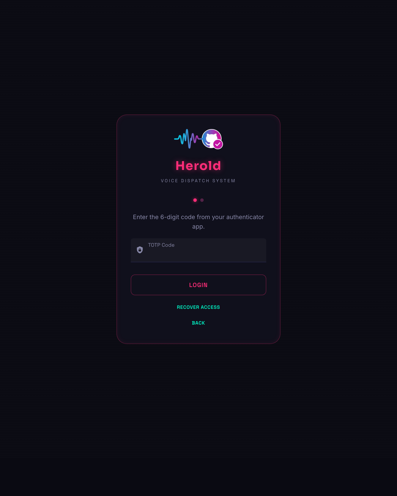

| Section | Content |
|---------|---------|
| **Identifier** | DLG-02 |
| **Name** | Second-factor verification |
| **Realises** | [UC-01](F2-anwendungsfaelle.md#uc-01--sign-in) step 5 (subsequent sign-in branch). |
| **Purpose** | Verify the time-based one-time password as the second factor on a subsequent sign-in, and complete the establishment of the authenticated session. |
| **Entry points** | Reached only from DLG-01 after a successful first-factor verification, when a confirmed second-factor secret is bound to the account. |
| **Layout regions** | Brand header; instruction text; single-column form region with the one-time-code field; primary action; secondary recovery and back links. |
| **Inputs** | One-time code (mandatory; six numeric digits). |
| **Actions** | *Login* — submits the code for second-factor verification. *Recover Access* — pivots to DLG-04 (the [UC-01](F2-anwendungsfaelle.md#uc-01--sign-in) exception path when the second factor cannot be produced). *Back* — returns to DLG-01. |
| **Outcomes** | *Verification succeeds:* authenticated session established; route to DLG-06. *Verification fails:* remains on DLG-02 with a generic error; retry within the rate limit. *Recover Access:* DLG-04. |
| **Validation** | Dialogue-level: code field is required and accepts exactly six numeric digits. |
| **Empty / loading / error states** | *Loading* and *error* per *Synchronous operation feedback* ([§B1.4.3](#b143-synchronous-operation-feedback)) and *Synchronous error handling* ([§B1.4.4](#b144-synchronous-error-handling)); rate-limit lockout per [NFR-15a-02](N1-nichtfunktional.md). |
| **Qualities** | [NFR-15a-01](N1-nichtfunktional.md) *Two-Factor Browser Authentication*; [NFR-15a-02](N1-nichtfunktional.md) *Login Rate Limiting and Lockout*. |

#### DLG-03 — Second-factor enrolment

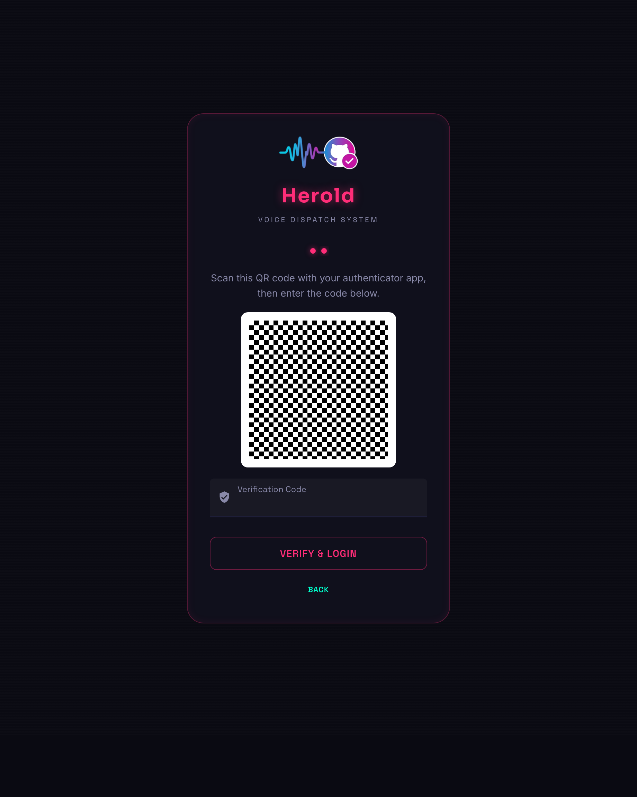

| Section | Content |
|---------|---------|
| **Identifier** | DLG-03 |
| **Name** | Second-factor enrolment |
| **Realises** | [UC-02](F2-anwendungsfaelle.md#uc-02--enrol-second-factor). |
| **Purpose** | Bind a fresh second-factor secret to the account and have the operator confirm it from their authenticator, so that subsequent sign-ins (DLG-02) can verify it. |
| **Entry points** | Inline from DLG-01 when no confirmed second-factor secret is bound (first sign-in); reached again after [UC-03](F2-anwendungsfaelle.md#uc-03--recover-access) recovery has unbound the prior secret and the operator returns to sign in. |
| **Layout regions** | Brand header; instruction text; provisioning region rendering the new secret in a form an authenticator app can capture (and as raw fallback); single-column form region with the confirmation-code field; primary action; back link. |
| **Inputs** | Confirmation code (mandatory; six numeric digits, derived by the authenticator from the displayed secret). |
| **Actions** | *Verify & Login* — submits the confirmation code; on success the secret is marked confirmed and the in-flight sign-in completes. *Back* — returns to DLG-01; the unconfirmed secret will be replaced on the next enrolment attempt. |
| **Outcomes** | *Confirmation succeeds:* authenticated session established; route to DLG-06. *Confirmation fails:* remains on DLG-03; the secret stays provisional; retry. |
| **Validation** | Dialogue-level: code field is required and accepts exactly six numeric digits. |
| **Empty / loading / error states** | *One-time secret display* ([§B1.4.8](#b148-one-time-secret-display)) — the raw secret is rendered on this screen only and is not retrievable later; if the operator abandons setup before confirming, [UC-02](F2-anwendungsfaelle.md#uc-02--enrol-second-factor) is repeated and a new secret is generated. *Loading* and *error* per [§B1.4.3](#b143-synchronous-operation-feedback) and [§B1.4.4](#b144-synchronous-error-handling). |
| **Qualities** | [NFR-15a-01](N1-nichtfunktional.md) *Two-Factor Browser Authentication*. No backup-code list is offered; the recovery path for a lost authenticator is DLG-04 (UC-03). |

#### DLG-04 — Recovery

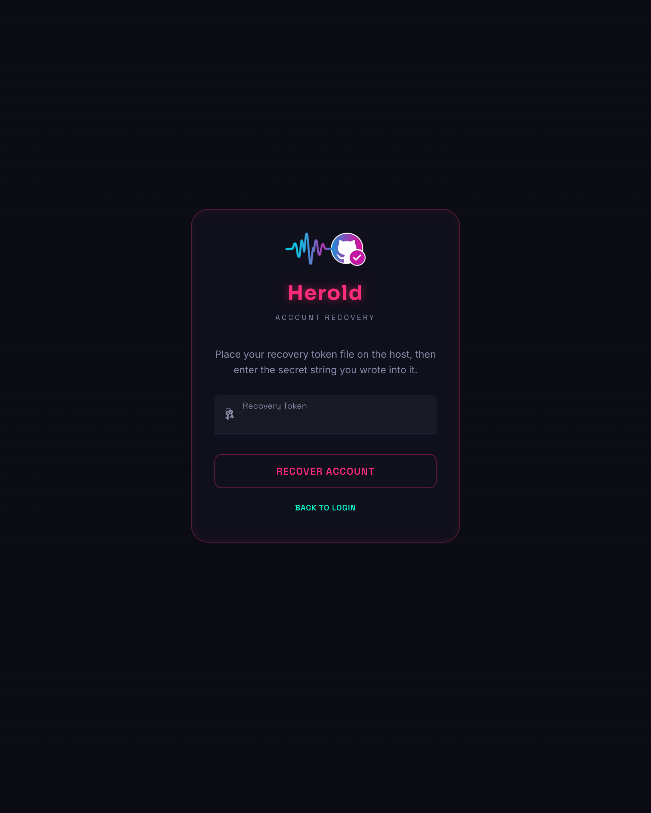

| Section | Content |
|---------|---------|
| **Identifier** | DLG-04 |
| **Name** | Recovery |
| **Realises** | [UC-03](F2-anwendungsfaelle.md#uc-03--recover-access) steps 1–4. |
| **Purpose** | Let the operator regain access to a locked-out account by redeeming a one-time recovery token they placed on the host out-of-band. |
| **Entry points** | Reached from DLG-01 or DLG-02 via the *Recover Access* link. |
| **Layout regions** | Brand header; instruction text describing the out-of-band precondition (operator must have placed a recovery token on the host); single-column form region with the recovery-secret field; primary action; back link to DLG-01. |
| **Inputs** | Recovery-token secret string (mandatory). The token's content was chosen by the operator when placing the file on the host. |
| **Actions** | *Recover Account* — submits the entered secret for redemption. *Back to Login* — returns to DLG-01 without redeeming. |
| **Outcomes** | *Redemption succeeds:* authenticated session established by the system; the bound second factor is unbound, a fresh API key is generated, and the screen transitions to DLG-05 to display it. *Redemption fails (no token present, token expired, or entered string does not match):* remains on DLG-04 with a single generic rejection that does not disclose which condition was hit; rate-limited and logged. |
| **Validation** | Dialogue-level: secret field must not be empty. The token's existence, age, and content are checked server-side and surface here as one undifferentiated rejection per [UC-03](F2-anwendungsfaelle.md#uc-03--recover-access) exception scenarios. |
| **Empty / loading / error states** | *Loading* per *Synchronous operation feedback* ([§B1.4.3](#b143-synchronous-operation-feedback)); *error* per *Synchronous error handling*, but with the generic-rejection wording stipulated by UC-03. |
| **Qualities** | [NFR-15a-02](N1-nichtfunktional.md) *Login Rate Limiting and Lockout* (recovery branch); [NFR-15a-04](N1-nichtfunktional.md) *Recovery Token Expiry*. |

#### DLG-05 — Recovery result

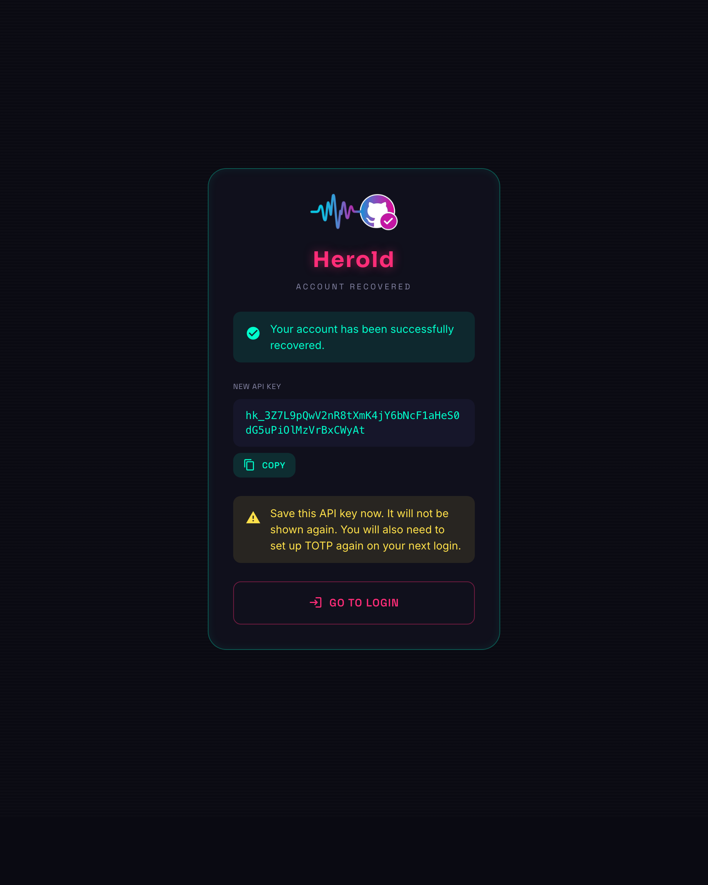

| Section | Content |
|---------|---------|
| **Identifier** | DLG-05 |
| **Name** | Recovery result |
| **Realises** | [UC-03](F2-anwendungsfaelle.md#uc-03--recover-access) step 6 (one-time display of the new API key). |
| **Purpose** | Display the freshly generated API key to the operator exactly once so they can record it before leaving the screen. |
| **Entry points** | Reached automatically after a successful redemption on DLG-04. The screen is unreachable by direct navigation. |
| **Layout regions** | Brand header (visually distinct from the primary recovery cluster — the *One-time secret display* pattern in [§B1.4.8](#b148-one-time-secret-display) marks the screen as a one-shot); success indicator; new-API-key region with copy affordance; warning region restating the irretrievability of the key and the requirement to re-enrol the second factor on the next sign-in; primary action to leave the cluster. |
| **Inputs** | None. |
| **Actions** | *Copy* — copies the new API key to the operator's clipboard. *Go to Login* — leaves the recovery cluster and routes to DLG-01; the operator's next sign-in will trigger DLG-03 inline, since no confirmed second factor is bound after recovery. |
| **Outcomes** | *Continue:* DLG-01. *Operator closes the screen before recording the key:* the key cannot be retrieved; the operator must restart [UC-03](F2-anwendungsfaelle.md#uc-03--recover-access) with a freshly placed recovery token. |
| **Validation** | Not applicable (no operator input). |
| **Empty / loading / error states** | Not applicable; this screen has only a success representation. |
| **Qualities** | *One-time secret display* ([§B1.4.8](#b148-one-time-secret-display)). The screen is reachable only with a session already established; it sits in the unauthenticated cluster of B1.1's navigation map only because no second factor is yet bound. |

### B1.3.2 Common

#### DLG-06 — Dashboard

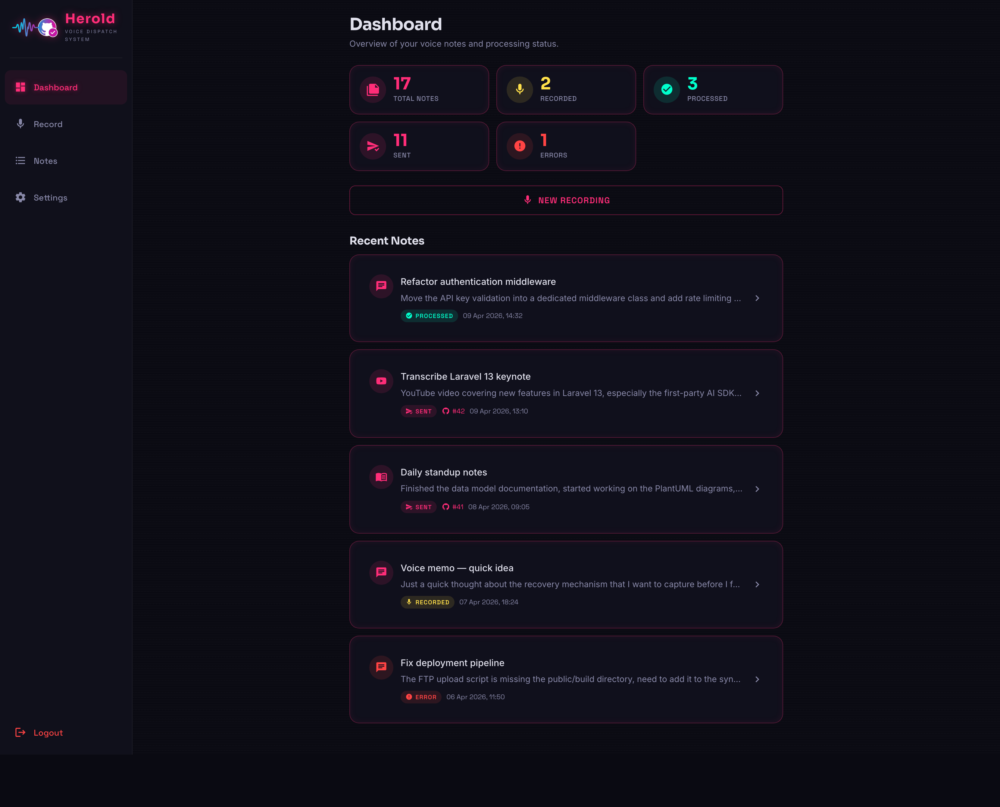

| Section | Content |
|---------|---------|
| **Identifier** | DLG-06 |
| **Name** | Dashboard |
| **Realises** | — (entry hub after sign-in; no F2 use case of its own). |
| **Purpose** | Give the operator an at-a-glance view of their voice-note activity by status, surface the most recent notes, and offer the most common forward action — capturing a new note. |
| **Entry points** | Default destination after a successful sign-in (UC-01); *Dashboard* item in the persistent navigation chrome ([§B1.4.1](#b141-application-chrome)). |
| **Layout regions** | Persistent navigation chrome; page header; status-overview tiles (one per processing state, with counts); primary capture entry point; recent-notes region listing the last few notes with title, summary, status, message-type indicator, issue reference (if dispatched), and timestamp. |
| **Inputs** | None. |
| **Actions** | *New Recording* — routes to DLG-09 ([UC-05](F2-anwendungsfaelle.md#uc-05--capture-voice-note)). *Open a recent note* — routes to DLG-08 ([UC-10](F2-anwendungsfaelle.md#uc-10--view-a-voice-note)). |
| **Outcomes** | Navigational only; the dashboard itself does not change state. |
| **Validation** | Not applicable. |
| **Empty / loading / error states** | *Empty:* when no notes exist, the recent-notes region uses the *Empty states* pattern ([§B1.4.7](#b147-empty-states)); the *New Recording* action remains visible. *Loading/error* of the underlying data follows the cross-cutting patterns in [§B1.4](#b14-cross-cutting-dialogue-patterns). |
| **Qualities** | *Application chrome* ([§B1.4.1](#b141-application-chrome)). |

### B1.3.3 Note Flow

#### DLG-09 — Capture voice note

The screen has three states reflecting the capture lifecycle. The operator moves through them in order, but may discard at any point and return to *idle*.

*Idle — ready to record:*

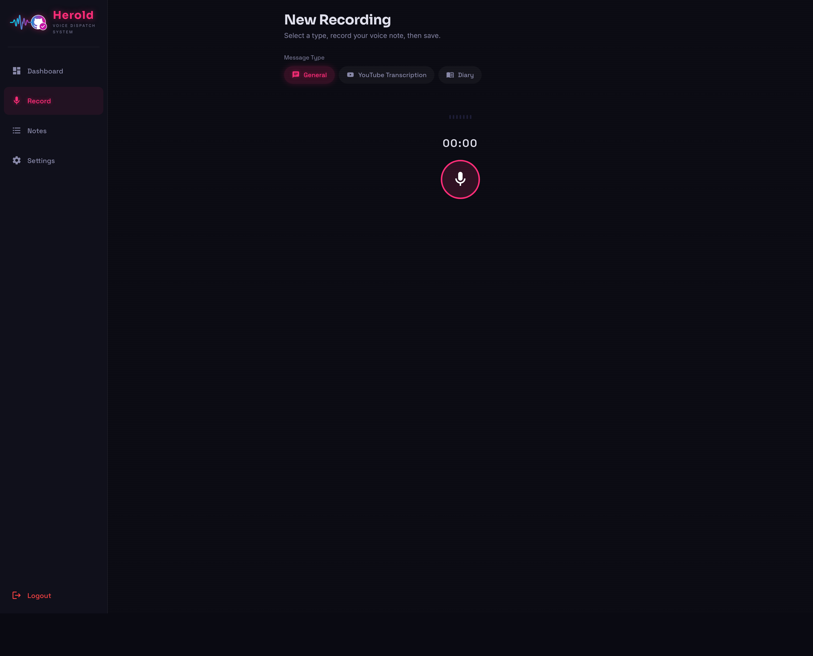

*Recording — active capture:*

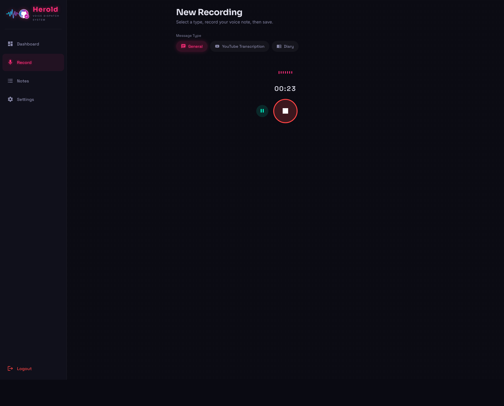

*Review — playback after recording:*

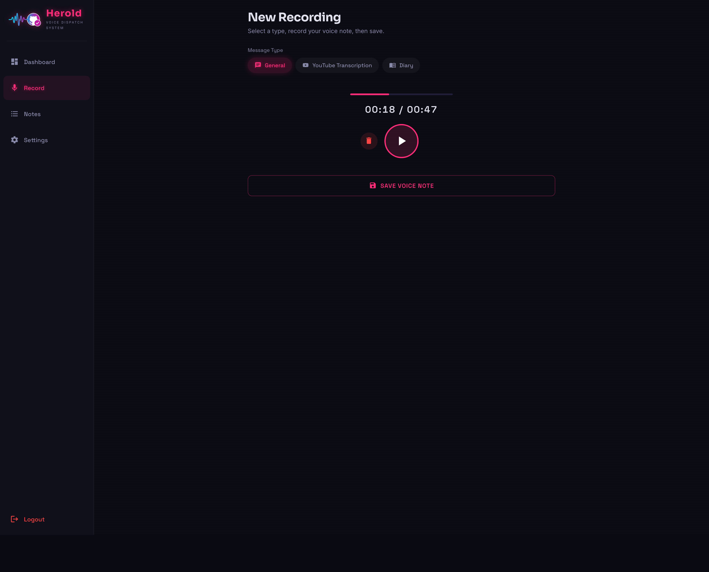

| Section | Content |
|---------|---------|
| **Identifier** | DLG-09 |
| **Name** | Capture voice note |
| **Realises** | [UC-05](F2-anwendungsfaelle.md#uc-05--capture-voice-note). |
| **Purpose** | Let the operator pick a message type, record an audio note in the browser, supply any extra fields the type declares, and submit the result for later processing. |
| **Entry points** | *Record* item in the navigation chrome; *New Recording* action on DLG-06. |
| **Layout regions** | Navigation chrome; page header; message-type selector listing the configured message types ([E2](E2-glossar.md) *message type*); type-driven extra-fields region (revealed only when the active type declares extra fields per [D2.4](D2-datentypen.md#d24-messagetypedt)/[D2.7](D2-datentypen.md#d27-typespecificdata)); audio capture region with a level indicator, an elapsed-time indicator, a primary record-or-stop control, and a secondary pause control; review region (visible only after capture) with playback, save, and discard. |
| **Inputs** | Message type (mandatory; one of the configured types). Type-specific extra fields (mandatory or optional per the active type's schema in [D2.7](D2-datentypen.md#d27-typespecificdata)). Audio recording (mandatory; produced by the operator's microphone). |
| **Actions** | *Start recording* — moves the screen from *idle* to *recording*. *Pause / Resume* — suspends and resumes capture without committing. *Stop* — ends capture and moves the screen to *review*. *Play / Re-record* — replays the captured audio or returns to *idle* to start over (discards the local capture). *Save* — submits the recording and metadata; on success transitions the note to status `recorded` ([D2.5](D2-datentypen.md#d25-notestatusdt)) and routes to DLG-08. |
| **Outcomes** | *Save succeeds:* DLG-08, with the note in `recorded` state. *Re-record:* discards the in-browser capture, returns to *idle*; nothing is persisted ([UC-05](F2-anwendungsfaelle.md#uc-05--capture-voice-note) cancellation alternative). |
| **Validation** | Dialogue-level: a message type must be selected; type-declared extra fields are validated per their schema; the captured audio must satisfy [NFR-15a-03](N1-nichtfunktional.md) *Audio Upload Validation*. Algorithmic validation lives in [N2](N2-querschnittskonzepte.md) *Validation*. |
| **Empty / loading / error states** | *Idle* (initial): no capture yet; record control prominent. *Recording:* live indicators; record control replaced by stop+pause. *Review:* playback and save/discard. *Error:* per *Synchronous error handling* ([§B1.4.4](#b144-synchronous-error-handling)) — covers microphone-permission denial, audio that violates the upload constraints, and submission failures. |
| **Qualities** | [NFR-13a-01](N1-nichtfunktional.md) *Mobile Usage on the Go* (the recording region is the primary target on small screens — see *Mobile usage* in [§B1.4.9](#b149-mobile-usage)); [NFR-15a-03](N1-nichtfunktional.md) *Audio Upload Validation*. |

### B1.3.4 Management

#### DLG-07 — Notes list

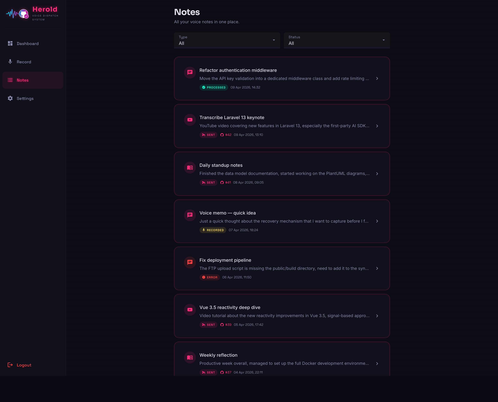

| Section | Content |
|---------|---------|
| **Identifier** | DLG-07 |
| **Name** | Notes list |
| **Realises** | [UC-09](F2-anwendungsfaelle.md#uc-09--browse-voice-notes). |
| **Purpose** | Let the operator browse the full collection of voice notes ordered by recency, narrow the view by message type or status, and select one for inspection. |
| **Entry points** | *Notes* item in the navigation chrome; *Back to Notes* affordance from DLG-08. |
| **Layout regions** | Navigation chrome; page header; filter region with two narrowing controls (message type and processing status); list region with one row per note, showing message-type indicator, title, summary, status badge, issue reference (if dispatched), timestamp, and an open-detail affordance. |
| **Inputs** | Message-type filter (optional; defaults to *All*). Status filter (optional; defaults to *All*). |
| **Actions** | *Open a note row* — routes to DLG-08 ([UC-10](F2-anwendungsfaelle.md#uc-10--view-a-voice-note)). *Change a filter* — narrows or widens the list in place. |
| **Outcomes** | Selecting a note transitions to DLG-08; changing a filter re-renders the list without leaving DLG-07. |
| **Validation** | Not applicable (filters are pre-constrained selections). |
| **Empty / loading / error states** | *Empty (no notes yet):* *Empty states* pattern ([§B1.4.7](#b147-empty-states)); the operator is invited to capture a note. *Empty after filtering:* explanation that the current filter combination has no matches. *Loading/error* per [§B1.4](#b14-cross-cutting-dialogue-patterns). |
| **Qualities** | *Application chrome* ([§B1.4.1](#b141-application-chrome)) and *Empty states* ([§B1.4.7](#b147-empty-states)). |

#### DLG-08 — Note detail

DLG-08 hosts [UC-10](F2-anwendungsfaelle.md#uc-10--view-a-voice-note) and is the entry point for [UC-06](F2-anwendungsfaelle.md#uc-06--process-voice-note), [UC-07](F2-anwendungsfaelle.md#uc-07--edit-generated-content), [UC-08](F2-anwendungsfaelle.md#uc-08--dispatch-voice-note), and [UC-11](F2-anwendungsfaelle.md#uc-11--delete-a-voice-note). The screen renders the note's three lifecycle stages (`recorded`, `processed`, `sent` per [D2.5](D2-datentypen.md#d25-notestatusdt)) as a vertical timeline; the affordances offered in each stage depend on the note's current status.

*Status `recorded` — only audio playback is available; the next forward action is *Process Note* (UC-06):*

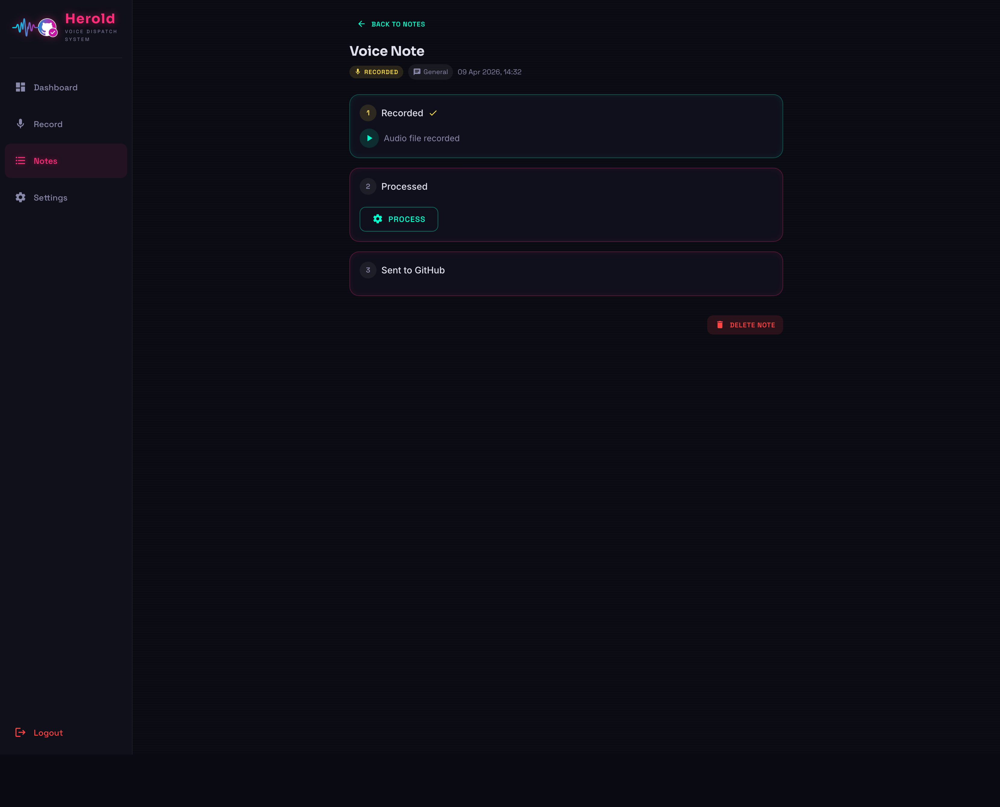

*Processing — synchronous loading state during UC-06 (per [NFR-12a-01](N1-nichtfunktional.md) *Synchronous Processing*):*

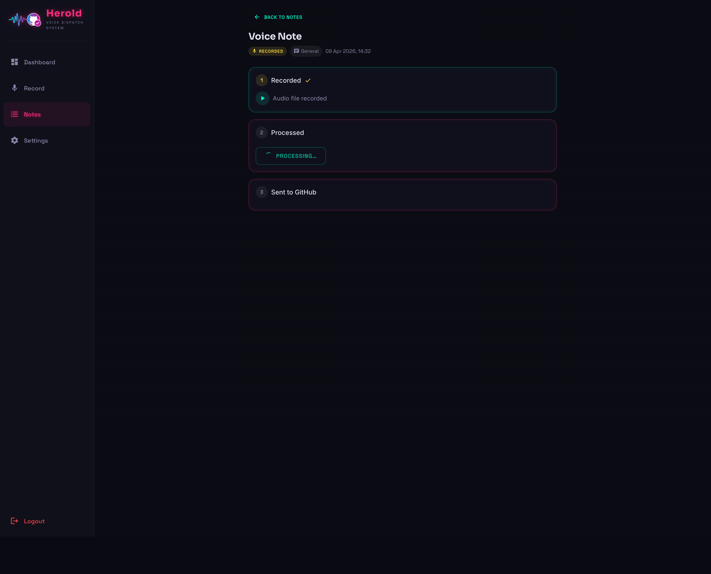

*Status `processed` — structured content is visible read-only; *Edit* (UC-07) and *Create Ticket* (UC-08) are offered:*

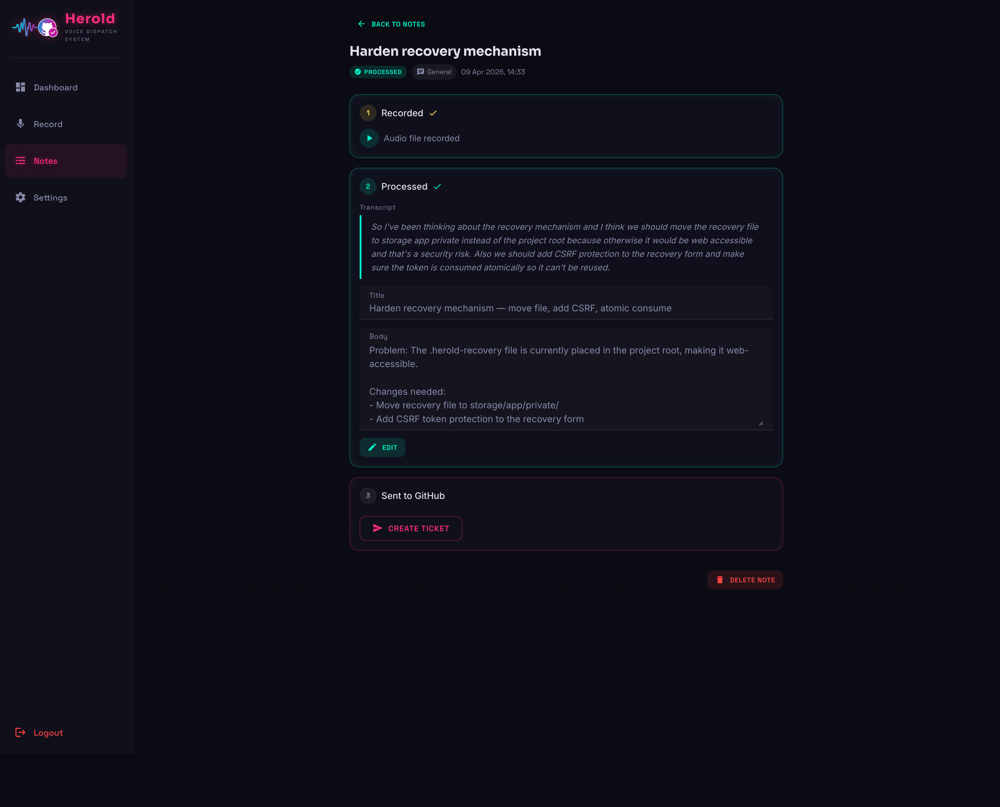

*Editing variant of the `processed` stage (UC-07) — title, body, and type-specific extra fields are editable:*

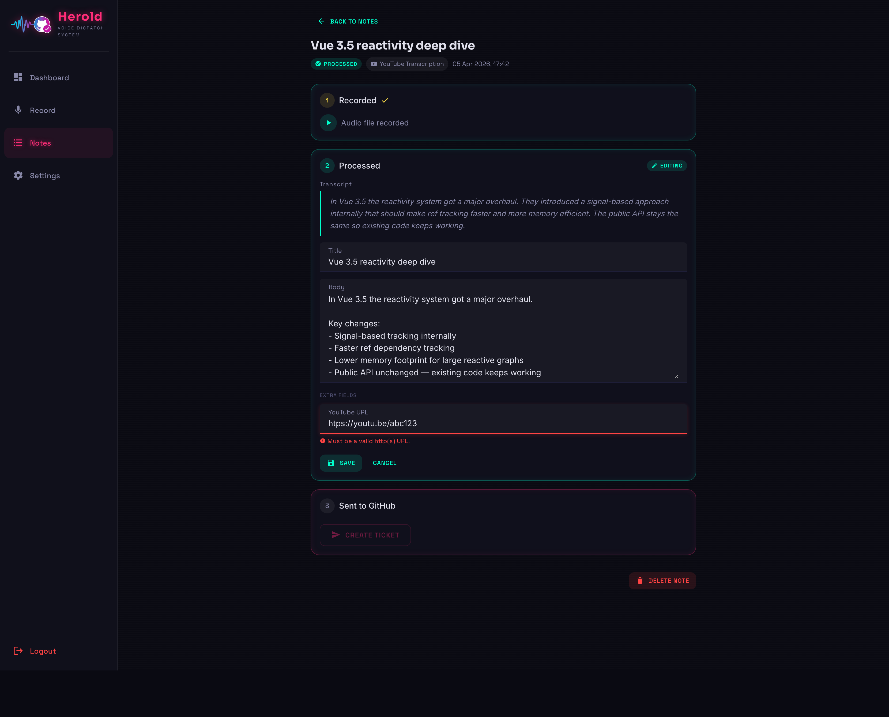

*Status `sent` — the issue reference produced by UC-08 is displayed; no further forward actions:*

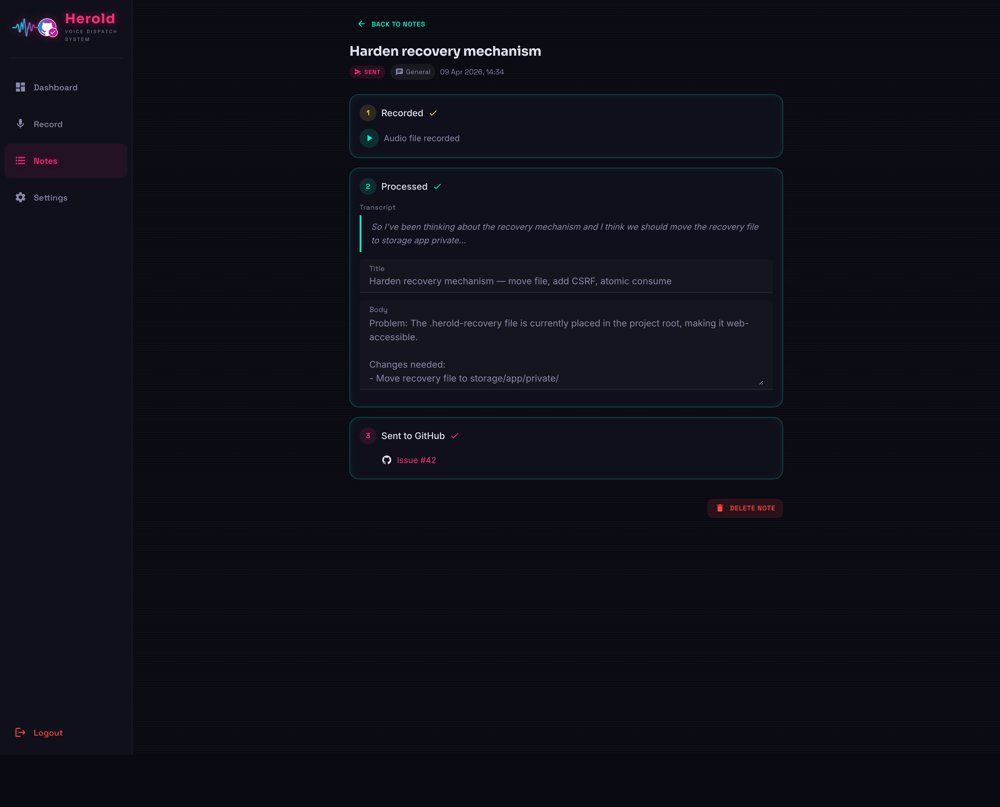

*Error — surfaces a failed synchronous operation per [NFR-12d-01](N1-nichtfunktional.md) *Synchronous Error Handling*:*

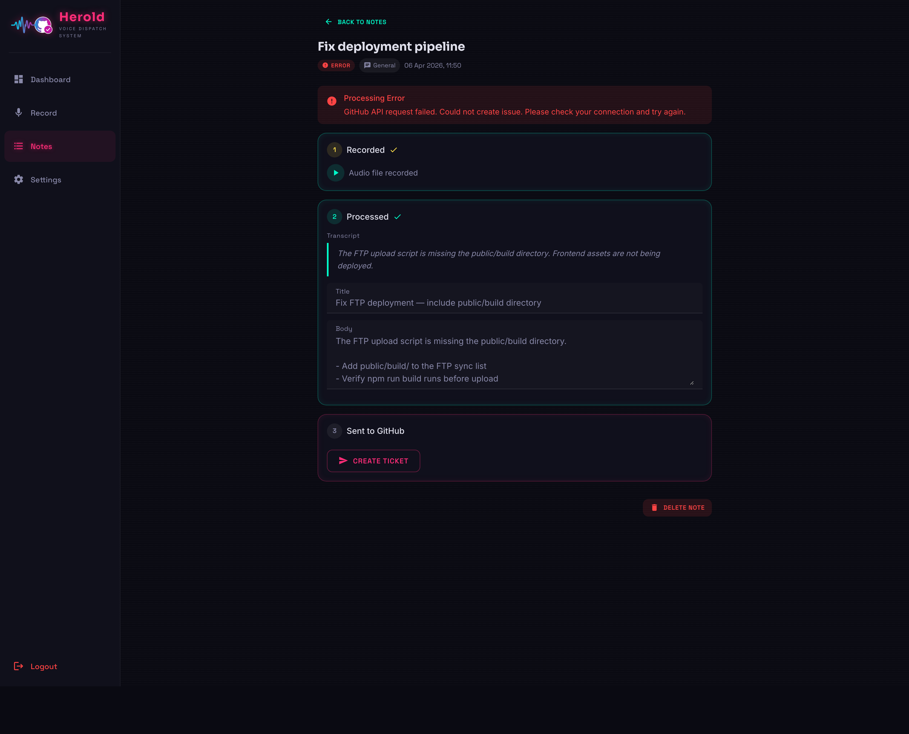

| Section | Content |
|---------|---------|
| **Identifier** | DLG-08 |
| **Name** | Note detail |
| **Realises** | [UC-10](F2-anwendungsfaelle.md#uc-10--view-a-voice-note) (host); [UC-06](F2-anwendungsfaelle.md#uc-06--process-voice-note), [UC-07](F2-anwendungsfaelle.md#uc-07--edit-generated-content), [UC-08](F2-anwendungsfaelle.md#uc-08--dispatch-voice-note), [UC-11](F2-anwendungsfaelle.md#uc-11--delete-a-voice-note) — all entered from this screen. |
| **Purpose** | Inspect a single voice note and run any further use case applicable to its current status — process it, edit the generated content, dispatch it as a GitHub issue, or delete it. |
| **Entry points** | Recent-note row on DLG-06; row click on DLG-07. |
| **Layout regions** | Navigation chrome; back-affordance to DLG-07; header with title, status badge, message-type indicator, and timestamp; lifecycle-stage region rendering the three stages (`recorded`, `processed`, `sent`) with the audio playback in the *recorded* stage, the structured content (transcript, generated title, generated body, type-specific extra fields per [D2.7](D2-datentypen.md#d27-typespecificdata)) in the *processed* stage — switching to an editing variant on demand — and the issue reference in the *sent* stage; danger region with the *Delete Note* action. |
| **Inputs** | *In editing mode (UC-07) only:* Generated title (mandatory). Generated body (mandatory; markdown). Type-specific extra fields, mandatory or optional per the active type's schema in [D2.7](D2-datentypen.md#d27-typespecificdata) (e.g. for the *YouTube Transcription* type the source URL must be a valid `http(s)` URL). |
| **Actions** | *Process Note* (status `recorded` only) — triggers the synchronous transcription + generation pipeline ([UC-06](F2-anwendungsfaelle.md#uc-06--process-voice-note)). *Edit* (status `processed` only) — switches the *processed* stage into the editing variant. *Save / Cancel* (within editing) — commits or discards the edit ([UC-07](F2-anwendungsfaelle.md#uc-07--edit-generated-content)); markdown is sanitised before persistence ([F3.AF-03](F3-anwendungsfunktionen.md#af-03--markdown-sanitisation)). *Create Ticket* (status `processed` only) — composes a GitHub issue and dispatches it ([UC-08](F2-anwendungsfaelle.md#uc-08--dispatch-voice-note)). *Delete Note* (any status) — opens the *Confirmation modals* pattern ([§B1.4.5](#b145-confirmation-modals)); on confirm, removes the note ([UC-11](F2-anwendungsfaelle.md#uc-11--delete-a-voice-note)) and routes to DLG-07. *Back to Notes* — returns to DLG-07. *Stream the audio recording* — plays the recorded audio from the *recorded* stage. |
| **Outcomes** | *Process / Save / Create Ticket succeed:* the corresponding stage is updated in place; the operator stays on DLG-08 and the next stage's affordances become available. *Delete confirmed:* DLG-07. *Back to Notes:* DLG-07. |
| **Validation** | Dialogue-level: in editing mode, mandatory fields must be non-empty and type-specific extra fields must satisfy their declared schema. Algorithmic validation lives in [N2](N2-querschnittskonzepte.md) *Validation* (backed by [D2.7](D2-datentypen.md#d27-typespecificdata)); markdown sanitisation lives in [F3.AF-03](F3-anwendungsfunktionen.md#af-03--markdown-sanitisation). |
| **Empty / loading / error states** | *Loading:* *Synchronous operation feedback* ([§B1.4.3](#b143-synchronous-operation-feedback)) replaces the affected stage's actions with a progress indicator while *Process Note* or *Create Ticket* is in flight ([NFR-12a-01](N1-nichtfunktional.md)). *Error:* *Synchronous error handling* ([§B1.4.4](#b144-synchronous-error-handling)) surfaces failures of transcription, content generation, or GitHub dispatch with retry where applicable ([NFR-12d-01](N1-nichtfunktional.md)). *Form validation:* dialogue-level errors render inline in the editing variant. |
| **Qualities** | [NFR-12a-01](N1-nichtfunktional.md) *Synchronous Processing*; [NFR-12d-01](N1-nichtfunktional.md) *Synchronous Error Handling*; [NFR-15b-04](N1-nichtfunktional.md) *Issue Content Sanitization* via [F3.AF-03](F3-anwendungsfunktionen.md#af-03--markdown-sanitisation). |

### B1.3.5 Configuration

#### DLG-10 — Settings

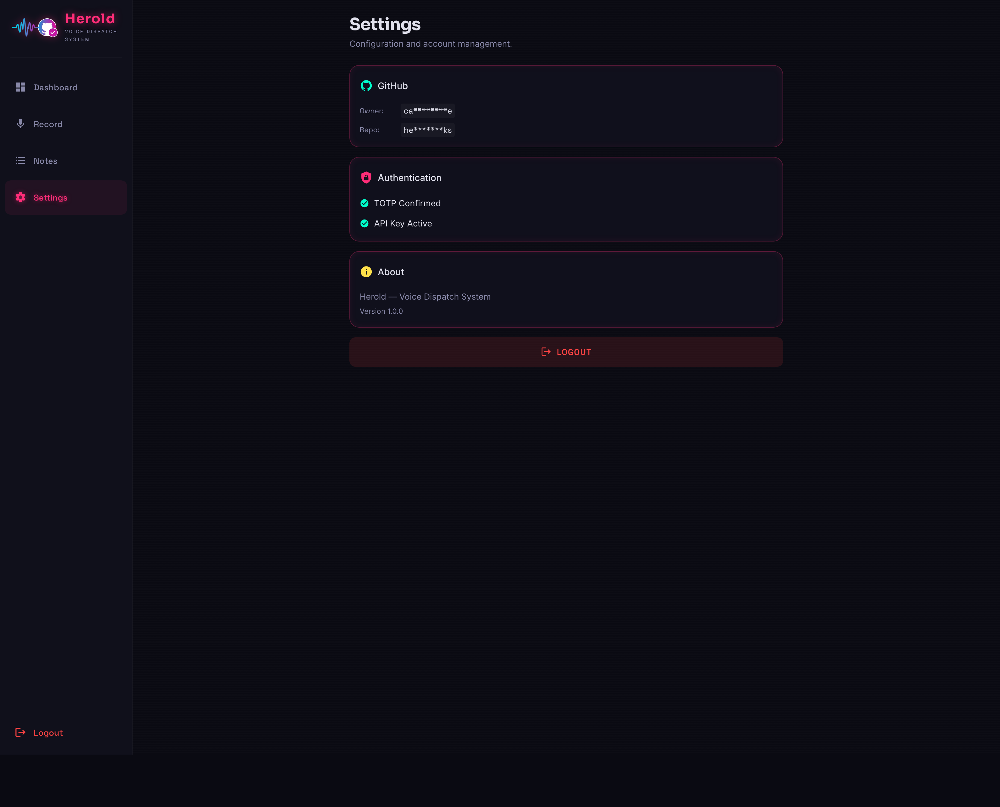

| Section | Content |
|---------|---------|
| **Identifier** | DLG-10 |
| **Name** | Settings |
| **Realises** | [UC-12](F2-anwendungsfaelle.md#uc-12--view-settings); offers a shortcut to [UC-04](F2-anwendungsfaelle.md#uc-04--sign-out). |
| **Purpose** | Let the operator inspect the active read-only system information — GitHub dispatch target, authentication state, and product identification — and offer an explicit sign-out next to it. |
| **Entry points** | *Settings* item in the navigation chrome. |
| **Layout regions** | Navigation chrome; page header; *GitHub* region with the dispatch target (owner and repository, rendered with non-secret characters partially masked); *Authentication* region with the second-factor and API-key state; *About* region with product name and version; sign-out action. |
| **Inputs** | None — the screen is read-only per [UC-12](F2-anwendungsfaelle.md#uc-12--view-settings). |
| **Actions** | *Logout* — triggers [UC-04](F2-anwendungsfaelle.md#uc-04--sign-out) (also available as part of the navigation chrome — see [§B1.4.1](#b141-application-chrome)). |
| **Outcomes** | *Logout:* session invalidated; route to DLG-01. *No other state change is possible from this screen* — configuration changes happen out-of-band on the host (see P1 constraints). |
| **Validation** | Not applicable. |
| **Empty / loading / error states** | None expected for the page itself; the displayed values are static configuration plus per-account state. |
| **Qualities** | *Application chrome* ([§B1.4.1](#b141-application-chrome)); read-only nature aligns with the P1 constraint that configuration is host-managed. |

---

## B1.4 Cross-cutting Dialogue Patterns

Patterns reused across multiple screens. Each subsection describes the pattern once; the per-screen specifications in B1.3 only reference the subsection by name.

### B1.4.1 Application chrome

Every authenticated screen (DLG-06 to DLG-10) is wrapped in the same persistent navigation surface offering the four primary destinations — *Dashboard* (DLG-06), *Record* (DLG-09), *Notes* (DLG-07), *Settings* (DLG-10) — plus a *Sign out* control that realises [UC-04](F2-anwendungsfaelle.md#uc-04--sign-out). The control's position is layout-adaptive (a persistent side rail on the desktop form factor and a bottom-edge bar on mobile per [§B1.4.9](#b149-mobile-usage)), but its inventory is invariant. The chrome is rendered identically across all authenticated screens; the active destination is highlighted. The chrome is absent on every screen in [§B1.3.1](#b131-access) (Access), since no session is established yet.

*Desktop chrome — persistent side rail with brand, four destinations, and a sign-out anchored at the bottom:*

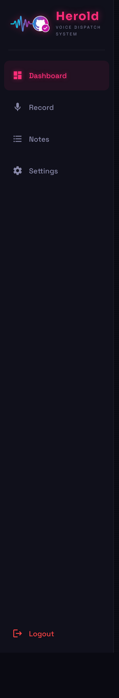

*Mobile chrome — same destinations rendered as a bottom-edge bar; the brand becomes a header element:*

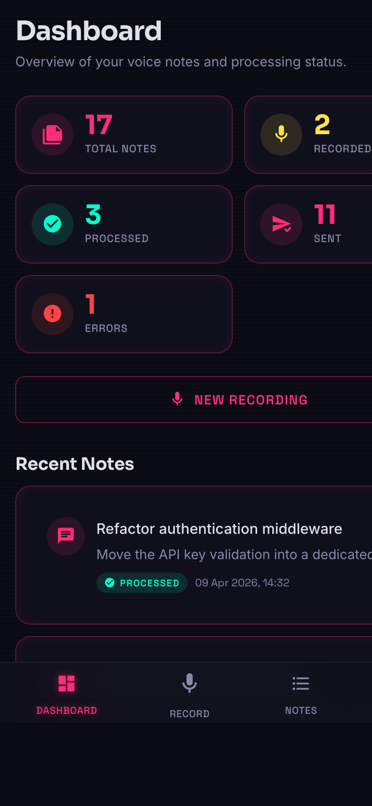

### B1.4.2 Unauthenticated redirect

When the operator addresses any authenticated screen (DLG-06 to DLG-10) without an active session — for example after the session has been invalidated by [UC-04](F2-anwendungsfaelle.md#uc-04--sign-out) or has otherwise expired — the system routes them to DLG-01 instead of rendering the requested screen. No partial content of the requested screen is shown. After a successful sign-in the operator lands on DLG-06; the originally requested screen is *not* re-resolved post-login (deep-link preservation is out of scope).

### B1.4.3 Synchronous operation feedback

Operations that block the HTTP request per [NFR-12a-01](N1-nichtfunktional.md) *Synchronous Processing* — *Process Note* ([UC-06](F2-anwendungsfaelle.md#uc-06--process-voice-note)), *Create Ticket* ([UC-08](F2-anwendungsfaelle.md#uc-08--dispatch-voice-note)), and the credential-verification actions in DLG-01/02/03/04 — replace their triggering control with a non-interactive progress indicator and disable any other action that would interfere with the in-flight request. The loading affordance is local to the affected stage or form region; the rest of the screen remains visible so the operator keeps context. The expected duration is the ~10–30 s window stated in [NFR-12a-01](N1-nichtfunktional.md). The pattern does not include an explicit cancel control, since the request cannot be cancelled meaningfully at the HTTP level.

*Example — DLG-08 during *Process Note*: the *Processed* stage card is replaced with a progress affordance while the synchronous request is in flight; navigation chrome and surrounding stages remain visible:*

### B1.4.4 Synchronous error handling

When an action governed by [NFR-12d-01](N1-nichtfunktional.md) *Synchronous Error Handling* fails, the system surfaces the failure inline next to the triggering control (not as a transient toast) and keeps the operator on the same screen. The note's status does *not* advance, the failure reason is preserved against the note, and the original action remains available so the operator can retry deliberately — no automatic retry. The wording is the failure reason produced by the underlying operation; in the recovery branch ([UC-03](F2-anwendungsfaelle.md#uc-03--recover-access)) it is replaced by a single generic rejection per [NFR-15a-04](N1-nichtfunktional.md) *Recovery Token Expiry*, which deliberately conflates the three failure modes.

*Example — DLG-08 after a failed processing attempt: the failure reason is shown inline, status remains `recorded`, and the *Process Note* control is offered again so the operator can retry:*

### B1.4.5 Confirmation modals

Irreversible actions — currently only *Delete Note* ([UC-11](F2-anwendungsfaelle.md#uc-11--delete-a-voice-note)) — open a confirmation prompt that names the affected note, restates the irreversible nature of the action, and offers two clearly distinct controls: *Confirm* and *Cancel*. The destructive *Confirm* is visually de-emphasised relative to *Cancel* so it cannot be triggered by reflex. The prompt blocks interaction with the underlying screen until resolved. *Cancel* leaves the underlying screen untouched; *Confirm* runs the synchronous deletion and, on success, navigates away from DLG-08 to DLG-07.

*Example — confirmation modal opened from DLG-08 for [UC-11](F2-anwendungsfaelle.md#uc-11--delete-a-voice-note); the underlying screen is dimmed but visible so the operator keeps context:*

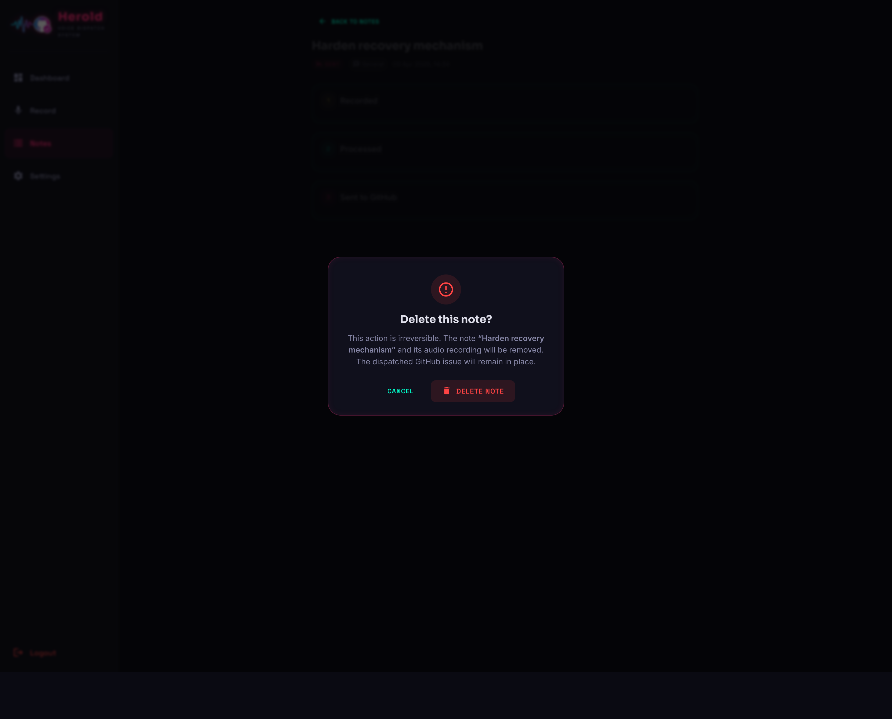

### B1.4.6 Form validation feedback

Dialogue-level validation messages render inline next to the offending field (not in a global banner) and appear on submit; they do not pre-empt the operator while they are still typing. Algorithmic validation lives in [N2](N2-querschnittskonzepte.md) *Validation* and is run server-side; B1 only specifies *where* its outcome surfaces, not *how* it is computed. For the editing variant of DLG-08 the type-specific extra fields are validated against their declared schema in [D2.7](D2-datentypen.md#d27-typespecificdata); each violating field carries its own message, the form is not submitted, and the *Save* control remains available so the operator can correct and retry.

*Example — DLG-08 editing variant for a *YouTube Transcription* note: the source-URL field has a per-field violation message ("Must be a valid `http(s)` URL"); other fields are unaffected; the *Save* control remains visible:*

### B1.4.7 Empty states

Where a list-shaped region has no content yet — the recent-notes region of DLG-06, the list region of DLG-07 ([UC-09](F2-anwendungsfaelle.md#uc-09--browse-voice-notes)) — the screen replaces the list with a short message naming what is missing and an inline action that bootstraps the missing content (typically *Capture a note*, routing to DLG-09). The empty state is not an error: no error styling, no retry. A list emptied by a filter (DLG-07) uses the same pattern but explains the filter combination instead, and the bootstrap action is *Clear filter*.

*Example — initial empty state on DLG-07: explains what is missing and offers the bootstrap action:*

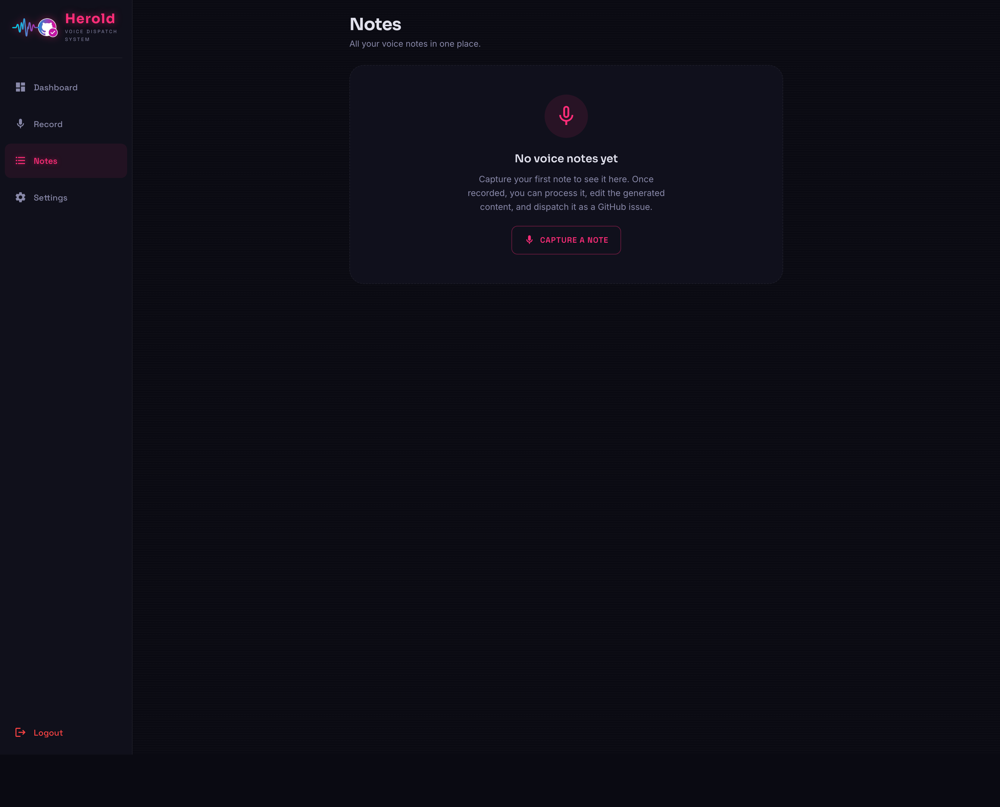

*Example — filter-induced empty state on DLG-07: filter selections stay visible, the empty body cites the active combination, and the bootstrap action is *Clear filter*:*

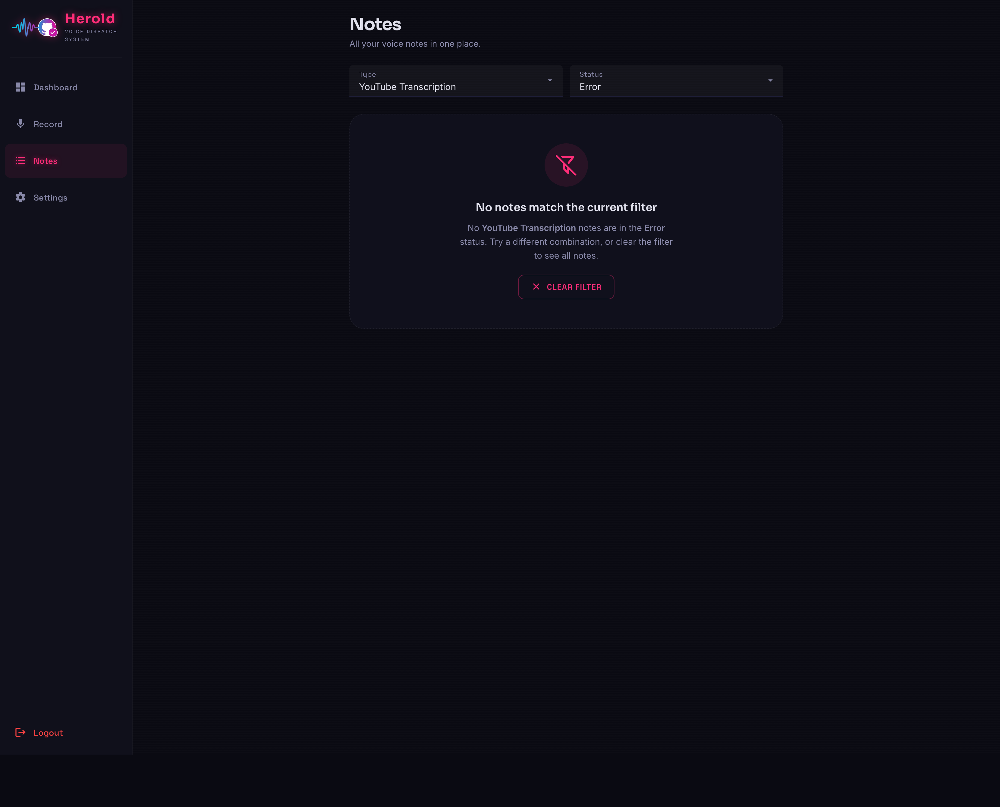

### B1.4.8 One-time secret display

A value that is generated by the system and shown to the operator exactly once, never again retrievable, is rendered with three reinforcing cues: a visually distinct container (DLG-03 uses scannable provisioning material; DLG-05 uses the second-factor-coloured frame), a copy affordance, and an explicit warning that the value will not be shown again. Leaving the screen forfeits the value irrecoverably; in the recovery flow this means the operator must restart [UC-03](F2-anwendungsfaelle.md#uc-03--recover-access) with a freshly placed token. The pattern does not offer a "show again" control.

The two screens that apply this pattern are DLG-03 (TOTP secret in scannable form, see [§B1.3.1](#b131-access)) and DLG-05 (new API key with copy affordance and warning, see [§B1.3.1](#b131-access)).

### B1.4.9 Mobile usage

Per [NFR-13a-01](N1-nichtfunktional.md) *Mobile Usage on the Go*, every screen is usable on a current mobile browser (Safari iOS, Chrome Android). The application chrome ([§B1.4.1](#b141-application-chrome)) collapses from a side rail to a bottom-edge bar; primary actions (notably *Record* on DLG-09 and *Save* on DLG-08's editing variant) remain reachable with a single thumb in portrait orientation. DLG-09 specifically is laid out so that the record/stop control is the dominant target while capture is in progress, since this is the use case most often invoked in motion.

*Example — DLG-09 in mobile portrait: the record control is the dominant target; navigation collapses to the bottom edge:*

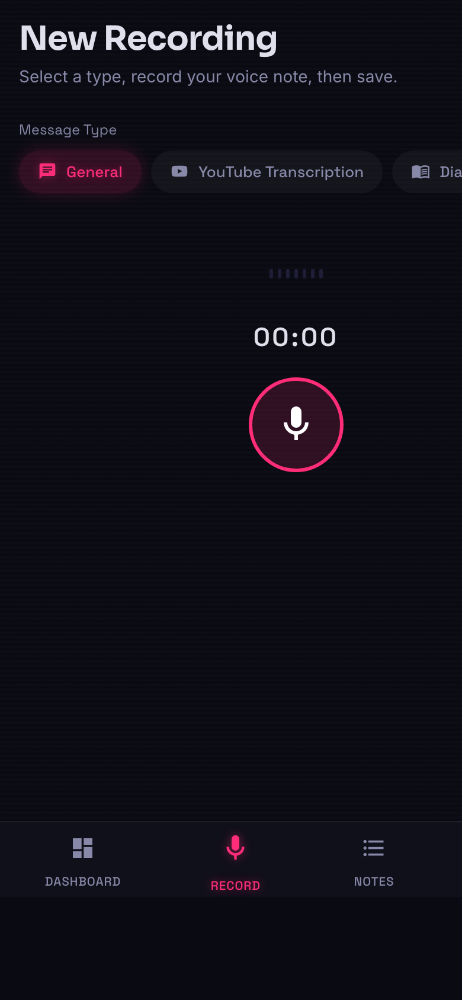

---

## B1.5 Out of Scope for B1

- **Visual design language.** Colours, typography, glow, spacing — fixed centrally in `DESIGN.md`, not duplicated per screen.
- **Pixel-level layout, component library, or front-end framework.** Those are implementation choices; B1 stays at the level of regions and controls.
- **Internal screen-to-screen URLs and route names.** Implementation-bound; documented in code and architecture.
- **Algorithmic validation and sanitisation.** Lives in [N2](N2-querschnittskonzepte.md) *Validation* (per-type input) and [F3.AF-03](F3-anwendungsfunktionen.md#af-03--markdown-sanitisation) *Markdown Sanitisation*; B1 only cites where it is surfaced.
- **Localisation and translation.** Herold runs in a single language for a single operator; multi-language support is not in scope.
- **Accessibility conformance levels.** *TBD* — defer to N1 once a conformance target is fixed.

---

## B1.6 Cross-references

| Block | Relevance to B1 |
|-------|-----------------|
| [F2](F2-anwendungsfaelle.md) | Every screen in B1.3 realises one or more use cases; the *Realises* line in each per-screen table cites the UC and scenario step. |
| [F3](F3-anwendungsfunktionen.md) | Sanitisation surfaced in B1 is implemented by [AF-03](F3-anwendungsfunktionen.md#af-03--markdown-sanitisation). |
| [N1](N1-nichtfunktional.md) | Synchronous-processing feedback ([NFR-12a-01](N1-nichtfunktional.md)), error handling ([NFR-12d-01](N1-nichtfunktional.md)), rate limiting and lockout ([NFR-15a-02](N1-nichtfunktional.md)), audio upload constraints ([NFR-15a-03](N1-nichtfunktional.md)), recovery token expiry ([NFR-15a-04](N1-nichtfunktional.md)), mobile usability ([NFR-13a-01](N1-nichtfunktional.md)). |
| [N2](N2-querschnittskonzepte.md) | *Validation* underpins B1 form-validation feedback; authentication and session handling underpin DLG-01 to DLG-05 and the cross-cutting patterns in B1.4. |
| `DESIGN.md` | Visual identity. B1 deliberately abstracts from it. |
| [E2](E2-glossar.md) | Definitions for *message type*, *voice note*, *Recovery*. |
