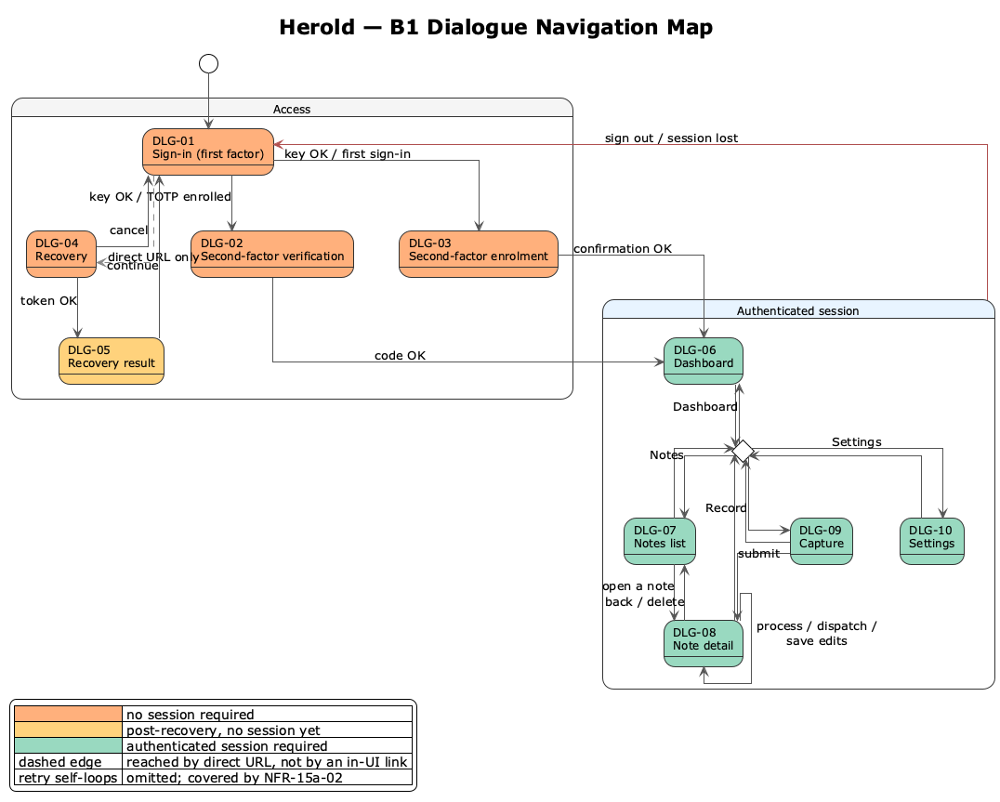

# B1 — Dialogue Specification

Dialogue specification in the sense of Siedersleben (chapter 4.5): the operator-facing screens of Herold, the navigation between them, and the dialogue patterns shared across screens. B1 describes **what each screen offers the operator** and **how screens connect** — independently of any visual design language, component library, or front-end technology. Visual identity (colour, typography, glow, spacing) is *not* part of B1; it is fixed in `DESIGN.md` and consumed uniformly by every screen described here.

Each screen realises one or more use cases from F2; conversely, every operator-meaningful step in F2 is rendered by exactly one screen in B1. The mapping is recorded in B1.1 and re-stated per screen in B1.3. Numbering of dialogue identifiers (`DLG-xx`) is stable; once referenced from another block, an ID is not renumbered.

---

## B1.1 Dialogue Index

| ID | Screen | Group | Realises UC | Auth required |
|----|--------|-------|-------------|---------------|
| DLG-01 | Sign-in (first factor) | Access | UC-01 (steps 1–3) | no |
| DLG-02 | Second-factor verification | Access | UC-01 (step 5) | no (mid-flow) |
| DLG-03 | Second-factor enrolment | Access | UC-02 | no (mid-flow) |
| DLG-04 | Recovery | Access | UC-03 (steps 1–4) | no |
| DLG-05 | Recovery result | Access | UC-03 (step 6) | yes (post-recovery) |
| DLG-06 | Dashboard | Common | — (entry hub) | yes |
| DLG-07 | Notes list | Management | UC-09 | yes |
| DLG-08 | Note detail | Management / Note flow | UC-10 (host); UC-06, UC-07, UC-08, UC-11 (entered from here) | yes |
| DLG-09 | Capture voice note | Note flow | UC-05 | yes |
| DLG-10 | Settings | Configuration | UC-12 | yes |

The system-wide chrome (application header, navigation, sign-out control) is described in B1.4 rather than as a standalone dialogue, since it is composed onto every authenticated screen and carries no goal of its own.

The navigation map shows how the operator moves between dialogues. The two cluster backgrounds separate the unauthenticated *Access* dialogues from those reached through an *Authenticated session*. Per-dialogue fill colour mirrors the encoding used in F2: warm tones for dialogues reachable without an established session, cool tone for dialogues that require one (DLG-05 sits in between — the recovery has succeeded, but no session has yet been established).

Within the authenticated cluster the persistent navigation chrome (side nav on desktop, bottom nav on mobile) is rendered once as a fan-in choice node rather than as N×N edges, since every authenticated screen offers the same four targets — *Dashboard*, *Record*, *Notes*, *Settings* — plus the *Sign out* control that leaves the cluster entirely (see B1.4).

---

## B1.2 Per-Screen Specification Template

Each entry in B1.3 follows the same shape:

| Section | Meaning |
|---------|---------|
| **Identifier** | Stable `DLG-xx` ID. |
| **Name** | Human-readable screen name. |
| **Realises** | UC(s) from F2 and the specific scenario steps rendered here. |
| **Purpose** | One sentence on what the operator accomplishes on this screen. |
| **Entry points** | How the operator reaches this screen. |
| **Layout regions** | Logical regions of the screen (header, primary content, action area, side panels), independent of pixel layout. |
| **Inputs** | Operator-supplied fields and controls, with their dialogue-level constraints (mandatory, optional, conditional). |
| **Actions** | Operator-triggered actions available on the screen and the use case or scenario step each one drives. |
| **Outcomes** | Resulting screen transitions per action (success, failure, cancel). |
| **Validation** | Dialogue-level validation rules. Algorithmic validation lives in [N2](N2-querschnittskonzepte.md) *Validation* (backed by [D2.7](D2-datentypen.md#d27-typespecificdata)); here only what the operator sees and when. |
| **Empty / loading / error states** | What the screen presents when there is no data, while a synchronous operation runs, or when the last action failed. |
| **Qualities** | Cross-references into N1 (NFRs), N2 (cross-cutting concepts) where relevant. |

---

## B1.3 Dialogue Specifications

### B1.3.1 Access

#### DLG-01 — Sign-in (first factor)

| Section | Content |
|---------|---------|
| **Identifier** | DLG-01 |
| **Name** | Sign-in (first factor) |
| **Realises** | UC-01 steps 1–3. |
| **Purpose** | *TBD.* |
| **Entry points** | *TBD.* |
| **Layout regions** | *TBD.* |
| **Inputs** | *TBD.* |
| **Actions** | *TBD.* |
| **Outcomes** | *TBD.* |
| **Validation** | *TBD.* |
| **Empty / loading / error states** | *TBD.* |
| **Qualities** | *TBD.* |

#### DLG-02 — Second-factor verification

| Section | Content |
|---------|---------|
| **Identifier** | DLG-02 |
| **Name** | Second-factor verification |
| **Realises** | UC-01 step 5 (subsequent sign-in branch). |
| **Purpose** | *TBD.* |
| **Entry points** | *TBD.* |
| **Layout regions** | *TBD.* |
| **Inputs** | *TBD.* |
| **Actions** | *TBD.* |
| **Outcomes** | *TBD.* |
| **Validation** | *TBD.* |
| **Empty / loading / error states** | *TBD.* |
| **Qualities** | *TBD.* |

#### DLG-03 — Second-factor enrolment

| Section | Content |
|---------|---------|
| **Identifier** | DLG-03 |
| **Name** | Second-factor enrolment |
| **Realises** | UC-02. |
| **Purpose** | *TBD.* |
| **Entry points** | *TBD.* |
| **Layout regions** | *TBD.* |
| **Inputs** | *TBD.* |
| **Actions** | *TBD.* |
| **Outcomes** | *TBD.* |
| **Validation** | *TBD.* |
| **Empty / loading / error states** | *TBD.* |
| **Qualities** | *TBD.* |

#### DLG-04 — Recovery

| Section | Content |
|---------|---------|
| **Identifier** | DLG-04 |
| **Name** | Recovery |
| **Realises** | UC-03 steps 1–4. |
| **Purpose** | *TBD.* |
| **Entry points** | *TBD.* |
| **Layout regions** | *TBD.* |
| **Inputs** | *TBD.* |
| **Actions** | *TBD.* |
| **Outcomes** | *TBD.* |
| **Validation** | *TBD.* |
| **Empty / loading / error states** | *TBD.* |
| **Qualities** | *TBD.* |

#### DLG-05 — Recovery result

| Section | Content |
|---------|---------|
| **Identifier** | DLG-05 |
| **Name** | Recovery result |
| **Realises** | UC-03 step 6 (one-time display of the new API key). |
| **Purpose** | *TBD.* |
| **Entry points** | *TBD.* |
| **Layout regions** | *TBD.* |
| **Inputs** | *TBD.* |
| **Actions** | *TBD.* |
| **Outcomes** | *TBD.* |
| **Validation** | *TBD.* |
| **Empty / loading / error states** | *TBD.* |
| **Qualities** | *TBD.* |

### B1.3.2 Common

#### DLG-06 — Dashboard

| Section | Content |
|---------|---------|
| **Identifier** | DLG-06 |
| **Name** | Dashboard |
| **Realises** | — (entry hub after sign-in; no F2 use case of its own). |
| **Purpose** | *TBD.* |
| **Entry points** | *TBD.* |
| **Layout regions** | *TBD.* |
| **Inputs** | *TBD.* |
| **Actions** | *TBD.* |
| **Outcomes** | *TBD.* |
| **Validation** | *TBD.* |
| **Empty / loading / error states** | *TBD.* |
| **Qualities** | *TBD.* |

### B1.3.3 Note Flow

#### DLG-09 — Capture voice note

| Section | Content |
|---------|---------|
| **Identifier** | DLG-09 |
| **Name** | Capture voice note |
| **Realises** | UC-05. |
| **Purpose** | *TBD.* |
| **Entry points** | *TBD.* |
| **Layout regions** | *TBD.* |
| **Inputs** | *TBD.* |
| **Actions** | *TBD.* |
| **Outcomes** | *TBD.* |
| **Validation** | *TBD.* |
| **Empty / loading / error states** | *TBD.* |
| **Qualities** | *TBD.* |

### B1.3.4 Management

#### DLG-07 — Notes list

| Section | Content |
|---------|---------|
| **Identifier** | DLG-07 |
| **Name** | Notes list |
| **Realises** | UC-09. |
| **Purpose** | *TBD.* |
| **Entry points** | *TBD.* |
| **Layout regions** | *TBD.* |
| **Inputs** | *TBD.* |
| **Actions** | *TBD.* |
| **Outcomes** | *TBD.* |
| **Validation** | *TBD.* |
| **Empty / loading / error states** | *TBD.* |
| **Qualities** | *TBD.* |

#### DLG-08 — Note detail

| Section | Content |
|---------|---------|
| **Identifier** | DLG-08 |
| **Name** | Note detail |
| **Realises** | UC-10 (host); UC-06, UC-07, UC-08, UC-11 are entered from this screen. |
| **Purpose** | *TBD.* |
| **Entry points** | *TBD.* |
| **Layout regions** | *TBD.* |
| **Inputs** | *TBD.* |
| **Actions** | *TBD.* |
| **Outcomes** | *TBD.* |
| **Validation** | *TBD.* |
| **Empty / loading / error states** | *TBD.* |
| **Qualities** | *TBD.* |

### B1.3.5 Configuration

#### DLG-10 — Settings

| Section | Content |
|---------|---------|
| **Identifier** | DLG-10 |
| **Name** | Settings |
| **Realises** | UC-12. |
| **Purpose** | *TBD.* |
| **Entry points** | *TBD.* |
| **Layout regions** | *TBD.* |
| **Inputs** | *TBD.* |
| **Actions** | *TBD.* |
| **Outcomes** | *TBD.* |
| **Validation** | *TBD.* |
| **Empty / loading / error states** | *TBD.* |
| **Qualities** | *TBD.* |

---

## B1.4 Cross-cutting Dialogue Patterns

Patterns reused across multiple screens. They are described once here and only referenced (not repeated) from the per-screen specifications in B1.3.

- **Application chrome.** The persistent header and navigation surface available on every authenticated screen, including the sign-out control that realises UC-04. *TBD.*
- **Unauthenticated redirect.** What happens when the operator addresses an authenticated screen without an active session. *TBD.*
- **Synchronous operation feedback.** How the UI represents a request that blocks per [NFR-12a-01](N1-nichtfunktional.md) *Synchronous Processing* — relevant to UC-06 (process) and UC-08 (dispatch). *TBD.*
- **Synchronous error handling.** How failed operations surface to the operator per [NFR-12d-01](N1-nichtfunktional.md) *Synchronous Error Handling*, and how retry is offered. *TBD.*
- **Confirmation modals.** Used for irreversible actions (UC-11 *Delete*). *TBD.*
- **Form validation feedback.** Where dialogue-level validation messages render and how they relate to algorithmic validation in [N2](N2-querschnittskonzepte.md) *Validation*. *TBD.*
- **Empty states.** What an empty notes list (UC-09) and an empty detail view present to the operator. *TBD.*
- **One-time secret display.** Pattern used in DLG-03 (TOTP secret) and DLG-05 (new API key) for values shown to the operator exactly once. *TBD.*
- **Mobile usage.** Adaptations required by [NFR-13a-01](N1-nichtfunktional.md) *Mobile Usage on the Go*, especially for DLG-09. *TBD.*

---

## B1.5 Out of Scope for B1

- **Visual design language.** Colours, typography, glow, spacing — fixed centrally in `DESIGN.md`, not duplicated per screen.
- **Pixel-level layout, component library, or front-end framework.** Those are implementation choices; B1 stays at the level of regions and controls.
- **Internal screen-to-screen URLs and route names.** Implementation-bound; documented in code and architecture.
- **Algorithmic validation and sanitisation.** Lives in [N2](N2-querschnittskonzepte.md) *Validation* (per-type input) and [F3.AF-03](F3-anwendungsfunktionen.md#af-03--markdown-sanitisation) *Markdown Sanitisation*; B1 only cites where it is surfaced.
- **Localisation and translation.** Herold runs in a single language for a single operator; multi-language support is not in scope.
- **Accessibility conformance levels.** *TBD* — defer to N1 once a conformance target is fixed.

---

## B1.6 Cross-references

| Block | Relevance to B1 |
|-------|-----------------|
| [F2](F2-anwendungsfaelle.md) | Every screen in B1.3 realises one or more use cases; the *Realises* line in each per-screen table cites the UC and scenario step. |
| [F3](F3-anwendungsfunktionen.md) | Sanitisation surfaced in B1 is implemented by [AF-03](F3-anwendungsfunktionen.md#af-03--markdown-sanitisation). |
| [N1](N1-nichtfunktional.md) | Synchronous-processing feedback ([NFR-12a-01](N1-nichtfunktional.md)), error handling ([NFR-12d-01](N1-nichtfunktional.md)), rate limiting and lockout ([NFR-15a-02](N1-nichtfunktional.md)), audio upload constraints ([NFR-15a-03](N1-nichtfunktional.md)), recovery token expiry ([NFR-15a-04](N1-nichtfunktional.md)), mobile usability ([NFR-13a-01](N1-nichtfunktional.md)). |
| [N2](N2-querschnittskonzepte.md) | *Validation* underpins B1 form-validation feedback; authentication and session handling underpin DLG-01 to DLG-05 and the cross-cutting patterns in B1.4. |
| `DESIGN.md` | Visual identity. B1 deliberately abstracts from it. |
| [E2](E2-glossar.md) | Definitions for *message type*, *voice note*, *Recovery*. |
