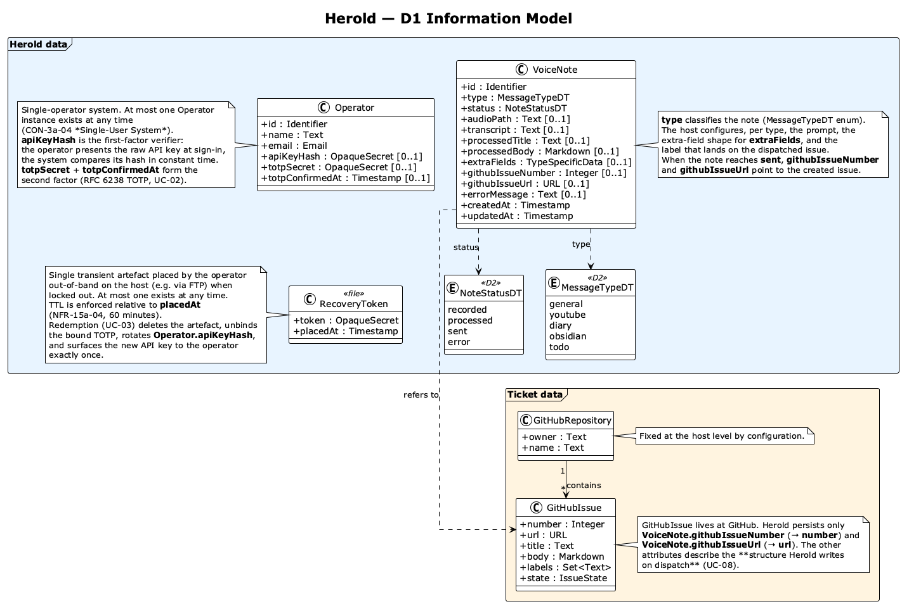

# D1 — Data Model

> **Status: draft.** Block boundaries follow the Siedersleben building plan; details may shift as F2/F3 settle.

D1 captures the *information* Herold orchestrates, irrespective of where that information physically lives. The model spans two data stores:

- **Herold data** — information held inside Herold. Most of it lives in the local database; audio recordings live in the local file store and are referenced by `VoiceNote.audioPath`; the `RecoveryToken` lives as a single transient artefact in the local file store and is the only entity placed by the operator out-of-band.
- **Ticket data** — information owned by a neighbouring system (GitHub Issues) that Herold writes to and references back.

Configuration parameters supplied by the host operator out-of-band (per-type prompt and extra-field shape, GitHub credentials and target repository, OpenAI model identifiers) are **not** modelled as D1 entities. They are spec-level constants of the running system, inspected via UC-12.

The diagram and tables below show **entity types only**. Non-trivial domain data types referenced as attribute types — e.g., `Identifier`, `OpaqueSecret`, `NoteStatusDT`, `IssueState`, `MessageTypeDT`, `TypeSpecificData` — are catalogued in [D2](D2-datentypen.md). Trivial types (`Text`, `Integer`, `Boolean`, `Email`, `URL`, `Timestamp`, `Markdown`) are used at face value and not separately defined. Storage decisions and physical schema live in the architecture layer (`docs/arch/`) and in code, not here.

---

## D1.1 Herold data

Information Herold itself owns and persists.

### VoiceNote

The central entity. One row per captured voice note from recording through dispatch.

| Attribute | Type | Notes |
|-----------|------|-------|
| `id` | Identifier | Stable, time-sortable. |
| `type` | MessageTypeDT | The bound message type. See [D2.5](D2-datentypen.md#d25-messagetypedt). |
| `status` | NoteStatusDT | See [D2.6](D2-datentypen.md#d26-notestatusdt). |
| `audioPath` | Text [0..1] | Locator into the local audio store. Set on capture; cleared together with the row by UC-11. Subject to [NFR-15a-03](N1-nichtfunktional.md) *Audio Upload Validation*. |
| `transcript` | Text [0..1] | Set after AF-01 succeeds. |
| `processedTitle` | Text [0..1] | Set after AF-02; editable in UC-07. |
| `processedBody` | Markdown [0..1] | Set after AF-02; editable in UC-07; sanitised per [NFR-15b-04](N1-nichtfunktional.md). |
| `extraFields` | TypeSpecificData [0..1] | Shape declared per `MessageTypeDT` value by host configuration; validated by AF-08. |
| `githubIssueNumber` | Integer [0..1] | Refers to `GitHubIssue.number`. Repository-scoped. Populated together with `githubIssueUrl` when the note reaches `sent`. |
| `githubIssueUrl` | URL [0..1] | Refers to `GitHubIssue.url`. Stable navigable URL of the dispatched issue. |
| `errorMessage` | Text [0..1] | Last failure reason; cleared on successful retry. |
| `createdAt` | Timestamp | |
| `updatedAt` | Timestamp | |

**Associations:**
- `..> GitHubIssue` — `githubIssueNumber` (→ `number`) and `githubIssueUrl` (→ `url`) reference an issue at GitHub once the note has been dispatched.

### Operator

The single human user. Per [CON-3a-04](P1-constraints.md) *Single-User System* there is at most one operator instance.

Authentication ([NFR-15a-01](N1-nichtfunktional.md) *Two-Factor Browser Authentication*) is **API key + TOTP**. The first factor is the API key whose hash is held in `apiKeyHash`; the second factor is the TOTP whose shared secret is held in `totpSecret`.

| Attribute | Type | Notes |
|-----------|------|-------|
| `id` | Identifier | |
| `name` | Text | |
| `email` | Email | |
| `apiKeyHash` | OpaqueSecret [0..1] | First-factor verifier. The operator presents the raw API key at sign-in (UC-01); the system compares its hash in constant time per [D2.7](D2-datentypen.md#d27-opaquesecret). Initially populated from the host configuration on first install; rotated by UC-03. |
| `totpSecret` | OpaqueSecret [0..1] | Second-factor shared secret. Bound provisionally in UC-02 step 1 and confirmed in step 5; cleared by UC-03. |
| `totpConfirmedAt` | Timestamp [0..1] | Marks UC-02 completion. While unset, UC-01 cannot succeed. |

### RecoveryToken

A single transient artefact in the local file store, placed by the operator out-of-band when locked out (UC-03 precondition). Modelled as its own entity because, unlike all other Herold-data entities, it is *operator-placed* rather than system-created and lives in the file store rather than the database.

| Attribute | Type | Notes |
|-----------|------|-------|
| `token` | OpaqueSecret | Operator-chosen secret string; the entire artefact's content. Verified in constant time on redemption per [D2.7](D2-datentypen.md#d27-opaquesecret). |
| `placedAt` | Timestamp | Time the artefact was created in the file store; basis for the time-to-live enforced by [NFR-15a-04](N1-nichtfunktional.md) *Recovery Token Expiry*. |

**Multiplicity.** At most one `RecoveryToken` exists at any time. Subsequent placements overwrite the previous one.

**Lifetime.**
- Created by the operator out-of-band (e.g. via FTP).
- Expires 60 minutes after `placedAt` per [NFR-15a-04](N1-nichtfunktional.md).
- Deleted by the system on successful redemption in UC-03 step 4.
- A missing token, an expired token, and a token whose secret does not match the entered string all surface to the operator as the same generic rejection per [NFR-15a-04](N1-nichtfunktional.md).

**Redemption side effects (UC-03):** Deleting the `RecoveryToken` triggers, in one step, (a) clearing `Operator.totpSecret` and `Operator.totpConfirmedAt`, (b) generating a fresh API key, persisting its hash into `Operator.apiKeyHash`, and surfacing the raw new API key to the operator exactly once.

---

## D1.2 Ticket data

Information owned by a neighbouring system. Herold *writes* it on dispatch and *navigates back* via the persisted reference, but does not maintain its lifecycle (cf. P1 non-goal [NG-03](P1-ziele-rahmenbedingungen.md) *Local ticket lifecycle*).

### GitHubIssue

| Attribute | Type | Notes |
|-----------|------|-------|
| `number` | Integer | Per repository. |
| `url` | URL | |
| `title` | Text | Composed in UC-08 from `VoiceNote.processedTitle`. |
| `body` | Markdown | Composed in UC-08 from `VoiceNote.processedBody` (sanitised). |
| `labels` | Set<Text> | Includes a per-`MessageTypeDT` label declared by host configuration. |
| `state` | IssueState | `open` \| `closed`. Read-only from Herold's perspective. |

### GitHubRepository

| Attribute | Type | Notes |
|-----------|------|-------|
| `owner` | Text | |
| `name` | Text | |

The repository is fixed at the host level by configuration. Issues live within their repository.

---

## D1.3 Out of Scope for D1

- **Physical schema** — table layouts, column types, indexes, migrations: architecture concern, not D1.
- **Session and framework-internal storage** — sessions, jobs queue, cache: not domain information.
- **Host configuration** — per-type prompt and extra-field shape, GitHub credentials and target repository, OpenAI model identifiers: spec-level constants of the running system, not D1 entities. Inspected via UC-12.
- **Transient API payloads** to OpenAI — request/response are transformations, not entities; their *outputs* enter `VoiceNote` (transcript, processed content) and that is where they are modelled.
- **GitHub-side state changes after dispatch** — comments, label changes, closure, deletion: outside Herold's scope ([NG-03](P1-ziele-rahmenbedingungen.md)).

---

## D1.4 Cross-references

| Block | Relevance to D1 |
|-------|-----------------|
| [F1](F1-geschaeftsprozesse.md) | Activities A3, A6, A7, A8 write to `VoiceNote`; A8 populates `githubIssueNumber` / `githubIssueUrl` and creates the `GitHubIssue`. |
| [F2](F2-anwendungsfaelle.md) | Every UC reads or writes one or more entities here. UC-11 is the only deleter. |
| [F3](F3-anwendungsfunktionen.md) | AF-01 populates `transcript`; AF-02/AF-03 populate `processedTitle`/`processedBody`; AF-04 resolves the configuration bound to a `MessageTypeDT`; AF-05 composes the `GitHubIssue`; AF-06 governs `NoteStatusDT` transitions; AF-08 validates `extraFields` against the host-configured shape for the bound `MessageTypeDT`. |
| [N1](N1-nichtfunktional.md) | Two-factor authentication scheme on `Operator` ([NFR-15a-01](N1-nichtfunktional.md)); audio size limits ([NFR-15a-03](N1-nichtfunktional.md)); content sanitisation for `processedBody` and the dispatched body ([NFR-15b-04](N1-nichtfunktional.md)); time-to-live for `RecoveryToken` ([NFR-15a-04](N1-nichtfunktional.md)). |
| [P1](P1-constraints.md) | [CON-3a-04](P1-constraints.md) *Single-User System* limits `Operator` to one instance; [NG-03](P1-ziele-rahmenbedingungen.md) excludes GitHub-side lifecycle from this model. |
| [P2](P2-architekturueberblick.md) | Identifies the storage realms (local DB, audio store, GitHub) the two D1 data stores correspond to. |
| [E2](E2-glossar.md) | Definitions for *message type*, *fine-grained PAT*, *voice note*. |
