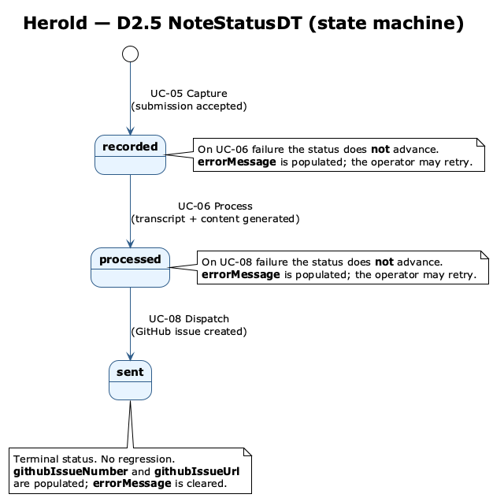

# D2 — Domain Data Types

> **Status: draft.** Synchronised with the entity attributes catalogued in [D1](D1-datenmodell.md).

D2 catalogues the **non-trivial domain data types** referenced as attribute types in D1. Trivial standard types — `Text`, `Integer`, `Boolean`, `Date`, `Email`, `URL`, `Timestamp`, `Markdown` — are used at face value and not catalogued here. (`Date` denotes a calendar date without a time component; `Timestamp` denotes a moment in time.)

Each entry states the *value range*, *equality and ordering semantics*, and *handling rules* a consumer must observe. Implementation choices (column types, encoding, library) are not D2 concerns — they live in `docs/arch/` and in code.

Catalogue entries are listed alphabetically; the section numbering follows that order.

---

## D2.1 Type Catalogue

| Type | Kind | Defined in |
|------|------|-----------|
| `Identifier` | Opaque, time-sortable key | [§ D2.2](#d22-identifier) |
| `IssueStateDT` | Enumeration | [§ D2.3](#d23-issuestatedt) |
| `MessageTypeDT` | Enumeration of message types | [§ D2.4](#d24-messagetypedt) |
| `NoteStatusDT` | Enumeration | [§ D2.5](#d25-notestatusdt) |
| `OpaqueSecret` | Opaque value with security semantics | [§ D2.6](#d26-opaquesecret) |
| `TypeSpecificData` | Schema-shaped record | [§ D2.7](#d27-typespecificdata) |

---

## D2.2 Identifier

Used as the primary key type of every entity in [D1](D1-datenmodell.md): `VoiceNote.id`, `Operator.id`, …

**Value form.** Opaque value. Consumers must not parse, compare structurally, or attribute meaning to its internal form.

**Generation.** Created at the moment the owning entity is constructed; never reassigned over the entity's lifetime; never reused after deletion.

**Equality.** Bytewise equality; case-sensitive if rendered.

**Ordering.** Identifiers are *time-sortable*: for two values *a* and *b* generated at distinct moments, the value generated later compares greater. Lexicographic order is therefore a valid creation-time order. Co-creation within the same instant is allowed but the relative order of such values is unspecified.

**Cross-references.** Sortability is the basis for the recency ordering used by UC-09 (*Browse voice notes*).

---

## D2.3 IssueStateDT

*(IssueStateDT = issue state data type.)* Mirrors the lifecycle state of a `GitHubIssue` ([D1.2](D1-datenmodell.md#githubissue)) at GitHub. Read-only from Herold's perspective — Herold does not transition this value (see P1 non-goal [NG-03](P1-ziele-rahmenbedingungen.md) *Local ticket lifecycle*).

| Value | Meaning |
|-------|---------|
| `open` | Issue is currently open at GitHub. |
| `closed` | Issue has been closed at GitHub. |

**Equality & ordering.** Equality only.

---

## D2.4 MessageTypeDT

*(MessageTypeDT = message type data type.)* Enumeration of the message-type categories a `VoiceNote` ([D1.1](D1-datenmodell.md#voicenote)) can be classified as. Each value is a stable lower-case ASCII slug.

| Value | Meaning |
|-------|---------|
| `general` | Free-form note. |
| `youtube` | Note tied to a YouTube video. |
| `diary` | Diary entry, optionally dated. |
| `obsidian` | Note destined for an Obsidian vault. |
| `todo` | Task or to-do item, optionally with a deadline. |

**Per-value bindings.** Each `MessageTypeDT` value carries three pieces of behaviour:

| Binding | Source | Consumed by |
|---------|--------|-------------|
| Slot inventory for `VoiceNote.metadata` | Spec ([D2.7](#d27-typespecificdata)) | [UC-05](F2-anwendungsfaelle.md#uc-05--capture-voice-note) (capture form), [UC-07](F2-anwendungsfaelle.md#uc-07--edit-generated-content) (validation on save) |
| Generation prompt | Host configuration (out-of-band) | [S1.4](S1-nachbarsysteme.md#s14--nb-03--openai-chat-completion-api) *Chat Completion API* |
| GitHub label | Host configuration (out-of-band) | [S1.5](S1-nachbarsysteme.md#s15--nb-04--github-issues-api) *Issues API* |

**Resolution rule.** All consumers obtain these bindings through this single catalogue; message types are never hard-coded outside it. Unknown identifiers are rejected at the boundary that observes them. The configured prompt and label are visible to the operator via [UC-12](F2-anwendungsfaelle.md#uc-12--view-settings). The cross-cutting strategy for type-driven behaviour is documented in [N2](N2-querschnittskonzepte.md) *Type-driven configuration*.

**Equality & ordering.** Equality only.

**Extensibility.** This set is closed; introducing a new message type is a spec change (extending the enum) accompanied by a configuration entry on the host.

---

## D2.5 NoteStatusDT

*(NoteStatusDT = note status data type.)* Tracks the position of a `VoiceNote` ([D1.1](D1-datenmodell.md#voicenote)) within the synchronous capture–process–dispatch pipeline.

| Value | Meaning |
|-------|---------|
| `recorded` | Audio captured, awaiting processing. |
| `processed` | Structured content generated, awaiting review and dispatch. |
| `sent` | Dispatched to GitHub; `VoiceNote.githubIssueNumber` and `VoiceNote.githubIssueUrl` populated. |

**Equality & ordering.** Equality only; values are not ordered.

**Reachable transitions.** The set above is closed; new values require a spec change.

| From       | To         | Trigger                                                                  |
|------------|------------|--------------------------------------------------------------------------|
| (none)     | `recorded` | Capture submission ([UC-05](F2-anwendungsfaelle.md#uc-05--capture-voice-note) Schritt 7). |
| `recorded` | `processed`| Successful transcription + content generation ([UC-06](F2-anwendungsfaelle.md#uc-06--process-voice-note) Schritt 6). |
| `processed`| `sent`     | Successful dispatch to GitHub ([UC-08](F2-anwendungsfaelle.md#uc-08--dispatch-voice-note) Schritt 5). |

No other transitions are reachable; in particular there are no regressions and no skipping of intermediate states. The status is never advanced speculatively — each transition is the consequence of a successful operation at the corresponding boundary (transcript + content populated for `processed`; issue reference populated for `sent`).

**Failure handling (orthogonal to status).** Transition triggers may fail. On failure the status **does not advance**; instead `VoiceNote.errorMessage` is populated with the failure reason per [NFR-12d-01](N1-nichtfunktional.md) *Synchronous Error Handling*. The operator may retry by re-invoking the same use case; on success `errorMessage` is cleared and the documented transition fires. `errorMessage` is therefore an orthogonal failure flag on `VoiceNote`, not a separate state.

---

## D2.6 OpaqueSecret

A type tag for credential or secret material (`Operator.apiKeyHash`, `Operator.totpSecret`, `RecoveryToken.token`, and the host-configured GitHub access token).

**Handling rules.**

- Values are never rendered to a UI surface. UC-12 *View settings* shows the *presence* of an `OpaqueSecret`, never the value.
- Values are never returned in an outbound API payload, log line, error message, or diagnostic.
- Comparison is constant-time when used for verification.
- A value, once stored, is replaceable but never round-tripped to the operator. Recovery flows replace, not reveal.

**Equality.** Equality is verification-only and constant-time. Direct equality between two `OpaqueSecret` values outside a verification context is not defined.

**Cross-references.** [NFR-15a-02](N1-nichtfunktional.md), [E2](E2-glossar.md) (*fine-grained PAT*).

---

## D2.7 TypeSpecificData

A structured record of named typed slots whose **slot inventory is fixed at spec level per `MessageTypeDT`** ([D2.4](#d24-messagetypedt)). Used as the type of `VoiceNote.metadata` ([D1.1](D1-datenmodell.md#voicenote)).

**Shape rules.**

- Each declared slot for the bound `MessageTypeDT` carries one value of its declared type.
- A slot is *required* [iff](E2-glossar.md#iff) marked so in the inventory; *optional* slots may be absent.
- No slots beyond those declared for the bound `MessageTypeDT` are permitted.

**Slot inventory per `MessageTypeDT`.** Slot types are trivial standard types from D2's preamble.

| `MessageTypeDT` | Slot | Type | Required | Meaning |
|-----------------|------|------|----------|---------|
| `general` | — | — | — | No slots. |
| `youtube` | `youtubeUrl` | `URL` | yes | YouTube video the note refers to. |
| `diary` | `entryDate` | `Date` | no | Calendar date the entry is associated with; resolved from speech where possible by [S1.4](S1-nachbarsysteme.md#s14--nb-03--openai-chat-completion-api). |
| `obsidian` | `vault` | `Text` | no | Target Obsidian vault name; resolved from speech where possible by [S1.4](S1-nachbarsysteme.md#s14--nb-03--openai-chat-completion-api). |
| `todo` | `deadline` | `Date` | no | Due date for the task; resolved from speech where possible by [S1.4](S1-nachbarsysteme.md#s14--nb-03--openai-chat-completion-api). |

This inventory is closed; introducing or removing a slot is a spec change. Wire and storage representation of the record (column type, serialization format) is an implementation concern and not described here.

**Validation rules.**

- Strict: missing required slots, slots whose value is not of the declared type, and slot names not declared for the bound `MessageTypeDT` all fail.
- The audio recording itself is not validated here beyond presence; format and size checks at the upload boundary are governed by [NFR-15a-03](N1-nichtfunktional.md) *Audio Upload Validation* and apply at [S1.3](S1-nachbarsysteme.md#s13--nb-02--openai-whisper-api).
- A failed validation surfaces the offending fields to the operator; no `VoiceNote` row is created or updated until the input is accepted.

**When validation runs.** On capture submission ([UC-05](F2-anwendungsfaelle.md#uc-05--capture-voice-note) Schritt 6) and on edit save ([UC-07](F2-anwendungsfaelle.md#uc-07--edit-generated-content) Schritt 4), in both cases against the slot inventory above for the bound `VoiceNote.type`. The cross-cutting strategy for input validation is documented in [N2](N2-querschnittskonzepte.md) *Validation*.

**Equality.** Two values are equal [iff](E2-glossar.md#iff) their declared slots have equal values under the equality of their respective slot types.

---

## D2.8 Notation Conventions

The following multiplicity and composition notations are used in D1 and D2 attribute tables:

| Notation | Meaning |
|----------|---------|
| `T` | Exactly one value of type `T`. |
| `T [0..1]` | Zero or one. |
| `T [n..m]` | Between *n* and *m* values. |
| `Set<T>` | Unordered collection of `T`, no duplicates. |
| `List<T>` | Ordered collection of `T`. |

---

## D2.9 Cross-references

| Block | Relevance to D2 |
|-------|-----------------|
| [D1](D1-datenmodell.md) | Every type in this catalogue appears as an attribute type in at least one D1 entity. |
| [F2](F2-anwendungsfaelle.md) | Status transitions in [D2.5](#d25-notestatusdt) are driven by [UC-05](F2-anwendungsfaelle.md#uc-05--capture-voice-note), [UC-06](F2-anwendungsfaelle.md#uc-06--process-voice-note), [UC-08](F2-anwendungsfaelle.md#uc-08--dispatch-voice-note); the slot inventory in [D2.7](#d27-typespecificdata) is validated at [UC-05](F2-anwendungsfaelle.md#uc-05--capture-voice-note) and [UC-07](F2-anwendungsfaelle.md#uc-07--edit-generated-content). |
| [S1](S1-nachbarsysteme.md) | Per-`MessageTypeDT` bindings drive [S1.4](S1-nachbarsysteme.md#s14--nb-03--openai-chat-completion-api) (prompt) and [S1.5](S1-nachbarsysteme.md#s15--nb-04--github-issues-api) (label). |
| [N1](N1-nichtfunktional.md) | Handling rules for `OpaqueSecret` are reinforced by content-sanitisation and rate-limiting NFRs; failure handling in [D2.5](#d25-notestatusdt) defers to [NFR-12d-01](N1-nichtfunktional.md). |
| [N2](N2-querschnittskonzepte.md) | *Type-driven configuration* operationalises the resolution rule in [D2.4](#d24-messagetypedt); *Validation* operationalises the rules in [D2.7](#d27-typespecificdata). |
| [E2](E2-glossar.md) | Glossary entries for *fine-grained PAT*, *message type*. |
