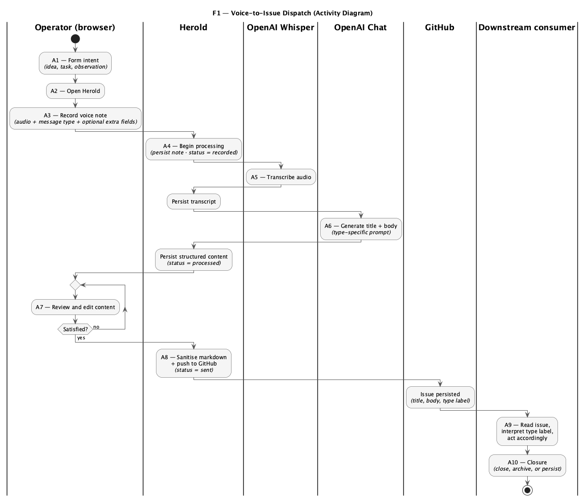

# F1 — Business Processes

Real-world workflows that Herold participates in, in the sense of Siedersleben (chapter 4.3): a business process is a temporally and logically ordered sequence of activities, described **independently of any IT system**. A process may be supported wholly, partially, or not at all by IT — and most non-trivial processes use **several** IT systems in combination.

Herold is one such supporting IT system. The process documented here therefore extends beyond Herold's HTTP boundary: it starts before the operator opens the browser and ends after a downstream consumer has acted on the resulting GitHub Issue. Herold is the *capture and dispatch* segment of the process — important, but not the whole.

The blocks that translate this process into Herold-implemented behaviour are **F2** (use cases — the system-supported activities) and **F3** (application functions — the algorithms reused across use cases).

---

## F1.1 Process: Voice-to-Issue Dispatch

Herold supports a **single business process**: voice-mediated capture of an idea, observation, or task, and its dispatch as a GitHub Issue to a downstream consumer — typically an AI agent, occasionally a human reader. The Herold-internal segment is the same regardless of what kind of note is being captured; the variation lies in the *type label* attached to the issue, which steers the downstream consumer's handling (see F1.2).

### F1.1.1 Actors

| Actor | Type | Role |
|-------|------|------|
| **Operator** | Human | Initiates the process; speaks; reviews; dispatches. |
| **Mobile device / browser** | IT system (client) | Captures audio; renders UI. |
| **Herold** | IT system | Persists note; orchestrates transcription and content generation; pushes to GitHub. |
| **OpenAI Whisper API** | IT system (third party) | Speech-to-text. |
| **OpenAI Chat Completion API** | IT system (third party) | Title and body generation per message-type prompt. |
| **GitHub Issues** | IT system (third party) | Final ticket store. |
| **Downstream consumer** | IT system (typically an AI agent) or human | Reads the issue, interprets the type label, and acts accordingly. |

Note that Herold itself, the AI agent, GitHub, and OpenAI are listed as actors here. Siedersleben treats every IT system as an actor in the business process, on equal footing with humans.

### F1.1.2 Activities

Listed in temporal order. The **Support** column names which actor materially performs the activity; activities labelled *manual* are not system-supported even when an IT system is incidentally present.

| # | Activity | Support | Notes |
|---|----------|---------|-------|
| A1 | Operator forms an intent (idea, task, observation) | manual | Pre-Herold; no IT support. |
| A2 | Operator opens Herold to start a new note | Browser → Herold | Entry point; bracket between A1 and Herold-supported activities. |
| A3 | Operator records the voice note (choosing the message type and filling any required extra fields) | Browser | Status `recorded`. The message type is captured as a parameter of the recording, not as a separate activity; it drives the prompt (A6) and the outbound label (A8). Audio upload is validated server-side per [NFR-15a-03](N1-nichtfunktional.md) *Audio Upload Validation*. The capture must work on mobile browsers per [NFR-13a-01](N1-nichtfunktional.md) *Mobile Usage on the Go*. |
| A4 | Operator triggers processing | Herold | Synchronous request begins ([NFR-12a-01](N1-nichtfunktional.md) *Synchronous Processing*). |
| A5 | Audio is transcribed | OpenAI Whisper | Synchronous; blocks the request. Failure is surfaced to the operator without state change ([NFR-12d-01](N1-nichtfunktional.md) *Synchronous Error Handling*). |
| A6 | Transcript is structured into title + body (and optional extra fields) | OpenAI Chat | Prompt is type-specific. Failure handled per [NFR-12d-01](N1-nichtfunktional.md). |
| A7 | Operator reviews and edits the generated content | Herold | Status `processed`; markdown is sanitised on save per [NFR-15b-04](N1-nichtfunktional.md) *Issue Content Sanitization*. |
| A8 | Operator dispatches the note | Herold → GitHub | Status `sent`; issue reference recorded. Push is gated by sanitisation ([NFR-15b-04](N1-nichtfunktional.md)) and runs synchronously ([NFR-12a-01](N1-nichtfunktional.md)). |
| A9 | Downstream consumer reads the issue and acts on it according to the type label | Downstream consumer | Outside Herold's control. |
| A10 | Process closure | Downstream consumer or operator | Issue closed, archived, or simply persisted, depending on the type. |

**A1 and A9–A10 are deliberately included.** They bracket Herold's contribution and make explicit that the process exists with or without Herold — Herold replaces *typing* in A2–A8, not the workflow itself.

### F1.1.3 Documents

Concrete artefacts that move through the process.

| Document | Created in | Format |
|----------|-----------|--------|
| **Audio recording** | A3 | Browser-native audio recording. |
| **Transcript** | A5 | Plain text. |
| **Structured content** | A6 | Title, body, and optional extra fields per message-type schema. |
| **Voice note record** | A3, updated through A8 | Persistent record holding status, type, content, and issue reference. |
| **GitHub Issue** | A8 | Title + Markdown body + type label, on a private repository. |
| **Downstream artefact** | A9–A10 | Type-conditioned and outside Herold (e.g. pull request, vault note, archived issue). |

### F1.1.4 Data Stores

| Store | Owner | Holds |
|-------|-------|-------|
| **Local audio store** | Herold | Audio recording, persisted alongside the voice note record. Removed only when the note is deleted (see UC-11 in [F2](F2-anwendungsfaelle.md)). |
| **Application data store** | Herold | Voice note records, status, generated content, issue references, type metadata. |
| **GitHub repository (issues)** | GitHub | Sole external sink. Source of truth for the dispatched note. |
| **Operator's mind / notes app** | Operator | Pre-process (A1) and post-process review of the consumer's outcome. |

### F1.1.5 Activity Diagram

UML Activity Diagram with swimlanes per actor. The flow is linear with one operator-driven review loop at A7.

The labels **A1–A10** number the first-class steps of the business process, regardless of which actor performs them. A1 (Operator), A9, and A10 (Downstream consumer) are deliberately numbered alongside the Herold-supported A2–A8: they bracket Herold's contribution and show that the process exists with or without Herold.

The three **unnumbered nodes** in the diagram — `Persist transcript`, `Persist structured content`, `Issue persisted` — are *not* business activities. They are internal hand-off steps that bridge consecutive numbered activities and make the flow of artefacts between actors visible. In particular, Herold mediates between the two OpenAI services: the transcript from A5 returns to Herold for persistence before A6 is invoked.

The Operator and the browser share a single swimlane because the browser has no autonomous agency in the process — it renders the UI and captures audio on the operator's behalf. The actor list in F1.1.1 still distinguishes them, since the browser remains a distinct IT actor with its own technical contribution (audio capture, offline behaviour); collapsing the swimlane is a presentational choice, not a redefinition of actors.

---

## F1.2 Role of the Message Type

The note's **message type** (`general`, `todo`, `diary`, `youtube`, `obsidian`, …) is a *parameter* of the process, not a separate process. It does two things:

- **Inside Herold** (A3, A6, A8): selects the preprocessing prompt that shapes title and body, defines the optional extra fields the operator may fill, and determines the GitHub label attached to the dispatched issue.
- **Outside Herold** (A9–A10): signals to the downstream consumer what kind of handling is appropriate. A coding-oriented agent may treat `todo` as a work item and produce a pull request; an Obsidian sync agent may move `obsidian`-labelled issues into a vault; a diary-aware consumer may file `diary` issues into a journal; types without a configured consumer simply persist as an archived issue.

Adding a new message type does not introduce a new business process — it adds a new label/prompt pair to the existing one. The downstream-consumer ecosystem, which is operated outside Herold, decides what to do with each label. The set of available message types is configurable.

This is why F1 documents only one process: the Herold-internal flow is type-agnostic, and the type-specific behaviour lives either *upstream* of Herold (in the operator's choice) or *downstream* of Herold (in the consumer's logic).

---

## F1.3 Boundaries

Activities and concerns that are deliberately **not** part of this process:

- **Agent selection, agent configuration, agent execution.** The operator chooses and operates the downstream agent independently. See [ADR-003](../arch/ARCHITECTURE_DECISIONS.md) and P1 non-goal [NG-02](P1-ziele-rahmenbedingungen.md) *Agent control API*.
- **Issue triage and labelling beyond the message-type label.** Herold attaches exactly one type label and the title/body. Any further triage (priority, milestone, assignee) is done in GitHub by the operator or the agent.
- **Issue lifecycle after dispatch.** Status synchronisation, comments, and closure are handled in GitHub; Herold does not read back. P1 non-goal [NG-03](P1-ziele-rahmenbedingungen.md) *Local ticket lifecycle*.
- **Cross-process coordination.** Each voice note is one process instance. Herold has no concept of related notes, threads, or campaigns.
- **Multi-operator workflows.** Single-user system per [CON-3a-04](P1-constraints.md) *Single-User System*.

---

## F1.4 Anti-patterns Avoided

Following Siedersleben's warnings (chapter 4.3):

- This block is **not a flowchart**. The textual narrative around the activity table is load-bearing; the diagram is illustration.
- F1 is **not the specification**. It is the first step. Functional surface is defined in **F2**, algorithmic detail in **F3**, data in **D1**.
- No code, no SQL, no class names. Activities are described from the business-world perspective; implementation choices live in [`docs/arch/`](../arch/).

---

## F1.5 Cross-references

| Block | Relevance to F1 |
|-------|-----------------|
| [P1](P1-ziele-rahmenbedingungen.md) | Goals G-01, G-02, G-05 — why this process exists. |
| [P2](P2-architekturueberblick.md) | NB-01 to NB-05 — every actor in F1.1.1 mapped to a neighbouring system. |
| [F2](F2-anwendungsfaelle.md) | Use cases UC-05 to UC-08 realise activities A2–A8; access UCs (UC-01 to UC-04) bracket the process. |
| [F3](F3-anwendungsfunktionen.md) | [AF-03](F3-anwendungsfunktionen.md#af-03--markdown-sanitisation) *Markdown Sanitisation* runs inside A6, A7 and at the dispatch boundary in A8. |
| [S1](S1-nachbarsysteme.md) | [S1.3](S1-nachbarsysteme.md#s13--nb-02--openai-whisper-api) and [S1.4](S1-nachbarsysteme.md#s14--nb-03--openai-chat-completion-api) are invoked inside A5/A6; [S1.5](S1-nachbarsysteme.md#s15--nb-04--github-issues-api) is invoked at A8. |
| [D1](D1-datenmodell.md) | Voice note record, audio document lifecycle, issue reference, message-type metadata. Status transitions ([D2.5](D2-datentypen.md#d25-notestatusdt)) are driven by A3, A6, A8. |
| [N1](N1-nichtfunktional.md) | End-to-end latency budget for A4–A8 ([NFR-12a-01](N1-nichtfunktional.md) *Synchronous Processing*); mobile-first capture for A3 ([NFR-13a-01](N1-nichtfunktional.md) *Mobile Usage on the Go*); audio upload constraints at A3 ([NFR-15a-03](N1-nichtfunktional.md) *Audio Upload Validation*). |
