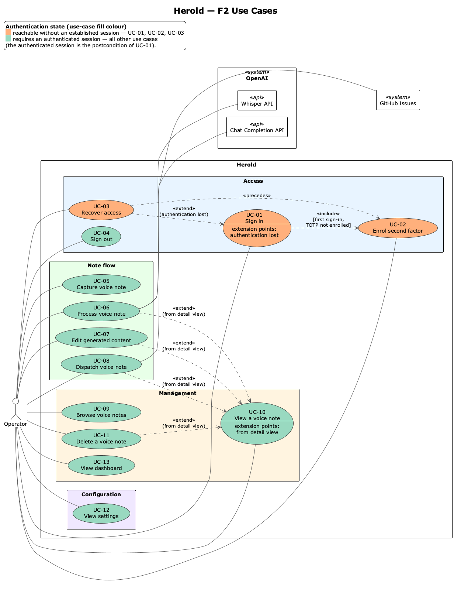
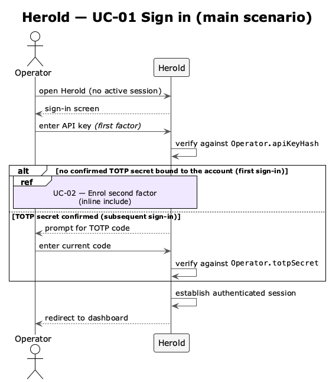
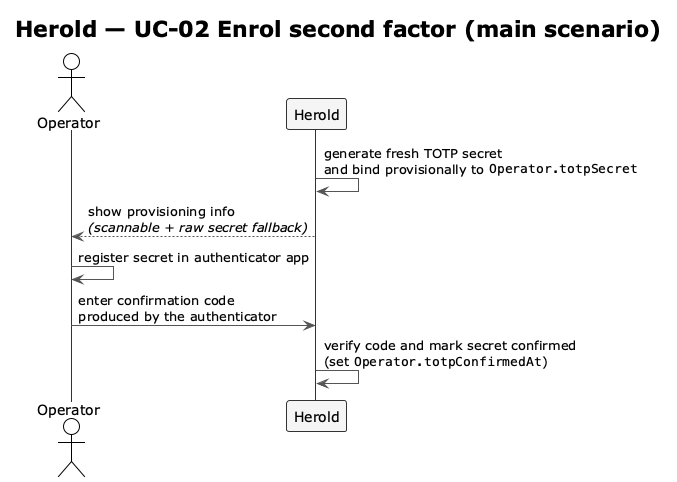
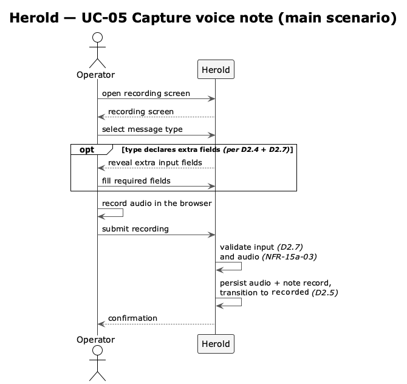
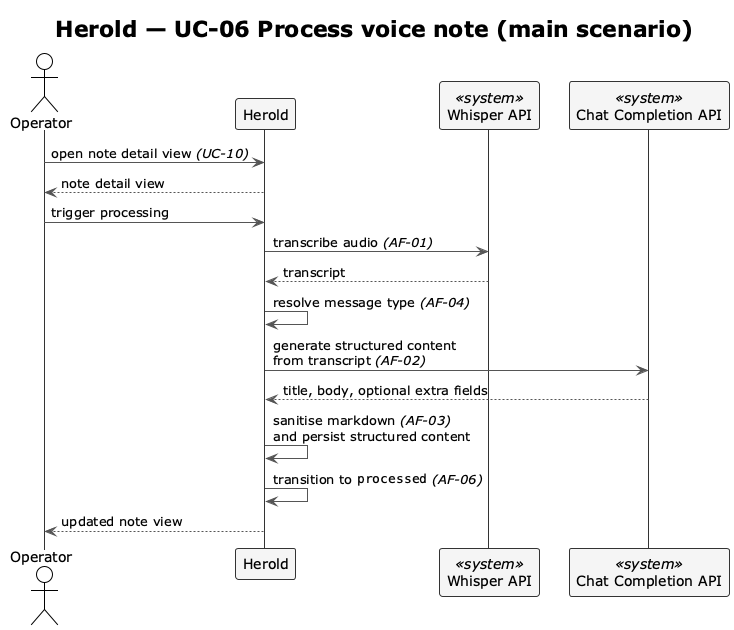
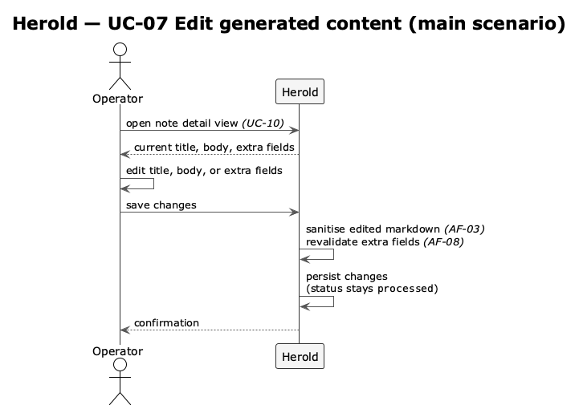
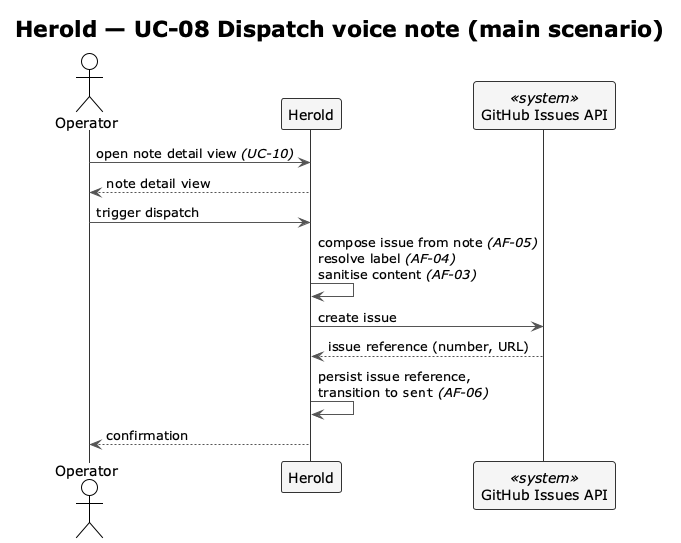
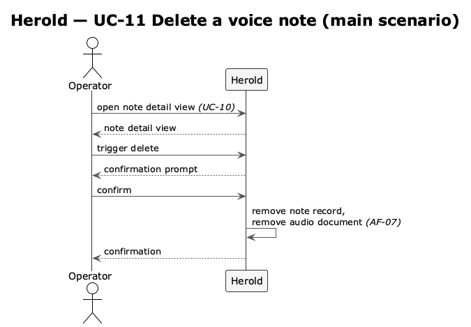

# F2 — Use Cases

Use cases in the sense of Siedersleben (chapter 4.4): concrete interaction scenarios between an operator and the system, each pursuing a single operator-meaningful goal that ends in a stable state. F2 is the **system-supported subset** of the business process described in F1: every activity in F1.1.2 that involves operator interaction with Herold appears here as a use case; system-internal steps (e.g. transcription, generation) are not use cases — they live in F3 as application functions.

Each use case is described with a tabular specification template adopted from Pohl & Rupp (2021), *Basiswissen Requirements Engineering* (5th ed., dpunkt.verlag). Attributes are filled where meaningful information can be stated; sections such as *Authors*, *Priority*, *Criticality*, *Source*, and *Responsible Stakeholder* are omitted because they would carry no discriminating value across the use cases of this single-operator system. Cross-references into F1, F3, N1, and the data model are recorded under *Qualities* and within the scenario steps. The numbering is stable; once a UC ID is referenced from another block, it is not renumbered.

---

## F2.1 Use Case Index

| ID | Use Case | Group | Maps to F1 activity | Status |
|----|----------|-------|---------------------|--------|
| [UC-01](#uc-01--sign-in) | Sign in | Access | — (precondition for A2) | ✅ |
| [UC-02](#uc-02--enrol-second-factor) | Enrol second factor | Access | — (one-time setup) | ✅ |
| [UC-03](#uc-03--recover-access) | Recover access | Access | — (recovery branch) | ⬜ |
| [UC-04](#uc-04--sign-out) | Sign out | Access | — (post-process) | ⬜ |
| [UC-05](#uc-05--capture-voice-note) | Capture voice note | Note flow | A2 + A3 | ✅ |
| [UC-06](#uc-06--process-voice-note) | Process voice note | Note flow | A4 (orchestrates A5–A6) | ✅ |
| [UC-07](#uc-07--edit-generated-content) | Edit generated content | Note flow | A7 | ✅ |
| [UC-08](#uc-08--dispatch-voice-note) | Dispatch voice note | Note flow | A8 | ✅ |
| [UC-09](#uc-09--browse-voice-notes) | Browse voice notes | Management | — (cross-cutting) | ✅ |
| [UC-10](#uc-10--view-a-voice-note) | View a voice note | Management | — (cross-cutting) | ✅ |
| [UC-11](#uc-11--delete-a-voice-note) | Delete a voice note | Management | — (cross-cutting) | ✅ |
| [UC-12](#uc-12--view-settings) | View settings | Configuration | — (auxiliary) | ✅ |

Status legend: ✅ done · 🚧 in progress · ⬜ unfinished.

The diagram shows the operator-facing surface of Herold, organised along three orthogonal axes: the four F2 sections (*Access*, *Note flow*, *Management*, *Configuration*) as package backgrounds; the two external `<<system>>` nodes Herold delegates to within individual scenarios — *OpenAI* (exposing the two `<<api>>` endpoints Whisper and Chat Completion) and *GitHub Issues*; and the per-use-case authentication state, encoded as fill colour.

The use-case relationships drawn follow directly from the textual specifications below:

- **`<<extend>>` from [UC-10](#uc-10--view-a-voice-note):** [UC-06](#uc-06--process-voice-note), [UC-07](#uc-07--edit-generated-content), [UC-08](#uc-08--dispatch-voice-note) and [UC-11](#uc-11--delete-a-voice-note) are typically entered from the detail view rendered by [UC-10](#uc-10--view-a-voice-note).
- **`<<extend>>` from [UC-01](#uc-01--sign-in):** [UC-03](#uc-03--recover-access) is the recovery branch taken when [UC-01](#uc-01--sign-in) cannot succeed.
- **`<<include>>` from [UC-01](#uc-01--sign-in) to [UC-02](#uc-02--enrol-second-factor):** conditional, guarded by the edge label — runs only on the first sign-in, when no TOTP secret is yet enrolled.
- **`<<precedes>>` from [UC-02](#uc-02--enrol-second-factor) to [UC-03](#uc-03--recover-access):** an informal stereotype used here to denote a temporal precondition (neither include nor extend); after a recovery, [UC-02](#uc-02--enrol-second-factor) must be re-run before normal use resumes.

The constraint note attached to the *Herold* boundary records the system-wide precondition that all use cases except [UC-01](#uc-01--sign-in), [UC-02](#uc-02--enrol-second-factor) and [UC-03](#uc-03--recover-access) require an authenticated session — captured once instead of being drawn as nine repetitive edges. The same note doubles as the legend for the per-use-case fill colour: the warm tone marks the three use cases reachable without an established session, the cool tone marks every use case that requires one (including [UC-04](#uc-04--sign-out) *Sign out*, the only authentication-state use case in F2.2 to require a session).

---

## F2.2 Access

### UC-01 — Sign in

| Section | Content |
|---------|---------|
| **Identifier** | UC-01 |
| **Name** | Sign in |
| **Description** | Operator authenticates and receives a session valid for any further use case. On the first sign-in, the second factor is enrolled inline as part of this use case ([UC-02](#uc-02--enrol-second-factor)); on every subsequent sign-in, the previously enrolled second factor is verified. |
| **Trigger** | Operator opens Herold without an active session. |
| **Actors** | Operator (primary). |
| **Precondition** | An API key is bound to the operator account; operator possesses the API key. |
| **Postcondition** | Authenticated session active. |
| **Main scenario** | 1. System presents the sign-in screen. 2. Operator enters the API key as the first factor. 3. System verifies the API key against `Operator.apiKeyHash`. 4. If no confirmed TOTP secret is bound to the account, system runs [UC-02](#uc-02--enrol-second-factor) inline as part of this sign-in. 5. Otherwise, system prompts for the time-based one-time password; operator enters the current code; system verifies it against `Operator.totpSecret`. 6. System establishes an authenticated session. 7. Operator is taken to the dashboard.   |
| **Exception scenarios** | *API key is rejected:* operator may retry within the rate limit; no session is established. *TOTP code fails (subsequent sign-in):* operator may retry within the same rate limit, or pivot to [UC-03](#uc-03--recover-access). *Inline enrolment fails (first sign-in):* see [UC-02](#uc-02--enrol-second-factor) exceptions; the sign-in attempt is aborted and no session is established; operator restarts [UC-01](#uc-01--sign-in) to retry. |
| **Qualities** | [NFR-15a-01](N1-nichtfunktional.md) *Two-Factor Browser Authentication*; [NFR-15a-02](N1-nichtfunktional.md) *Login Rate Limiting and Lockout*. |

### UC-02 — Enrol second factor

| Section | Content |
|---------|---------|
| **Identifier** | UC-02 |
| **Name** | Enrol second factor |
| **Description** | Operator binds a confirmed TOTP secret to the account, so the second factor is available to [UC-01](#uc-01--sign-in) from this point on (including the in-flight first sign-in, if [UC-02](#uc-02--enrol-second-factor) was reached as part of it). |
| **Trigger** | [UC-01](#uc-01--sign-in) step 4 found no confirmed TOTP secret bound to the account (first sign-in), or [UC-03](#uc-03--recover-access) has just completed and the second factor must be re-enrolled before normal use resumes. |
| **Actors** | Operator (primary). |
| **Precondition** | The operator has been authenticated by the calling use case (first factor verified within an in-flight [UC-01](#uc-01--sign-in), or [UC-03](#uc-03--recover-access) has just established a session) and no confirmed TOTP secret is currently bound to the account. |
| **Postcondition** | A confirmed TOTP secret is bound to the account (`Operator.totpSecret` and `Operator.totpConfirmedAt` populated). |
| **Result** | Fresh TOTP secret bound to the account, captured by the operator in an authenticator app of their choice. |
| **Main scenario** | 1. System generates a fresh TOTP secret and binds it provisionally to the account. 2. System displays the secret in a form an authenticator app can capture (scannable provisioning information and the raw secret as fallback). 3. Operator registers the secret in their authenticator app. 4. Operator enters a confirmation code produced by the authenticator from the new secret. 5. System verifies the confirmation code and marks the secret confirmed.   |
| **Exception scenarios** | - *Confirmation code wrong:* operator retries; the secret remains provisional and no confirmed TOTP secret is bound. - *Operator abandons setup before confirming:* the unconfirmed secret is replaced on the next enrolment attempt; no confirmed TOTP secret is bound until step 5 succeeds. |
| **Qualities** | No backup codes are issued. The recovery path for a lost authenticator is [UC-03](#uc-03--recover-access) (out-of-band file token), not a stored backup-code list. |

### UC-03 — Recover access

| Section | Content |
|---------|---------|
| **Identifier** | UC-03 |
| **Name** | Recover access |
| **Description** | Operator regains access to a locked-out account by redeeming a one-time recovery token they placed on the host out-of-band. The redemption resets the second factor and rotates the API key. |
| **Trigger** | Operator has lost the API key, lost access to the authenticator, or both — and cannot complete [UC-01](#uc-01--sign-in). |
| **Actors** | Operator (primary). |
| **Precondition** | Operator has out-of-band write access to the host (e.g. via FTP) and has placed a recovery token, as a single freshly created file in the local storage area, on the server within the last 60 minutes. The token's content is the operator's chosen secret string. |
| **Postcondition** | Authenticated session active. The bound TOTP is unbound (`Operator.totpSecret` and `Operator.totpConfirmedAt` cleared); a fresh API key has been generated, persisted as `Operator.apiKeyHash`, and shown to the operator exactly once. The recovery-token file has been deleted. [UC-02](#uc-02--enrol-second-factor) must be run again before normal use resumes. |
| **Main scenario** | 1. Operator selects the recovery option from the sign-in screen. 2. System checks that a recovery token exists and has not expired (see [NFR-15a-04](N1-nichtfunktional.md)). 3. Operator enters the token's secret string. 4. System verifies the entered string in constant time against the file's content, then deletes the recovery-token file. 5. System unbinds the TOTP secret, generates a fresh API key, persists its hash, and establishes an authenticated session. 6. System displays the new API key to the operator exactly once; the operator records it. 7. Operator is required to run [UC-02](#uc-02--enrol-second-factor) again before resuming normal use. |
| **Exception scenarios** | *No recovery token present, or token expired, or entered string does not match:* all three return the same generic rejection without disclosing which condition was hit; rejections are rate-limited and logged. *Operator closes the screen before recording the new API key in step 6:* the API key cannot be retrieved; the operator must run [UC-03](#uc-03--recover-access) again with a freshly placed recovery token. |
| **Qualities** | [NFR-15a-02](N1-nichtfunktional.md) *Login Rate Limiting and Lockout* (recovery branch); [NFR-15a-04](N1-nichtfunktional.md) *Recovery Token Expiry* (60-minute time-to-live based on the file modification time). |

### UC-04 — Sign out

| Section | Content |
|---------|---------|
| **Identifier** | UC-04 |
| **Name** | Sign out |
| **Description** | Operator ends the active session. |
| **Trigger** | Operator chooses to end the session. |
| **Actors** | Operator (primary). |
| **Precondition** | Authenticated session. |
| **Postcondition** | No authenticated session. |
| **Main scenario** | 1. Operator triggers sign-out. 2. System invalidates the session. 3. Operator is returned to the sign-in screen. |

---

## F2.3 Note Flow

The four use cases in this group form the supported segment of the business process from F1.1.2 (activities A2–A8). Each UC ends in a stable note status (`recorded`, `processed`, or `sent`); the operator may pause between UCs for any duration.

### UC-05 — Capture voice note

| Section | Content |
|---------|---------|
| **Identifier** | UC-05 |
| **Name** | Capture voice note |
| **Description** | Operator records an audio note in the browser, choosing a message type and supplying any required extra fields, and submits it for later processing. |
| **Trigger** | Operator wants to capture an idea, task, or observation by voice. |
| **Actors** | Operator (primary). |
| **Precondition** | Authenticated session; at least one configured message type is available. |
| **Postcondition** | Voice note exists at status `recorded`; audio document held in the local audio store. |
| **Main scenario** | 1. Operator opens the recording screen. 2. Operator selects a message type. 3. If the type declares extra fields (per AF-04), system reveals them and operator fills the required ones. 4. Operator records an audio note in the browser. 5. Operator submits the recording. 6. System validates the operator input against the type schema (AF-08) and the audio against the upload constraints in [NFR-15a-03](N1-nichtfunktional.md) *Audio Upload Validation*. 7. System persists the audio document and a new note record, transitioning it to status `recorded` (AF-06).   |
| **Alternative scenarios** | *Operator cancels before submitting:* nothing is persisted. |
| **Exception scenarios** | - *Type-specific validation fails:* the offending fields are flagged; operator corrects and resubmits. - *Audio fails upload validation:* operator is informed; no note is created. - *Microphone access is denied by the browser:* operator is informed; no note is created. |
| **Qualities** | [NFR-15a-03](N1-nichtfunktional.md) *Audio Upload Validation*; [NFR-13a-01](N1-nichtfunktional.md) *Mobile Usage on the Go*. |

### UC-06 — Process voice note

| Section | Content |
|---------|---------|
| **Identifier** | UC-06 |
| **Name** | Process voice note |
| **Description** | System turns a recorded audio note into structured content (title, body, optional extra fields) within a single synchronous request. |
| **Trigger** | Operator wants the recorded audio turned into structured note content. |
| **Actors** | Operator (primary); OpenAI Whisper API (supporting); OpenAI Chat Completion API (supporting). |
| **Precondition** | A voice note exists at status `recorded`. |
| **Postcondition** | Note at status `processed` with structured content (title, body, optional extra fields) attached; transcript not retained. |
| **Main scenario** | 1. Operator opens the note's detail view (see [UC-10](#uc-10--view-a-voice-note)). 2. Operator triggers processing. 3. System transcribes the audio (AF-01). 4. System resolves the message type (AF-04) and generates structured content from the transcript (AF-02). 5. System sanitises the generated markdown (AF-03) and persists the structured content. 6. System transitions the note to status `processed` (AF-06).   |
| **Alternative scenarios** | *Operator leaves the page during processing:* the synchronous request continues; the operator can return and observe the result. |
| **Exception scenarios** | - *Transcription fails:* the note remains `recorded`; the operator is informed and may retry per [NFR-12d-01](N1-nichtfunktional.md) *Synchronous Error Handling*. - *Content generation fails:* same as above. |
| **Qualities** | [NFR-12a-01](N1-nichtfunktional.md) *Synchronous Processing*; [NFR-12d-01](N1-nichtfunktional.md) *Synchronous Error Handling*. |

### UC-07 — Edit generated content

| Section | Content |
|---------|---------|
| **Identifier** | UC-07 |
| **Name** | Edit generated content |
| **Description** | Operator refines or corrects the system-generated content of a processed note before dispatching it. |
| **Trigger** | Operator wants to refine or correct the system-generated content. |
| **Actors** | Operator (primary). |
| **Precondition** | Note at status `processed`. |
| **Postcondition** | Note still at status `processed`; content reflects the edits. |
| **Main scenario** | 1. Operator opens the note's detail view (see [UC-10](#uc-10--view-a-voice-note)). 2. Operator edits the title, body, or extra fields. 3. Operator saves. 4. System sanitises the edited markdown (AF-03) per [NFR-15b-04](N1-nichtfunktional.md) *Issue Content Sanitization*, revalidates the extra fields against the type schema (AF-08), and persists the changes.   |
| **Alternative scenarios** | - *Operator leaves without saving:* changes are discarded. |
| **Exception scenarios** | - *Validation fails:* operator is shown the offending fields and corrects them. |
| **Qualities** | [NFR-15b-04](N1-nichtfunktional.md) *Issue Content Sanitization*. |

### UC-08 — Dispatch voice note

| Section | Content |
|---------|---------|
| **Identifier** | UC-08 |
| **Name** | Dispatch voice note |
| **Description** | System composes a GitHub issue from the note and pushes it to the configured repository, then records the issue reference. |
| **Trigger** | Operator wants to send the note as a GitHub issue. |
| **Actors** | Operator (primary); GitHub Issues (supporting). |
| **Precondition** | Note at status `processed`. |
| **Postcondition** | Note at status `sent`; issue reference stored. |
| **Main scenario** | 1. Operator opens the note's detail view (see [UC-10](#uc-10--view-a-voice-note)). 2. Operator triggers dispatch. 3. System composes a GitHub issue from the note (AF-05) using the type-resolved label (AF-04) and the sanitised content (AF-03). 4. System pushes the issue to the configured GitHub repository. 5. System records the resulting issue reference against the note and transitions it to status `sent` (AF-06).   |
| **Alternative scenarios** | - *Operator leaves the page during dispatch:* the synchronous request continues; the operator can return and observe the result. |
| **Exception scenarios** | - *GitHub returns an error:* the note remains `processed`; the operator is informed and may retry per [NFR-12d-01](N1-nichtfunktional.md) *Synchronous Error Handling*. - *Network error mid-dispatch:* same as above; the system does not assume the issue was created. |
| **Qualities** | [NFR-12a-01](N1-nichtfunktional.md) *Synchronous Processing*; [NFR-12d-01](N1-nichtfunktional.md) *Synchronous Error Handling*; [NFR-15b-04](N1-nichtfunktional.md) *Issue Content Sanitization*. |

---

## F2.4 Management

### UC-09 — Browse voice notes

| Section | Content |
|---------|---------|
| **Identifier** | UC-09 |
| **Name** | Browse voice notes |
| **Description** | Operator inspects the collection of voice notes to locate one or get a feel for what is pending. |
| **Trigger** | Operator wants an overview of past and pending notes. |
| **Actors** | Operator (primary). |
| **Precondition** | Authenticated session. |
| **Postcondition** | No state change. |
| **Main scenario** | 1. Operator opens the notes list. 2. System renders the notes ordered by recency, showing status, message type, timestamp, and a short summary. |
| **Alternative scenarios** | - *Operator narrows the list (e.g. by status or message type):* the system re-renders accordingly. - *Operator picks a note:* continues with [UC-10](#uc-10--view-a-voice-note) *View a voice note*. - *No notes yet:* an empty-state message is shown. |

### UC-10 — View a voice note

| Section | Content |
|---------|---------|
| **Identifier** | UC-10 |
| **Name** | View a voice note |
| **Description** | Operator inspects a single note: status, type, timestamps, structured content, and (if dispatched) issue reference; may stream the audio recording. |
| **Trigger** | Operator wants to inspect a single note. |
| **Actors** | Operator (primary). |
| **Precondition** | Authenticated session; the selected note exists. |
| **Postcondition** | No state change. |
| **Main scenario** | 1. System renders the note's detail view: status, type, timestamps, structured content (if any), issue reference (if `sent`). 2. Operator may stream the audio recording. |
| **Alternative scenarios** | - *Operator triggers processing:* continues with [UC-06](#uc-06--process-voice-note) *Process voice note* (status `recorded`). - *Operator edits the content:* continues with [UC-07](#uc-07--edit-generated-content) *Edit generated content* (status `processed`). - *Operator dispatches the note:* continues with [UC-08](#uc-08--dispatch-voice-note) *Dispatch voice note* (status `processed`). - *Operator triggers delete:* continues with [UC-11](#uc-11--delete-a-voice-note) *Delete a voice note* (any status). |

### UC-11 — Delete a voice note

| Section | Content |
|---------|---------|
| **Identifier** | UC-11 |
| **Name** | Delete a voice note |
| **Description** | Operator irreversibly removes a note record and its audio document; any dispatched GitHub issue is left untouched. |
| **Trigger** | Operator wants the note gone. |
| **Actors** | Operator (primary). |
| **Precondition** | Authenticated session; the selected note exists, in any status. |
| **Postcondition** | Note and its audio document are gone. The dispatched GitHub issue (if any) remains in place. |
| **Main scenario** | 1. Operator opens the note's detail view (see [UC-10](#uc-10--view-a-voice-note)). 2. Operator triggers delete. 3. System asks the operator to confirm, since the action is irreversible. 4. Operator confirms. 5. System removes the note record and its audio document (AF-07).   |
| **Alternative scenarios** | - *Operator cancels at the confirmation step:* nothing changes. |
| **Qualities** | Deletion is one-way and local-only — Herold does not touch the GitHub issue (F1.3; P1 non-goal [NG-03](P1-ziele-rahmenbedingungen.md) *Local ticket lifecycle*). |

---

## F2.5 Configuration

### UC-12 — View settings

| Section | Content |
|---------|---------|
| **Identifier** | UC-12 |
| **Name** | View settings |
| **Description** | Operator inspects the active read-only configuration (configured message types, target GitHub repository, active OpenAI model identifier). |
| **Trigger** | Operator wants to inspect the active configuration. |
| **Actors** | Operator (primary). |
| **Precondition** | Authenticated session. |
| **Postcondition** | No state change. |
| **Main scenario** | 1. Operator opens the settings screen. 2. System renders the active configuration in a read-only form. |
| **Qualities** | Settings are read-only; configuration changes happen out-of-band on the host (per P1 constraints and S3 deployment). |

---

## F2.6 Out of Scope for F2

- **Transcription, content generation, markdown sanitisation, message-type resolution.** These are system-internal steps with no operator decision point — F3 functions AF-01 to AF-04.
- **Streaming the audio recording.** Step inside [UC-10](#uc-10--view-a-voice-note), not a goal in itself.
- **Re-process and re-dispatch on failure.** Operator simply repeats [UC-06](#uc-06--process-voice-note) or [UC-08](#uc-08--dispatch-voice-note); the status machine (AF-06) makes retries safe.
- **Issue triage, labelling beyond the type label, comments, or closure on the GitHub side.** Outside Herold (F1.3; P1 non-goal [NG-03](P1-ziele-rahmenbedingungen.md)).
- **Scheduled jobs, background workers, batch processing.** Herold has none (B2 not applicable; [ADR-002](../arch/ARCHITECTURE_DECISIONS.md); P1 non-goal [NG-04](P1-ziele-rahmenbedingungen.md) *Asynchronous processing*).
- **Multi-operator collaboration.** Forbidden by [CON-3a-04](P1-constraints.md) *Single-User System*.

---

## F2.7 Cross-references

| Block | Relevance to F2 |
|-------|-----------------|
| [F1](F1-geschaeftsprozesse.md) | Activities A2–A8 are realised by [UC-05](#uc-05--capture-voice-note) to [UC-08](#uc-08--dispatch-voice-note); access UCs bracket the process. |
| [F3](F3-anwendungsfunktionen.md) | Application functions AF-01 to AF-08 are invoked from the UCs as listed in their main scenarios. |
| D1 (planned) | Voice note record, status enum (`recorded → processed → sent`), issue reference, message-type metadata are referenced throughout. |
| [B1] (planned) | Screen designs and dialogue flow for each UC. |
| [N1](N1-nichtfunktional.md) | Latency budget for [UC-06](#uc-06--process-voice-note) and [UC-08](#uc-08--dispatch-voice-note) ([NFR-12a-01](N1-nichtfunktional.md) *Synchronous Processing*); error handling on retry ([NFR-12d-01](N1-nichtfunktional.md) *Synchronous Error Handling*); rate limiting for [UC-01](#uc-01--sign-in), [UC-03](#uc-03--recover-access) ([NFR-15a-02](N1-nichtfunktional.md) *Login Rate Limiting and Lockout*); audio upload constraints for [UC-05](#uc-05--capture-voice-note) ([NFR-15a-03](N1-nichtfunktional.md) *Audio Upload Validation*); recovery token expiry for [UC-03](#uc-03--recover-access) ([NFR-15a-04](N1-nichtfunktional.md) *Recovery Token Expiry*); content sanitisation for [UC-08](#uc-08--dispatch-voice-note) ([NFR-15b-04](N1-nichtfunktional.md) *Issue Content Sanitization*). |
| [N2] (planned) | Authentication and TOTP handling underpin [UC-01](#uc-01--sign-in) to [UC-04](#uc-04--sign-out). |
| [S1] (planned) | OpenAI and GitHub interface contracts consumed by [UC-06](#uc-06--process-voice-note) and [UC-08](#uc-08--dispatch-voice-note). |
| [E2](E2-glossar.md) | Definitions for *message type*, *Recovery* (file-based recovery flow), *fine-grained PAT*, *voice note*. |
