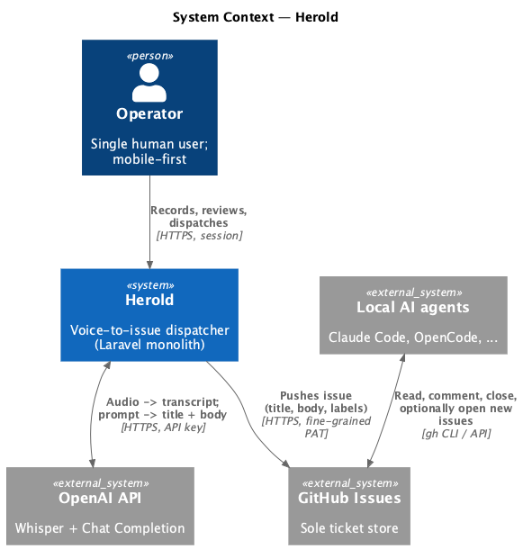

# P2 — Architecture Overview

Application-level overview of how Herold embeds into its surrounding system landscape, in the sense of Siedersleben (chapter 4.2): the goal of this block is the **complete enumeration of neighbouring systems** and the direction of data flow between them.

Internal architecture (component decomposition, layering, sequence diagrams, deployment view) is **out of scope** for this block and deliberately deferred to a dedicated architecture document.

---

## P2.1 System Context

Herold has **one inbound channel** (the operator's browser), one **bidirectional channel** to OpenAI (request/response carries the substantive transcript and generated text), and **one outbound channel** to GitHub (one-way push; the response is only used to record the issue reference). Local agents interact **bidirectionally** with GitHub — reading dispatched tickets, commenting, closing, and potentially opening their own issues — but never with Herold directly.

---

## P2.2 Neighbouring Systems

Complete list of systems Herold communicates with. Detailed interface contracts (endpoints, payloads, error semantics) belong in **S1 — Neighbouring System Interfaces**; this table is the inventory.

| ID | System | Role | Direction | Coupling | Frequency | Owner |
|----|--------|------|-----------|----------|-----------|-------|
| NB-01 | **Operator browser** | Sole human actor; recording, review, dispatch trigger | inbound | tight (synchronous request) | per voice note | Operator |
| NB-02 | **OpenAI Whisper API** | Speech-to-text on the uploaded audio | bidirectional (request: audio; response: transcript) | tight (synchronous; pipeline blocks on response) | per `process` action | OpenAI (third party) |
| NB-03 | **OpenAI Chat Completion API** | Title + Markdown body generation from transcript | bidirectional (request: prompt; response: title + body) | tight (synchronous) | per `process` action | OpenAI (third party) |
| NB-04 | **GitHub Issues API** | Final ticket sink; one-way push of title, body, labels | outbound (response only used to record issue reference) | tight (synchronous) | per `send` action | GitHub (third party) |
| NB-05 | **Local AI agents** (Claude Code, OpenCode, …) | Read dispatched tickets, comment, close, optionally open new issues; do not call Herold | indirect via NB-04 (bidirectional with GitHub) | none from Herold's side | per ticket pickup / agent action | Operator (locally) |

**Notes on the inventory**

- **No legacy systems.** Herold is greenfield; S2 (data migration) is not applicable.
- **No peer enterprise systems.** All outbound partners are public third-party APIs accessed over HTTPS with token authentication.
- **Agents (NB-05) are intentionally not direct neighbours.** They appear here for completeness; the only system Herold pushes to is GitHub.
